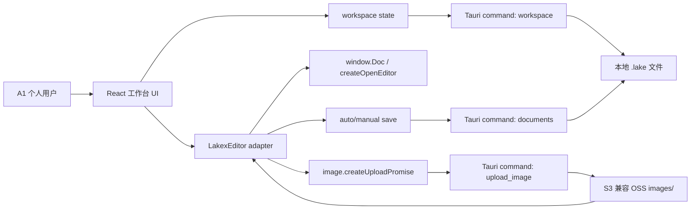

# feat: Build Lake-first local notes app

## Overview

构建一个 Tauri 桌面笔记软件：用户选择本地知识库目录，新建和打开 `.lake` 文件，用本地打包的语雀 LakexEditor 编辑并保存 `text/lake` 内容，插入图片时上传到用户自己的 S3 兼容 OSS。第一版以个人使用和可行性验证为目标，UI 参考语雀原生编辑工作台，而不是 Markdown-first 笔记软件。

---

## Problem Frame

来源需求明确从 Obsidian 插件转向独立 App：核心价值是保留语雀 Lake 原生编辑能力，同时让数据落在用户可控的本地文件夹中。计划必须围绕 `docs/brainstorms/2026-04-26-lake-first-notes-requirements.md` 的一句话 MVP 展开：选目录、新建 `.lake`、用语雀编辑器编辑保存、图片上传到 OSS。

---

## Requirements Trace

- R1. 允许用户选择本地目录作为知识库目录。
- R2. 展示并打开当前知识库目录中的 `.lake` 文档。
- R3. 支持在当前知识库目录中新建 `.lake` 文档。
- R4. `.lake` 文件以语雀 `text/lake` 作为主存储格式。
- R5. 使用本地打包的语雀编辑器资源，不依赖运行时 CDN。
- R6. 支持自动保存和手动保存，保存时从编辑器读取 `text/lake` 并写回文件。
- R7. 支持配置 S3 兼容 OSS 图片上传信息。
- R8. 图片上传按资源类型目录存储，第一版至少支持图片目录。
- R9. 图片上传成功后向语雀编辑器返回图片 URL、文件名和大小。
- R10. 第一版界面参考语雀工作台：左侧窄图标栏、知识库/文档树侧栏、中间编辑画布、右侧大纲区域。
- R11. 顶部提供文档标题区域和语雀编辑器工具栏。
- R12. 视觉以轻量、克制、白底、浅边框、绿色强调色为主，避免营销式首页、装饰性渐变和卡片堆叠。
- R13. 正文区域接近截图阅读/编辑体验：居中内容宽度、清晰大标题、舒适行高、右侧大纲不干扰正文。
- R14. Markdown 和 HTML 不作为第一版默认存储格式；若实现导出，只能是显式手动动作。
- R15. 第一版不支持 Obsidian、Markdown 反链、图谱或搜索索引。

**Origin actors:** A1 个人用户, A2 桌面 App, A3 S3 兼容 OSS, A4 语雀编辑器。

**Origin flows:** F1 选择知识库目录, F2 新建并编辑 Lake 文档, F3 图片上传到 OSS。

**Origin acceptance examples:** AE1 目录与文件打开, AE2 新建编辑保存, AE3 图片上传, AE4 类语雀工作台 UI。

---

## Scope Boundaries

### Deferred for later

- Markdown / HTML 导出命令。
- 附件、音频、视频上传。
- WebDAV 存储 provider。
- 全文搜索、标签、反链、图谱、索引。
- 多知识库管理、复杂配置迁移、公开发布插件或应用市场发布。
- Markdown 导入或从 Obsidian 迁移。

### Outside this product's identity

- 不做 Obsidian 插件。
- 不做 Markdown-first 笔记软件。
- 不做云端协作文档平台。
- 不做语雀 OpenAPI 客户端或语雀云同步工具。

### Deferred to Follow-Up Work

- 语雀编辑器版本升级策略：第一版只锁定一个可运行版本，升级检查和兼容矩阵后置。
- 安全凭据存储增强：第一版可使用本地应用配置，后续再评估系统 Keychain。
- WebDAV provider：保留上传 provider 抽象边界，但不在第一版实现。

---

## Context & Research

### Relevant Code and Patterns

- `yuque-developer-docs.md` 记录 LakexEditor 的 UMD 资源、`createOpenEditor`、`createOpenViewer`、`setDocument('text/lake')`、`getDocument('text/lake')`、`contentchange` 事件。
- `yuque-developer-docs.md` 记录图片 `createUploadPromise(request)` 可接管上传，并返回 `{ url, size, filename }`。
- 当前仓库还没有应用代码，计划是 greenfield Tauri 项目；目录结构本身是本计划的重要产物。
- 仓库根部没有现有 `AGENTS.md` 文件，执行时遵守用户在会话中提供的 AGENTS 规则：中文输出、极简、验证优先、不创建无关文档、不硬编码绕过需求。

### Institutional Learnings

- 当前仓库未发现 `docs/solutions/` 或历史实现模式；本计划主要依赖来源需求、语雀开发文档和 Tauri/S3 官方文档。

### External References

- Tauri v2 创建项目与前端框架入口：https://v2.tauri.app/start/create-project/
- Tauri v2 资源打包说明：https://v2.tauri.app/develop/resources/
- Tauri v2 文件系统能力参考：https://v2.tauri.app/reference/javascript/fs/
- Tauri v2 前端 mock 测试参考：https://v2.tauri.app/develop/tests/mocking/
- Tauri v2 WebDriver 测试参考：https://v2.tauri.app/develop/tests/webdriver/
- AWS SDK for Rust S3 示例：https://docs.aws.amazon.com/sdk-for-rust/latest/dg/rust_s3_code_examples.html
- Amazon S3 object key 命名指南：https://docs.aws.amazon.com/AmazonS3/latest/userguide/object-keys.html

---

## Key Technical Decisions

- 使用 Tauri v2 + Vite + React + TypeScript：WebView 适合承载 LakexEditor，本地文件和上传能力交给 Tauri 后端，符合来源需求中的桌面壳方向。
- `.lake` 第一版保存原始 `text/lake` 字符串：最小化格式风险，优先保留语雀编辑器能力；标题、mtime 等元数据从文件名和文件系统读取。
- 文件读写由 Tauri Rust 命令负责：统一做工作区根目录校验、路径穿越防护、原子写入和错误映射。
- S3 上传由 Tauri Rust 后端负责：避免在 WebView 中暴露 OSS 密钥，前端只把图片 bytes、文件名和 MIME 传给 `upload_image`。
- 语雀编辑器资源本地 vendor：将 LakexEditor UMD、CSS、React/ReactDOM UMD 或等价运行时依赖、Antd CSS 固定在 `public/vendor/lakex-doc/`，实现阶段必须确认版本来源和许可边界。
- 前端通过薄 adapter 使用 `window.Doc`：业务代码不散落直接访问全局对象，方便测试时 mock 编辑器，也方便后续替换资源加载方式。
- UI 第一屏就是编辑工作台：没有 landing page；空目录也展示工作台结构和新建入口。
- 上传对象 key 采用类型目录：图片进入 `images/` 前缀，可按日期和安全文件名继续分层，给 WebDAV 扩展留下 provider 边界。

---

## Alternative Approaches Considered

- Obsidian 插件：已由来源需求明确放弃；Obsidian 的文件类型、视图生命周期和插件沙箱会让 Lake 原生编辑变成插件适配问题。
- Markdown-first 本地笔记：不选；会丢失语雀 Lake 高亮块、卡片、复杂排版等原生能力，违背 R4。
- 前端直传 S3：不选；会把 OSS 密钥暴露给 WebView，且难以统一错误处理和未来 provider 扩展。
- `.lake` 元数据包装格式：第一版不选；会让保存格式从一开始偏离 `text/lake`，增加后续兼容成本。

---

## Success Metrics

- 用户能完成 MVP 主链路：选目录、新建 `.lake`、编辑保存、图片上传到 OSS。
- `.lake` 文件内容来自 `getDocument('text/lake')`，重新打开后能用 `setDocument('text/lake')` 还原。
- 生产构建断网时仍能加载语雀编辑器资源，不访问运行时 CDN。
- 插入图片后 OSS 返回的 URL、文件名和大小能被 LakexEditor 接受，并在文档重开后继续显示。
- 主界面视觉结构接近来源截图：左 rail、文档侧栏、顶部标题/工具栏、中间编辑画布、右侧大纲齐备且不重叠。

---

## Open Questions

### Resolved During Planning

- `.lake` 文件是否包装元数据：第一版不包装，只保存原始 `text/lake`。
- S3 上传在前端还是后端：第一版走 Tauri Rust 后端命令，前端不持有密钥。
- 是否运行时依赖 CDN：不依赖，语雀编辑器相关资源本地打包。
- 是否支持搜索：不支持，按来源需求 R15 明确排除。

### Deferred to Implementation

- 语雀编辑器资源的最终版本号、下载来源和许可说明：实现 U1 前确认并锁定，若许可不允许打包，需要回到用户处重新决策。
- Tauri WebView 的最终 CSP 和资源路径细节：依赖实际资源加载方式，U1/U3 原型验证时收敛。
- S3 兼容厂商的 endpoint/path-style/region 差异：U5 设计配置项覆盖主流差异，具体厂商兼容性通过用户实际配置验证。
- 大纲区域数据来源：优先使用 LakexEditor 自带 toc/outline 能力；若本地 UMD 版本能力不足，第一版保留右侧区域但仅显示当前文档结构占位状态。

---

## Output Structure

```text
.
├── docs/
│   ├── brainstorms/
│   │   └── 2026-04-26-lake-first-notes-requirements.md
│   └── plans/
│       └── 2026-04-26-001-feat-lake-first-notes-app-plan.md
├── public/
│   └── vendor/
│       └── lakex-doc/
├── src/
│   ├── App.tsx
│   ├── main.tsx
│   ├── app/
│   │   ├── AppController.tsx
│   │   └── appState.ts
│   ├── components/
│   │   ├── AppRail.tsx
│   │   ├── DocumentSidebar.tsx
│   │   ├── OutlinePanel.tsx
│   │   └── TopBar.tsx
│   ├── features/
│   │   ├── lake-editor/
│   │   ├── settings/
│   │   └── workspace/
│   ├── lib/
│   │   └── tauri.ts
│   ├── styles/
│   │   └── app.css
│   └── test/
├── src-tauri/
│   ├── capabilities/
│   │   └── default.json
│   ├── src/
│   │   ├── commands/
│   │   ├── storage/
│   │   ├── lib.rs
│   │   ├── main.rs
│   │   └── models.rs
│   └── tests/
└── e2e/
```

该结构是范围声明，不是实现约束；实现时可根据 Tauri 模板生成的文件微调，但每个 implementation unit 的 `Files` 列表仍是执行依据。

---

## High-Level Technical Design

> This illustrates the intended approach and is directional guidance for review, not implementation specification. The implementing agent should treat it as context, not code to reproduce.



---

## Implementation Units

- U1. **Scaffold Tauri React App And Vendor Editor Assets**

**Goal:** 建立 Tauri v2 + React + TypeScript 项目骨架，并准备本地加载 LakexEditor 的资源边界。

**Requirements:** R5, R10, R11, R12, R13；支撑 AE2、AE4。

**Dependencies:** 外部前置：确认 LakexEditor 资源版本、来源和本地打包许可。

**Files:**
- Create: `package.json`
- Create: `index.html`
- Create: `vite.config.ts`
- Create: `tsconfig.json`
- Create: `src/main.tsx`
- Create: `src/App.tsx`
- Create: `src/styles/app.css`
- Create: `src/test/setup.ts`
- Create: `src-tauri/Cargo.toml`
- Create: `src-tauri/tauri.conf.json`
- Create: `src-tauri/capabilities/default.json`
- Create: `src-tauri/src/main.rs`
- Create: `src-tauri/src/lib.rs`
- Create: `public/vendor/lakex-doc/`
- Test: `src/App.test.tsx`
- Test: `src-tauri/tests/bootstrap.rs`

**Approach:**
- 从官方 Tauri v2 React 模板建立最小可运行应用，不引入与 MVP 无关的状态框架。
- `public/vendor/lakex-doc/` 保存固定版本的 LakexEditor UMD 和 CSS，以及运行它需要的本地依赖资源。
- Tauri capability 只开放计划内命令和必要插件权限，避免给 WebView 任意文件系统能力。
- 全局样式先定义工作台基础变量：白底、浅边框、绿色强调色、固定导航宽度和无营销装饰。

**Execution note:** 先让最小桌面壳和资源加载 smoke test 通过，再进入编辑器集成；不要在脚手架阶段扩展搜索、标签或同步。

**Patterns to follow:**
- Tauri 官方 v2 项目结构。
- `yuque-developer-docs.md` 中 LakexEditor UMD/CSS 资源加载方式。

**Test scenarios:**
- Happy path: 应用启动时渲染工作台根节点，页面不是空白。
- Happy path: 本地 vendor 资源路径存在，构建产物能引用 LakexEditor CSS/JS。
- Error path: 缺少 LakexEditor 资源时，前端显示明确的编辑器加载失败状态，而不是静默白屏。
- Integration: Tauri capability 中只暴露本计划需要的命令和插件能力。

**Verification:**
- 桌面应用能打开到工作台空状态。
- 浏览器控制台和 Tauri 日志没有资源加载 404 或未捕获初始化错误。

---

- U2. **Implement Workspace And Lake File Backend**

**Goal:** 支持选择知识库目录、列出 `.lake` 文件、新建 `.lake`、读取和写入原始 `text/lake` 内容。

**Requirements:** R1, R2, R3, R4；覆盖 F1、F2、AE1、AE2。

**Dependencies:** U1。

**Files:**
- Create: `src-tauri/src/commands/workspace.rs`
- Create: `src-tauri/src/commands/documents.rs`
- Create: `src-tauri/src/models.rs`
- Create: `src-tauri/src/state.rs`
- Modify: `src-tauri/src/lib.rs`
- Modify: `src-tauri/capabilities/default.json`
- Create: `src/lib/tauri.ts`
- Create: `src/features/workspace/workspaceStore.ts`
- Test: `src-tauri/tests/workspace_commands.rs`
- Test: `src/features/workspace/workspaceStore.test.ts`

**Approach:**
- 使用 Tauri dialog 插件选择目录，后端记录当前 workspace root。
- 后端命令返回文档列表时只包含 `.lake` 文件，并按目录结构组织给前端。
- 新建文档时生成安全文件名，默认内容为空 Lake 文档或语雀编辑器可接受的空内容。
- 写文件时校验目标路径必须位于当前 workspace root 内，使用临时文件加 rename 的方式降低半写入风险。
- 前端 `workspaceStore` 只维护当前 workspace、文档树、当前文档、加载状态和错误状态。

**Patterns to follow:**
- Tauri command + typed frontend wrapper 的薄边界。
- S3 object key 命名指南中的安全命名思路，用于本地文件名清理。

**Test scenarios:**
- Covers AE1. Happy path: 选择包含 `a.lake` 和 `nested/b.lake` 的目录后，文档树展示两个 `.lake` 文档并可打开。
- Covers AE2. Happy path: 新建标题为 `高级工程师的要求` 的文档后，目录中出现安全命名的 `.lake` 文件。
- Happy path: 保存 `text/lake` 字符串后，再读取同一文件得到完全一致的内容。
- Edge case: 空目录返回空文档树，并保留新建入口。
- Edge case: 目录中存在 `.md`、`.txt`、隐藏文件时，不作为 Lake 文档展示。
- Error path: 读取或写入 workspace 外路径时被拒绝。
- Error path: 目录无权限或文件被占用时，错误能传回前端并保留未保存状态。

**Verification:**
- 用户可以在一个真实临时目录中完成选择、列出、新建、读取、保存的闭环。
- 所有文件命令都经过 workspace root 校验。

---

- U3. **Integrate LakexEditor Document Lifecycle**

**Goal:** 在 React 中封装 LakexEditor，打开 `.lake` 时 `setDocument('text/lake')`，保存时 `getDocument('text/lake')`，同时支持自动保存和手动保存。

**Requirements:** R4, R5, R6, R11；覆盖 F2、AE2。

**Dependencies:** U1, U2。

**Files:**
- Create: `src/features/lake-editor/LakeEditor.tsx`
- Create: `src/features/lake-editor/lakeEditorAdapter.ts`
- Create: `src/features/lake-editor/useLakeAutosave.ts`
- Create: `src/features/lake-editor/editorTypes.ts`
- Modify: `src/App.tsx`
- Modify: `src/app/AppController.tsx`
- Test: `src/features/lake-editor/LakeEditor.test.tsx`
- Test: `src/features/lake-editor/useLakeAutosave.test.ts`
- Test: `src/features/lake-editor/lakeEditorAdapter.test.ts`

**Approach:**
- `lakeEditorAdapter` 是唯一直接访问 `window.Doc` 的位置，负责创建、销毁、读取、设置和事件订阅。
- 文档切换时先销毁旧 editor，再创建新 editor 并设置当前 `text/lake`。
- 监听 `contentchange` 触发 debounced autosave；`Cmd/Ctrl+S` 触发立即保存并刷新保存状态。
- 保存状态至少区分 clean、dirty、saving、saved、error，顶部标题区域展示状态。
- 编辑器容器使用语雀文档要求的 editor class，并把工具栏留给 LakexEditor 原生渲染。

**Patterns to follow:**
- `yuque-developer-docs.md` 的 `createOpenEditor`、`setDocument`、`getDocument`、`contentchange`、`destroy` 用法。
- React 组件中第三方 imperative widget 的 adapter 模式。

**Test scenarios:**
- Covers AE2. Happy path: 打开 `.lake` 后，adapter 调用 `setDocument('text/lake')` 加载文件内容。
- Covers AE2. Happy path: 编辑器触发 `contentchange` 后，autosave 读取 `getDocument('text/lake')` 并调用保存命令。
- Happy path: 用户按 `Cmd/Ctrl+S` 时立即保存当前 Lake 内容，不等待 debounce。
- Edge case: 快速连续输入多次时，只触发合并后的保存请求，最终保存最新内容。
- Edge case: 切换文档时销毁旧 editor，避免旧文档事件继续写入新文件。
- Error path: 保存失败时保留 dirty/error 状态，下一次手动保存可重试。
- Integration: 前端 mock `window.Doc` 时能验证 editor 生命周期，不依赖真实 UMD 资源跑单元测试。

**Verification:**
- 在真实 App 中输入内容后关闭再打开，同一个 `.lake` 文件保留最新 Lake 内容。
- 手动保存和自动保存状态在标题栏反馈一致。

---

- U4. **Build Yuque-Like Workbench UI And Outline**

**Goal:** 实现接近截图的轻量工作台界面：左图标栏、知识库/文档树、顶部标题与工具区、中间编辑画布、右侧大纲。

**Requirements:** R10, R11, R12, R13；覆盖 AE4。

**Dependencies:** U1；可与 U2、U3 局部并行，但最终需要接入文档状态。

**Files:**
- Create: `src/components/AppRail.tsx`
- Create: `src/components/DocumentSidebar.tsx`
- Create: `src/components/TopBar.tsx`
- Create: `src/components/OutlinePanel.tsx`
- Create: `src/components/IconButton.tsx`
- Modify: `src/App.tsx`
- Modify: `src/styles/app.css`
- Test: `src/components/workbenchLayout.test.tsx`
- Test: `src/components/documentSidebar.test.tsx`

**Approach:**
- 左侧 app rail 固定窄宽，提供工作区、选择目录、设置等图标入口；按钮使用图标和 tooltip，不堆文字说明。
- 文档侧栏展示目录树和 `.lake` 文件，当前文档高亮；支持按类型目录展示资源的入口可以预留但不实现搜索。
- 中间编辑区采用白底、居中正文宽度、舒适行高；避免卡片包卡片、装饰渐变和营销布局。
- 右侧大纲区域保持稳定宽度；优先接入 LakexEditor toc/outline 配置，若能力不足则显示空大纲状态。
- 响应式时优先折叠右侧大纲或文档侧栏，保证正文和 toolbar 不重叠。

**Patterns to follow:**
- 用户提供截图中的布局比例、浅边框、绿色强调色、顶部工具栏密度。
- 前端设计约束：稳定尺寸、文本不溢出、不使用 hero/landing/card-heavy 设计。

**Test scenarios:**
- Covers AE4. Happy path: 打开文档后页面包含 app rail、文档侧栏、顶部标题区域、中间 editor 容器和右侧大纲五个区域。
- Happy path: 当前文档在侧栏中有明确选中态。
- Edge case: 无 workspace 时仍显示工作台外壳和选择目录入口，不进入营销首页。
- Edge case: 窄窗口下侧栏/大纲折叠后，标题、toolbar、正文不发生重叠。
- Error path: 编辑器加载失败时，中间区域展示错误状态，左右导航仍可操作。

**Verification:**
- 使用桌面和窄窗口截图检查布局与来源截图的主要结构一致。
- 页面没有明显文本溢出、区域重叠、装饰性渐变或卡片堆叠。

---

- U5. **Implement S3-Compatible Image Upload**

**Goal:** 支持配置 S3 兼容 OSS，并通过 LakexEditor 图片上传钩子把图片上传到 `images/` 类型目录，返回编辑器要求的数据。

**Requirements:** R7, R8, R9；覆盖 F3、AE3。

**Dependencies:** U1, U3。

**Files:**
- Create: `src-tauri/src/commands/settings.rs`
- Create: `src-tauri/src/commands/upload.rs`
- Create: `src-tauri/src/storage/s3.rs`
- Modify: `src-tauri/src/models.rs`
- Modify: `src-tauri/src/lib.rs`
- Create: `src/features/settings/OssSettingsPanel.tsx`
- Create: `src/features/settings/ossSettingsStore.ts`
- Create: `src/features/lake-editor/uploadAdapter.ts`
- Modify: `src/features/lake-editor/LakeEditor.tsx`
- Test: `src-tauri/tests/upload_commands.rs`
- Test: `src-tauri/tests/oss_settings.rs`
- Test: `src/features/settings/OssSettingsPanel.test.tsx`
- Test: `src/features/lake-editor/uploadAdapter.test.ts`

**Approach:**
- OSS 配置包含 endpoint、bucket、region、access key、secret key、public base URL、是否 path-style、图片前缀。
- 前端 `createUploadPromise` 接收 LakexEditor 的 request；当类型是 file/base64 时转为 bytes 传给 `upload_image`；URL 转存第一版可明确返回不支持或仅对已匹配 OSS URL 放行。
- 后端生成对象 key：`images/YYYY/MM/<safe-random-name>.<ext>`；文件名清理遵循 S3 object key 安全字符建议。
- 后端使用 S3 兼容 SDK 上传 bytes，返回 `{ url, size, filename }` 给前端，再由前端原样返回给 LakexEditor。
- 上传失败时拒绝 promise，让编辑器保留失败反馈；不要插入不可用 URL。

**Patterns to follow:**
- `yuque-developer-docs.md` 的 `image.createUploadPromise(request)` 返回结构。
- AWS SDK for Rust S3 put object 示例。
- S3 object key 命名指南。

**Test scenarios:**
- Covers AE3. Happy path: 已配置 OSS 时，上传 `image.png` 后请求进入 `images/` 前缀，并返回 URL、size、filename。
- Happy path: public base URL 配置存在时，返回的 URL 使用该 base 生成。
- Edge case: 文件名包含空格、中文或特殊字符时，对象 key 仍安全且保留可读 filename。
- Edge case: 未配置 OSS 时，图片上传明确失败并提示用户进入设置。
- Error path: S3 返回认证失败、bucket 不存在或网络失败时，错误传回 editor upload promise。
- Integration: LakexEditor `createUploadPromise` 的返回对象字段与语雀文档要求一致。

**Verification:**
- 使用用户配置的真实 S3 兼容 OSS 能上传图片，并在文档中预览 OSS URL。
- 上传后的 Lake 文档保存并重新打开后，图片仍能显示。

---

- U6. **Wire End-To-End App Flow And State Persistence**

**Goal:** 串联选择目录、文档树、新建文档、打开编辑、保存状态、OSS 设置和图片上传，形成可用 MVP。

**Requirements:** R1-R9, R14, R15；覆盖 F1、F2、F3、AE1、AE2、AE3。

**Dependencies:** U2, U3, U5；与 U4 集成。

**Files:**
- Create: `src/app/AppController.tsx`
- Create: `src/app/appState.ts`
- Modify: `src/App.tsx`
- Modify: `src/components/TopBar.tsx`
- Modify: `src/components/DocumentSidebar.tsx`
- Modify: `src/features/settings/OssSettingsPanel.tsx`
- Modify: `src/lib/tauri.ts`
- Test: `src/app/AppController.test.tsx`
- Test: `e2e/lake-notes-smoke.test.ts`

**Approach:**
- `AppController` 作为前端编排层，协调 workspace、current document、editor lifecycle 和 settings panel。
- 最近一次 workspace 可在本地应用状态中记住；启动时如果不可访问，提示重新选择目录。
- 新建文档后立即打开并聚焦编辑器。
- R14/R15 在 UI 中体现为不提供默认 Markdown 存储、搜索、反链、图谱入口；如果保留导出按钮，第一版应隐藏或禁用。
- E2E smoke 使用可控临时目录和 mock/upload sandbox，不依赖真实用户数据。

**Patterns to follow:**
- 薄状态编排层，避免让 UI 组件直接调用多个 Tauri 命令。
- 来源需求的一句话 MVP 作为端到端验收主线。

**Test scenarios:**
- Covers AE1. Happy path: 选择目录后展示 `.lake` 文档树，点击文档打开编辑器。
- Covers AE2. Happy path: 点击新建，输入内容，手动保存，磁盘 `.lake` 内容为 editor 导出的 `text/lake`。
- Covers AE3. Happy path: 配置 OSS 后插入图片，上传成功并把 URL 插入文档。
- Edge case: 启动时最近 workspace 不存在，应用要求重新选择目录且不崩溃。
- Edge case: 当前文档有未保存错误时切换文档，应用阻止静默丢失或明确提示保存失败。
- Error path: OSS 设置缺失时插入图片失败并指向设置入口。
- Integration: 端到端 smoke 覆盖从目录选择到 `.lake` 保存的完整用户路径。

**Verification:**
- 用户可以完成 MVP 闭环：选目录、新建 `.lake`、编辑保存、上传图片到 OSS。
- UI 中没有搜索、图谱、反链、Obsidian 或云同步入口。

---

- U7. **Add Packaging, Permissions, And Verification Harness**

**Goal:** 收紧 Tauri 权限、完善本地资源打包和基础验证，使个人可用版本能稳定启动、构建和回归。

**Requirements:** R5, R10-R13；支撑全部 AE。

**Dependencies:** U1-U6。

**Files:**
- Modify: `src-tauri/tauri.conf.json`
- Modify: `src-tauri/capabilities/default.json`
- Modify: `vite.config.ts`
- Modify: `package.json`
- Create: `e2e/workbench-visual-smoke.test.ts`
- Create: `e2e/fixtures/sample.lake`
- Test: `e2e/lake-notes-smoke.test.ts`
- Test: `e2e/workbench-visual-smoke.test.ts`

**Approach:**
- 确认 LakexEditor vendor 资源进入 Tauri 构建产物，生产模式不访问 CDN。
- Tauri capability 只允许 dialog、必要命令和资源加载，不开放任意 FS API 给前端。
- 增加视觉 smoke：桌面宽屏和窄窗口至少检查主结构不空白、不重叠。
- 增加 sample `.lake` fixture 用于打开已有文档和视觉回归。

**Patterns to follow:**
- Tauri resources 和 WebDriver 测试官方文档。
- 本计划的 UI 约束和来源截图结构。

**Test scenarios:**
- Happy path: 生产构建打开 sample `.lake`，编辑器区域非空白。
- Happy path: 断网状态下应用仍能加载编辑器资源。
- Edge case: 窄窗口截图中顶栏、侧栏、正文、大纲没有明显重叠。
- Error path: 移除 vendor 资源后，应用出现可诊断错误状态。
- Integration: 端到端 smoke 在打包前构建环境中覆盖目录选择、新建、保存主链路。

**Verification:**
- 本地 dev 和生产构建都不依赖运行时 CDN。
- 权限配置能解释每个开放能力的用途。

---

## System-Wide Impact

- **Interaction graph:** 前端工作台、LakexEditor adapter、Tauri commands、本地 `.lake` 文件和 S3 上传链路会形成跨层回调；重点是 `contentchange -> getDocument -> save_document` 和 `createUploadPromise -> upload_image -> editor insert`。
- **Error propagation:** Rust 命令错误需要映射为前端可展示的中文错误；编辑器加载、保存和上传失败都不能导致静默数据丢失。
- **State lifecycle risks:** 自动保存可能和文档切换、手动保存并发；需要保存队列或最后写入胜出的策略，并确保旧 editor 事件不会写入新文档。
- **API surface parity:** 第一版只有桌面 UI 调用 Tauri 命令，没有 CLI、OpenAPI 或 Obsidian 插件接口。
- **Integration coverage:** 单元测试无法证明真实 UMD editor、WebView 资源和 Tauri 打包行为，必须保留手动/自动 smoke 验证。
- **Unchanged invariants:** `.lake` 是主格式；不默认生成 Markdown/HTML；不引入搜索、反链、图谱或云同步。

---

## Risks & Dependencies

| Risk | Likelihood | Impact | Mitigation |
|------|------------|--------|------------|
| LakexEditor 资源许可不允许本地打包或分发 | Medium | High | U1 前确认版本来源和许可；若不允许，停止实现并回到用户决策。 |
| Tauri WebView 与 UMD editor 的全局 React/样式依赖冲突 | Medium | High | U1/U3 先做最小资源加载和 adapter smoke，隔离 `window.Doc` 访问。 |
| 自动保存在文档切换或并发写入时覆盖错误文件 | Medium | High | U2 做路径校验和原子写入，U3 做 editor 销毁与保存状态隔离。 |
| OSS 密钥暴露到前端 | Low | High | U5 上传走 Rust 后端，前端不直接使用 secret key。 |
| S3 兼容厂商参数差异导致上传失败 | Medium | Medium | 配置支持 endpoint、region、path-style、public base URL；错误清晰返回设置界面。 |
| UI 与语雀截图体验偏离 | Medium | Medium | U4/U7 做桌面和窄窗口截图验证，限制装饰性布局和卡片化设计。 |
| Lake 内容格式不兼容空文档或旧版本 | Medium | Medium | U3 使用 LakexEditor 原生 `setDocument/getDocument('text/lake')` 作为唯一读写来源，用真实 sample 回归。 |

---

## Phased Delivery

### Phase 1: 可启动编辑壳

- U1 建立 Tauri/React 项目和本地资源边界。
- U4 建立类语雀工作台骨架。

### Phase 2: 本地 Lake 文件闭环

- U2 实现 workspace 和 `.lake` 文件命令。
- U3 接入 LakexEditor 编辑、自动保存和手动保存。

### Phase 3: OSS 图片上传闭环

- U5 实现 OSS 设置和图片上传 adapter。
- U6 串联完整 MVP 用户路径。

### Phase 4: 可用性和回归验证

- U7 收紧权限、打包资源和 smoke/视觉验证。

---

## Documentation / Operational Notes

- 不主动扩展 README；实现完成后如用户要求，再补最小使用说明。
- 若 implementation 发现 LakexEditor 许可、资源版本或 API 行为与 `yuque-developer-docs.md` 不一致，必须更新本计划或回到需求讨论。
- OSS 配置属于个人本地配置，第一版不做团队共享或云端同步。

---

## Sources & References

- **Origin document:** [docs/brainstorms/2026-04-26-lake-first-notes-requirements.md](docs/brainstorms/2026-04-26-lake-first-notes-requirements.md)
- **Yuque developer reference:** [yuque-developer-docs.md](yuque-developer-docs.md)
- Tauri v2 create project: https://v2.tauri.app/start/create-project/
- Tauri v2 resources: https://v2.tauri.app/develop/resources/
- Tauri v2 filesystem reference: https://v2.tauri.app/reference/javascript/fs/
- Tauri v2 mocking tests: https://v2.tauri.app/develop/tests/mocking/
- Tauri v2 WebDriver tests: https://v2.tauri.app/develop/tests/webdriver/
- AWS SDK for Rust S3 examples: https://docs.aws.amazon.com/sdk-for-rust/latest/dg/rust_s3_code_examples.html
- Amazon S3 object key naming: https://docs.aws.amazon.com/AmazonS3/latest/userguide/object-keys.html
