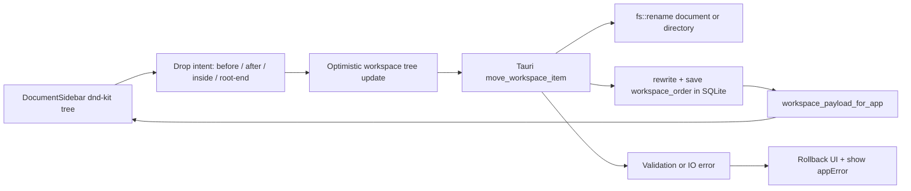

# fix: Support arbitrary knowledge-base tree drag sorting

## Overview

修复当前目录树拖拽排序无效和能力不足的问题。目标是在同一个知识库内，让目录和文档可以流畅地任意拖拽：同级重排、文档移入/移出目录、目录重排、目录移入其他目录，并把文件系统位置与 SQLite 顺序数据保持一致。

---

## Problem Frame

当前 `DocumentSidebar` 使用原生 HTML5 drag/drop，并在 drop 时要求 `sourceParentPath === node.parentPath`，所以只能尝试同一父目录内排序。`AppController.moveNode` 只更新扁平 `workspace_order`，不会移动本地 `.lake` 文件或目录；因此跨目录拖拽从产品角度不成立。用户明确补充：拖拽范围是“同一个知识库里面可以任意拖拽”，所以本计划不支持跨知识库拖拽，但要覆盖当前知识库内任意目录/文档位置变更。

---

## Requirements Trace

- R1. 当前知识库内的文档和目录节点都可以作为拖拽源。
- R2. 拖拽目标支持同级前后排序、拖入目录、拖到根目录空白区域或列表末尾。
- R3. 跨父目录移动必须同步本地文件系统路径：文档移动 `.lake` 文件，目录移动整个目录树。
- R4. 拖拽完成后必须把新的树顺序保存到 SQLite，重启应用后顺序保持一致。
- R5. 拖拽交互要流畅：有拖拽预览、落点指示、禁止非法落点，不依赖浏览器原生拖拽的粗糙反馈。
- R6. 不允许把目录拖入自身或自己的子孙目录；命名冲突、缺失文件、权限错误要给出明确错误。
- R7. 当前打开文档被移动后，编辑区继续指向移动后的新路径，不丢内容、不误保存到旧路径。

**Origin actors:** A1 个人用户, A2 桌面 App。

**Origin flows:** F1 选择知识库目录, F2 新建并编辑 Lake 文档。

**Origin acceptance examples:** AE1 目录与文件打开, AE2 新建编辑保存。

---

## Scope Boundaries

- 不支持跨知识库拖拽。
- 不实现搜索、标签、反链、图谱。
- 不改变 `.lake` 主存储格式。
- 不在拖拽中自动解决同名冲突；第一版冲突时阻止移动并提示。
- 不做复杂多选批量拖拽。

---

## Context & Research

### Relevant Code and Patterns

- `src/components/DocumentSidebar.tsx` 已有目录树渲染、行操作、原生 drag/drop 入口，是主要前端改造点。
- `src/features/workspace/workspaceStore.ts` 已有 `buildDocumentTree`、`flattenTreeOrder`，但当前树排序是按路径 itemId 扁平化，跨目录移动后 itemId 会变化。
- `src/app/AppController.tsx` 当前 `moveNode` 只调用 `saveWorkspaceOrder`，需要升级为“移动节点 + 保存顺序”的工作流。
- `src/lib/tauri.ts` 负责前端调用 Tauri command，适合新增 `moveWorkspaceItem` 封装。
- `src-tauri/src/commands/workspace.rs` 已有目录重命名、删除、`save_workspace_order`，适合新增同知识库内移动命令。
- `src-tauri/src/storage/app_database.rs` 已用 SQLite 表 `workspace_order` 保存顺序，并有路径 rewrite/prune 工具，可复用到移动后的路径更新。
- `src/components/documentSidebar.test.tsx`、`src/features/workspace/workspaceStore.test.ts`、`src/app/AppController.test.tsx`、`src-tauri/tests/workspace_commands.rs` 是主要测试入口。

### Institutional Learnings

- 仓库暂无 `docs/solutions/`；本计划直接基于当前实现和用户反馈。

### External References

- dnd kit 官方文档说明 sortable 依赖 `DndContext` + `SortableContext` + `useSortable`，`items` 顺序必须与渲染顺序一致。
- dnd kit 官方文档建议 scrollable 或超过视口的列表使用 `DragOverlay`，避免拖拽预览受正常文档流影响。
- npm 当前 `@dnd-kit/sortable` 包为 MIT 许可，提供 TypeScript 类型，适合作为 React 拖拽排序基础。

---

## Key Technical Decisions

- 用 `@dnd-kit/core` + `@dnd-kit/sortable` 替换原生 HTML5 drag/drop：当前问题需要更细的落点判断、拖拽 overlay、pointer/keyboard sensor 和顺滑动画，原生 drag/drop 不适合作为长期基础。
- 前端以“扁平可见树 + 深度信息”驱动拖拽：渲染仍保持树形视觉，但拖拽计算使用按当前显示顺序展开的数组，便于判断 before/after/inside/root-end。
- 后端提供原子移动命令：跨目录移动必须由 Rust 侧做路径校验和 `fs::rename`，前端不能只改顺序。
- SQLite 只保存当前知识库的显示顺序：文档内容仍在 `.lake` 文件中，排序和最近工作区等配置继续放 SQLite。
- 拖拽完成后乐观更新 UI，后端失败时回滚到原 workspace payload 并显示错误：保证流畅感，同时不牺牲数据一致性。

---

## Open Questions

### Resolved During Planning

- 是否支持跨知识库拖拽：不支持，用户明确限定为同一个知识库内。
- 是否允许任意跨目录拖拽：支持，目录和文档都可以在当前知识库内移动。
- 是否只改 SQLite 顺序：不可以，跨父目录时必须移动文件系统实体。

### Deferred to Implementation

- dnd kit 的最终落点算法细节：实现时根据真实 UI 高度微调 before/after/inside 阈值。
- 目录拖入目录时是否自动展开目标目录：第一版可做轻量延迟展开；若实现复杂，可先通过明确 inside drop indicator 完成。

---

## High-Level Technical Design

> This illustrates the intended approach and is directional guidance for review, not implementation specification. The implementing agent should treat it as context, not code to reproduce.

---

## Implementation Units

- U1. **Model Tree Moves Explicitly**

**Goal:** 建立可表达任意同知识库拖拽的类型和纯函数，避免 UI 和后端各自猜测移动语义。

**Requirements:** R1, R2, R4, R6。

**Dependencies:** None。

**Files:**
- Modify: `src/features/workspace/workspaceStore.ts`
- Test: `src/features/workspace/workspaceStore.test.ts`

**Approach:**
- 增加扁平树节点模型，包含 `itemId`、`path`、`parentPath`、`depth`、`type`、`children` 基础信息。
- 增加 drop intent 类型：`before`、`after`、`inside`、`root-end`。
- 增加纯函数用于从当前树和 drop intent 计算目标父目录、相邻顺序和非法落点。
- 明确禁止目录移动到自身或子孙目录。

**Patterns to follow:**
- 继续复用 `buildDocumentTree` 的 itemId 规则：`folder:<path>`、`document:<path>`。
- 保持 `workspaceStore.ts` 为无副作用数据转换层。

**Test scenarios:**
- Happy path: 文档从根目录拖入目录 -> 计算出的目标父目录为该目录路径。
- Happy path: 文档从目录拖到根列表末尾 -> 计算出的目标父目录为空字符串，排序落在末尾。
- Happy path: 目录拖到另一个目录内部 -> 目标父目录为目标目录路径。
- Edge case: 目录拖入自身 -> 返回非法落点。
- Edge case: 目录拖入自己的子孙目录 -> 返回非法落点。
- Edge case: drop 到同一位置 -> 标记为 no-op，避免多余保存。

**Verification:**
- 纯函数能覆盖拖拽语义，不依赖 DOM 事件也能判断合法移动。

---

- U2. **Replace Native Drag With Smooth dnd-kit Sidebar Interaction**

**Goal:** 用 dnd kit 重做目录树拖拽 UI，使任意拖拽有稳定手柄、预览、落点指示和流畅反馈。

**Requirements:** R1, R2, R5, R6。

**Dependencies:** U1。

**Files:**
- Modify: `package.json`
- Modify: `package-lock.json`
- Modify: `src/components/DocumentSidebar.tsx`
- Modify: `src/styles/app.css`
- Test: `src/components/documentSidebar.test.tsx`

**Approach:**
- 引入 `@dnd-kit/core`、`@dnd-kit/sortable`、`@dnd-kit/utilities`。
- 用 `DndContext`、sensor、`DragOverlay` 包住文档树；每一行用 drag handle 激活拖拽，避免点击文档、重命名、删除时误触拖拽。
- 渲染时使用扁平可见树，按 depth 设置缩进，保留当前视觉上的树结构。
- 拖拽过程中根据 pointer 相对目标行的 Y 坐标和目标类型展示 before/after/inside 指示。
- 对非法落点显示禁止样式，不触发 move。
- 保留键盘打开文档、按钮操作和当前文档高亮。

**Patterns to follow:**
- 现有 `TreeNode` 的图标、行操作、当前文档高亮样式。
- dnd kit 官方推荐的 `DragOverlay` 模式用于滚动列表。

**Test scenarios:**
- Happy path: 拖动文档到另一个文档后方 -> `onMoveNode` 收到 after intent。
- Happy path: 拖动文档到目录内部区域 -> `onMoveNode` 收到 inside intent。
- Happy path: 拖动目录到根列表末尾 -> `onMoveNode` 收到 root-end intent。
- Edge case: 点击重命名/删除按钮 -> 不触发拖拽，不触发打开文档。
- Edge case: 非法落点 -> 不调用 `onMoveNode`，显示不可投放状态。
- Integration: 展开目录中的子文档仍可拖拽，拖拽 overlay 显示当前节点标题。

**Verification:**
- 侧边栏拖拽不再依赖原生 `draggable` 属性，拖动时有可见 overlay 和落点线，点击操作不被拖拽干扰。

---

- U3. **Add Backend Move Command For Documents And Directories**

**Goal:** 在 Tauri 后端实现同知识库内节点移动，负责文件系统变更、路径校验、冲突检查和 SQLite 顺序更新。

**Requirements:** R3, R4, R6, R7。

**Dependencies:** U1。

**Files:**
- Modify: `src-tauri/src/commands/workspace.rs`
- Modify: `src-tauri/src/lib.rs`
- Modify: `src-tauri/src/models.rs`
- Modify: `src-tauri/src/storage/app_database.rs`
- Test: `src-tauri/tests/workspace_commands.rs`
- Test: `src-tauri/tests/app_database.rs`

**Approach:**
- 新增 `move_workspace_item` command，输入 source itemId、目标父目录、排序锚点或最终 order。
- 使用当前 workspace root 解析源路径和目标路径，所有路径必须留在 root 内。
- 文档移动时移动 `.lake` 文件；目录移动时移动目录树。
- 目标路径已存在时返回冲突错误，不覆盖。
- 目录不能移动到自身或子孙目录。
- 移动成功后重写受影响 itemId：目录移动需要同步所有子目录/子文档的 order path。
- 最后保存新的 `workspace_order` 到 SQLite，并返回最新 `WorkspacePayload`。

**Patterns to follow:**
- `rename_lake_directory`、`rename_lake_document` 的路径 rewrite 和 workspace payload 返回模式。
- `rewrite_workspace_order_path`、`prune_workspace_order_path` 的 SQLite 更新模式。

**Test scenarios:**
- Happy path: 根文档移动到目录 -> 文件出现在目录下，payload 文档 `parentPath` 更新。
- Happy path: 目录移动到另一个目录 -> 整个目录树移动，子文档路径同步。
- Happy path: 同级排序不改变文件路径，只更新 SQLite order。
- Edge case: 目录移动到自身 -> 返回错误，文件系统不变。
- Edge case: 目录移动到子目录 -> 返回错误，文件系统不变。
- Error path: 目标存在同名文档或目录 -> 返回冲突错误，SQLite 不更新。
- Error path: source itemId 不存在 -> 返回明确错误。
- Integration: 移动后重新读取 workspace payload，顺序和路径与预期一致。

**Verification:**
- 后端移动命令能独立保障数据一致性，前端即使传错非法目标也不会破坏知识库。

---

- U4. **Wire App State, Current Document, And Error Rollback**

**Goal:** 把前端拖拽意图接到后端移动命令，并确保当前打开文档路径随移动更新。

**Requirements:** R3, R4, R6, R7。

**Dependencies:** U1, U2, U3。

**Files:**
- Modify: `src/app/AppController.tsx`
- Modify: `src/lib/tauri.ts`
- Test: `src/app/AppController.test.tsx`

**Approach:**
- 用新的 `moveWorkspaceItem` 替换当前 `saveWorkspaceOrder` 式 `moveNode`。
- 拖拽完成后先基于 U1 纯函数做乐观排序，让 UI 立即反馈。
- 后端返回 payload 后用真实 payload 覆盖乐观状态。
- 如果当前打开文档被移动，基于后端返回的路径找到新 document entry，更新 `currentDocument.entry`，避免保存到旧路径。
- 后端失败时恢复拖拽前 workspace，展示 `appError`。

**Patterns to follow:**
- 当前 create/rename/delete 文档后刷新 workspace 和 currentDocument 的模式。
- `toMessage(error)` 的错误展示路径。

**Test scenarios:**
- Happy path: 拖动非当前文档后，workspace 使用后端 payload 更新。
- Happy path: 拖动当前打开文档到目录后，`currentDocument.entry.path` 更新为新路径。
- Edge case: 后端返回的新路径找不到当前文档 -> 清空当前文档或显示错误，不能继续保存旧路径。
- Error path: 后端移动失败 -> workspace 回滚到拖拽前，显示错误信息。
- Integration: 成功移动后不额外调用旧 `saveWorkspaceOrder`。

**Verification:**
- 前端状态、当前编辑文档和后端 payload 在拖拽后保持一致。

---

- U5. **Persist And Verify Real App Drag Behavior**

**Goal:** 用自动化和真实桌面验证覆盖拖拽体验、SQLite 持久化和重启恢复。

**Requirements:** R2, R4, R5, R7。

**Dependencies:** U1, U2, U3, U4。

**Files:**
- Modify: `README.md`
- Test: `src/components/documentSidebar.test.tsx`
- Test: `src/app/AppController.test.tsx`
- Test: `src-tauri/tests/workspace_commands.rs`

**Approach:**
- README 只补充必要的拖拽行为说明和验证入口，避免扩展无关文档。
- 使用单元测试覆盖纯函数、组件事件和后端命令。
- 使用 Computer Use 在 Tauri dev 应用中真实拖拽：文档进目录、目录换序、目录移到根、重启后顺序保持。
- 验证 SQLite `workspace_order` 中顺序变化，并确认 `.lake` 文件真实移动。

**Patterns to follow:**
- 既有 README 的开发/验证说明风格。
- 现有 Tauri dev + Computer Use 验证方式。

**Test scenarios:**
- Integration: 文档拖入目录后，应用侧边栏立即显示在目录下，磁盘路径同步变化。
- Integration: 目录拖到根列表不同位置后，重启应用顺序不变。
- Integration: 文档拖到根列表末尾后，SQLite order 与 UI 顺序一致。
- Error path: 制造同名冲突后拖拽，UI 回滚并显示错误。

**Verification:**
- 自动测试通过，真实 Tauri 窗口中拖拽流畅、顺序持久、路径正确。

---

## System-Wide Impact

- **Interaction graph:** `DocumentSidebar` 触发拖拽意图，`AppController` 管理乐观状态和后端同步，Tauri command 负责文件系统和 SQLite。
- **Error propagation:** 后端校验/IO 错误通过 `AppError` -> `toMessage` 显示；前端失败必须回滚。
- **State lifecycle risks:** 当前打开文档移动后路径变化是最大风险，必须同步 `currentDocument.entry`。
- **API surface parity:** 浏览器 preview fallback 也需要支持同样的 `moveWorkspaceItem` 语义，便于组件测试和非 Tauri 预览。
- **Integration coverage:** 单元测试无法证明 WebView 拖拽手感，必须用 Computer Use 做真实验证。
- **Unchanged invariants:** `.lake` 内容格式不变；OSS 设置和上传流程不变；跨知识库仍不支持。

---

## Risks & Dependencies

| Risk | Mitigation |
|------|------------|
| 跨目录移动导致文件路径变化，当前文档仍保存旧路径 | U4 移动成功后用 payload 重新绑定当前文档 entry |
| 目录移动到自身子目录造成递归路径破坏 | U1 和 U3 都做非法落点校验，后端是最终防线 |
| dnd kit 树形拖拽实现过复杂 | 使用扁平可见树和明确 drop intent，不实现多选和跨知识库 |
| 同名冲突覆盖用户文件 | 后端移动前检查目标路径存在，第一版直接阻止并提示 |
| 拖拽动画与侧边栏滚动不流畅 | 使用 dnd kit sensor、`DragOverlay` 和轻量 CSS transform，不在拖拽过程中频繁写 SQLite |

---

## Documentation / Operational Notes

- README 只补充拖拽行为和验证说明。
- 新增依赖后需要更新 `package-lock.json`。
- 实现完成后必须用 Computer Use 验证真实 Tauri 窗口拖拽，不只依赖 jsdom 测试。

---

## Sources & References

- **Origin document:** [docs/brainstorms/2026-04-26-lake-first-notes-requirements.md](../brainstorms/2026-04-26-lake-first-notes-requirements.md)
- Related plan: [docs/plans/2026-04-26-001-feat-lake-first-notes-app-plan.md](2026-04-26-001-feat-lake-first-notes-app-plan.md)
- Related code: `src/components/DocumentSidebar.tsx`
- Related code: `src/features/workspace/workspaceStore.ts`
- Related code: `src/app/AppController.tsx`
- Related code: `src-tauri/src/commands/workspace.rs`
- External docs: [dnd kit sortable preset](https://docs.dndkit.com/presets/sortable)
- External docs: [dnd kit overview](https://docs.dndkit.com/)
- External package: [@dnd-kit/sortable npm](https://www.npmjs.com/package/%40dnd-kit/sortable)
