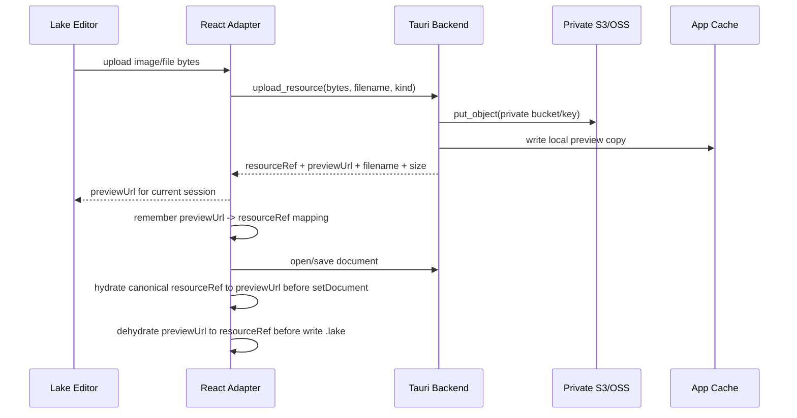

# feat: Secure private resource access and export sharing

## Overview

当前图片和附件上传后依赖 `publicBaseUrl + object key` 回显，等价于要求 S3/OSS 桶或对象路径可公网只读。这个计划把资源访问模型改为“私有桶 + 应用内安全预览 + 导出资源打包”：编辑态不再依赖公开对象 URL，附件下载不再让浏览器直接打开 OSS UUID 路径，导出时把资源作为本地包的一部分交付，必要时再提供短时签名链接方案。

---

## Problem Frame

来源需求要求图片上传到用户自己的 S3 兼容 OSS 并能在 Lake 编辑器中回显。实现推进后，附件上传、HTML/PDF/Markdown 导出也进入实际使用范围。现在的风险点是把“能回显”建立在“桶公开读”上：只要知道对象 URL，任何人都可以读取资源；UUID key 只能降低猜中概率，不能作为访问控制。更合理的模型是桶默认私有，桌面 App 持有用户配置的凭据，在编辑态按需生成本地预览资源或短时签名访问，在导出态生成可离线交付的资源包。

---

## Requirements Trace

- R1. 用户不需要把 S3/OSS bucket 或资源前缀配置为公开只读，也能在编辑器中上传、回显图片。
- R2. 附件上传后不暴露永久公开 URL；下载时使用原文件名，并由 Tauri 后端通过私有对象信息读取。
- R3. `.lake` 主存储仍是 Lake 内容，不切换到 Markdown-first 或云同步模型。
- R4. 文档保存内容不得持久化短时签名 URL；签名 URL 或本地预览 URL只允许作为会话态/导出态中间产物。
- R5. HTML、PDF、Markdown、知识库 ZIP 导出需要把图片和附件一起处理，并支持两种资源策略：短时签名链接和本地资源包。
- R6. 导出为短时签名链接时，用户必须能选择有效期，签名 URL 只写入导出产物，不写回 `.lake` 主文档。
- R7. 导出为本地资源包时，接收方不需要访问用户的私有桶；资源应随 HTML/Markdown/知识库 ZIP 一起交付。
- R8. 前端 WebView 不直接持有 S3 secret；上传、下载、签名、私有对象读取都由 Tauri 后端命令完成。
- R9. CSP 和 Tauri capability 应收敛到应用需要的最小资源访问面，避免继续允许任意 `http:`/`https:` 资源加载。

**Origin actors:** A1 个人用户, A2 桌面 App, A3 S3 兼容 OSS, A4 语雀编辑器。

**Origin flows:** F3 图片上传到 OSS。

**Origin acceptance examples:** AE3 图片上传后能继续显示；本计划强化其安全前提。

---

## Scope Boundaries

### Deferred for later

- 多用户协作、权限组、分享访问统计。
- 自建云端分享服务或公网代理服务。
- WebDAV、MinIO 以外的独立资源 provider 抽象重写。
- 对历史已公开泄露 URL 的撤销治理；实现只负责新模型和可识别旧链接的迁移提示。
- OS Keychain/Stronghold 凭据存储增强；本计划继续保持“前端不持有 secret”，但不强制迁移 SQLite 设置存储。

### Outside this product's identity

- 不做语雀云同步工具。
- 不做公开图床。
- 不做团队级对象存储权限管理平台。

### Deferred to Follow-Up Work

- 如果后续需要跨设备无数据库迁移，可再设计资源 manifest 文件；本计划优先让单机 App 安全可用。
- 如果需要大文件断点续传或多分片下载，可在资源模型稳定后独立规划。

---

## Context & Research

### Relevant Code and Patterns

- `src-tauri/src/storage/s3.rs` 当前只实现 `put_object`、`build_public_url`，上传后直接返回 `publicBaseUrl + key`。
- `src-tauri/src/commands/upload.rs` 的 `upload_image` / `upload_file` 都复用上传逻辑，附件 key 固定进 `files/`，图片进入配置的 `imagePrefix`。
- `src/features/lake-editor/uploadAdapter.ts` 将 Lake 编辑器传入的图片/附件转成 bytes，再调用前端 Tauri API 上传。
- `src/features/lake-editor/lakeEditorAdapter.ts` 对 file card 做了下载 toolbar 和 `downloadFileHandler`，但下载输入仍是 URL + 文件名。
- `src/lib/tauri.ts` 的 `downloadExternalFile` 在 Tauri 中选择保存路径后调用 `download_external_file(url, path)`，后端用 `reqwest::get` 直接拉 URL。
- `src-tauri/tauri.conf.json` 当前 CSP 允许 `img-src ... https: http:` 和 `connect-src ... https: http:`，这使任意远程资源都能进入编辑器渲染面。
- `src/features/lake-editor/lakeExport.ts` 已经集中处理 HTML、PDF、Markdown、知识库 ZIP 导出，是资源打包与链接重写的主要落点。

### Institutional Learnings

- 既有 Lake 编辑器运行时资源本地化经验说明：这类问题应优先在 adapter/export 的资源入口解决，而不是在 React 渲染层做补丁。编辑态和导出态都需要明确资源 URL 的生成方式。

### External References

- Amazon S3 Block Public Access：默认应避免公开 bucket/object，Block Public Access 可在 bucket/account 层阻断公开 ACL 和公开策略。
- Amazon S3 presigned URLs：可用短时签名 URL 临时授权对象访问，但不应持久化到文档。
- AWS SDK for Rust presigned URLs：`aws-sdk-s3` 支持在 `get_object` / `put_object` builder 上调用 `presigned()`，可生成短时请求。
- CloudFront signed URLs/cookies：需要在线分发私有内容时，可用 CDN 私有内容签名控制过期时间和访问限制。
- S3 CORS：浏览器直接访问 S3 时需要 CORS，但本计划优先走 Tauri 后端/本地预览，减少 WebView 直接跨域读取私有桶。
- Tauri CSP 与 capabilities：CSP 应尽量限制可加载资源；capabilities 应把前端能调用的本地能力控制在必要范围内。

---

## Key Technical Decisions

- 桶默认私有，关闭公开读：不再要求用户配置公开 bucket policy；保留 S3 兼容 endpoint、bucket、region、path-style 等配置。
- 文档里保存 canonical resource reference，不保存公开 URL 或签名 URL：采用内部资源引用，例如 `yuque-resource://<bucket>/<key>?name=...&type=...&size=...`，作为 `.lake` 内容中可持久化、可解析的资源地址。
- 编辑器打开前 hydrate，保存前 dehydrate：加载 `.lake` 时把 canonical reference 转换为当前会话可用的本地预览 URL；保存时把本地预览 URL 归一化回 canonical reference，避免把 `asset:`、临时文件路径或 presigned URL 写入文件。
- 预览优先使用本地资源缓存和 Tauri asset protocol：Rust 后端用 S3 SDK 读取私有对象到应用缓存目录，前端用 `asset:` / `http://asset.localhost` 这类本地 URL 给 Lake 编辑器渲染，减少 WebView 对私有桶的直接网络访问。
- presigned GET 只作为兼容 fallback 或临时在线分享能力：如果某些 S3 兼容服务或 WebView 资源加载限制导致本地 asset 预览不可用，再生成短时 GET URL，但该 URL 必须有 TTL 且不得保存进 `.lake`。
- 附件下载由资源引用驱动：点击附件时传 `resourceRef + filename` 给 Tauri，后端通过私有对象 key 下载，保存对话框默认使用 Lake card 里的原文件名。
- 导出资源策略分为两种明确模式：`本地资源包` 将图片和附件下载到导出目录或 ZIP 的 `assets/` / `attachments/` 下并重写为相对路径；`短时签名链接` 将资源引用重写为带有效期的 S3 presigned URL 或 CloudFront signed URL。
- 短时签名链接必须由用户选择有效期：前端提供预设时间和自定义时间输入，后端按最大 TTL 校验；签名 URL 只存在于导出产物，不写回 `.lake`。
- 收紧 CSP：导出前不再依赖任意 `https:`/`http:` 图片加载；编辑态只允许 `self`、`asset:`、`blob:`、`data:` 和经过配置/生成的必要本地资源源。

---

## Open Questions

### Resolved During Planning

- 是否继续使用公开 URL 回显：不继续。公开 URL 是当前安全问题的根因。
- 是否把 presigned URL 直接写入 `.lake`：不写入。签名 URL 会过期，也会把临时授权泄漏到文档历史。
- 是否需要接收方访问用户的私有桶才能看导出内容：取决于导出资源策略。选择本地资源包时不需要；选择短时签名链接时，接收方只能在有效期内访问。
- 是否让前端直连 S3：不作为主路径。前端不持有 secret，私有读取与签名由 Tauri 后端完成。

### Deferred to Implementation

- Lake 图片节点的精确属性结构：实现时需要用真实 `text/lake` 输出确认图片 src、alt、card data 的最终重写位置。
- Tauri asset protocol 的具体 URL 形式：实现时根据 Tauri v2 当前 API 选择 `asset:`/`convertFileSrc` 或自定义本地命令返回可渲染 URL。
- S3 兼容服务的 presign 兼容性：AWS SDK 支持标准 S3 presign；具体兼容厂商若不支持，需要走后端缓存下载路径。
- 导出单文件 HTML 是否内联附件：图片可以内联为 data URL；附件通常应放 ZIP，避免把大文件 base64 塞进单 HTML。短时签名链接模式可生成单 HTML，但资源会在有效期后失效。

---

## High-Level Technical Design

> *This illustrates the intended approach and is directional guidance for review, not implementation specification. The implementing agent should treat it as context, not code to reproduce.*

---

## Implementation Units

- U1. **Define private resource references and document normalization**

**Goal:** 建立 `.lake` 内可持久化的资源引用格式，并提供 hydrate/dehydrate 工具，使编辑器会话 URL 和文档存储 URL 分离。

**Requirements:** R1, R2, R3, R4, R8

**Dependencies:** None

**Files:**
- Create: `src/features/lake-editor/resourceReference.ts`
- Test: `src/features/lake-editor/resourceReference.test.ts`
- Modify: `src/features/lake-editor/LakeEditor.tsx`
- Modify: `src/features/lake-editor/lakeEditorAdapter.ts`
- Modify: `src/app/appState.ts`

**Approach:**
- 定义 canonical resource reference，例如 `yuque-resource://<bucket>/<key>`，并把原文件名、MIME、size、kind 作为结构化字段保存。
- 为 Lake HTML 中的图片 src、file/localdoc card value 提供解析和重写工具。
- 加载文档时把 canonical reference hydrate 为当前会话 preview URL。
- 保存文档时把 preview URL 或可识别的旧 OSS URL dehydrate 为 canonical reference。
- 保留一个会话级映射表，记录 upload/preview 过程中 `previewUrl -> resourceRef` 的关系。

**Patterns to follow:**
- `src/features/lake-editor/lakeExport.ts` 中集中解析 Lake HTML/card value 的方式。
- `src/features/lake-editor/lakeEditorAdapter.ts` 对 file card data 的解析和 normalize 入口。

**Test scenarios:**
- Happy path: 给定 `yuque-resource://bucket/images/2026/05/a.png`，解析得到 bucket、key、kind、filename 元数据。
- Happy path: 图片 src 中的 canonical reference 被 hydrate 为 preview URL；dehydrate 后恢复为 canonical reference。
- Happy path: file card value 中的 canonical reference 被 hydrate/dehydrate，原文件名和 size 不丢失。
- Edge case: 无法识别的外部 `https://example.com/a.png` 不被误改。
- Edge case: 旧的 `publicBaseUrl + key` 在能匹配当前 bucket 配置时可转换为 canonical reference。
- Error path: malformed resource reference 不抛出全局渲染错误，只保留原值并返回诊断信息。

**Verification:**
- `.lake` 保存内容不包含 `asset:`、临时文件路径或 presigned query 参数。
- 新上传的图片/附件重新打开后仍能回显或下载。

---

- U2. **Add private S3 read, cache, and signed access backend commands**

**Goal:** 在 Tauri 后端补齐私有对象读取、资源缓存、短时签名和私有附件下载能力。

**Requirements:** R1, R2, R4, R6, R8

**Dependencies:** U1

**Files:**
- Modify: `src-tauri/src/storage/s3.rs`
- Create: `src-tauri/src/commands/resources.rs`
- Modify: `src-tauri/src/commands/mod.rs`
- Modify: `src-tauri/src/lib.rs`
- Modify: `src-tauri/src/models.rs`
- Test: `src-tauri/tests/upload_commands.rs`
- Test: `src-tauri/tests/external_commands.rs`
- Create: `src-tauri/tests/resource_commands.rs`

**Approach:**
- 抽出 S3 client 构造逻辑，供 `put_object`、`get_object`、`presign_get_object` 复用。
- 增加 `prepare_resource_preview(resourceRef)`：校验引用属于当前配置的 bucket/prefix，读取私有对象到应用缓存目录，返回本地 preview URL。
- 增加 `download_resource(resourceRef, path)`：按资源引用读取对象并写入用户选择路径，不通过浏览器 GET。
- 增加可配置 TTL 的 `create_temporary_resource_url(resourceRef, ttl)`，仅用于显式在线分享或 fallback。
- 对 key 做 prefix allowlist 校验，默认只允许 `images/` 和 `files/` 或配置中声明的资源前缀。

**Patterns to follow:**
- `src-tauri/src/commands/upload.rs` 现有设置加载、校验和错误映射方式。
- `src-tauri/src/commands/external.rs` 现有保存路径写入方式，但下载来源改为 S3 SDK。

**Test scenarios:**
- Happy path: private image resource 准备预览时写入缓存并返回本地 URL。
- Happy path: private file resource 下载时使用传入原文件名对应的保存路径。
- Happy path: presigned URL 生成结果包含过期时间配置，且不会写入文档内容。
- Edge case: resourceRef bucket 与当前设置不一致时拒绝读取。
- Edge case: key 不在允许前缀内时拒绝读取，防止文档伪造任意 bucket key。
- Error path: S3 认证失败、对象不存在、网络失败时返回明确错误，前端不白屏。

**Verification:**
- 不开启 bucket 公共读也能完成上传、重新打开、预览和下载。
- 后端命令不会接受任意公网 URL 作为私有资源下载入口。

---

- U3. **Wire secure resource access into editor upload, preview, and file actions**

**Goal:** 将图片/附件上传、回显、预览和下载都切到资源引用模型，保持 Lake 编辑体验不变。

**Requirements:** R1, R2, R3, R4, R8

**Dependencies:** U1, U2

**Files:**
- Modify: `src/features/lake-editor/uploadAdapter.ts`
- Modify: `src/features/lake-editor/lakeEditorAdapter.ts`
- Modify: `src/features/lake-editor/LakeEditor.tsx`
- Modify: `src/app/AppController.tsx`
- Modify: `src/lib/tauri.ts`
- Test: `src/features/lake-editor/uploadAdapter.test.ts`
- Test: `src/features/lake-editor/lakeEditorAdapter.test.ts`
- Test: `src/features/lake-editor/LakeEditor.test.tsx`
- Test: `src/app/AppController.test.tsx`

**Approach:**
- 上传成功后，前端返回 Lake 编辑器当前会话可渲染的 `previewUrl`，同时记录 canonical resource reference。
- 编辑器 `setDocument` 前调用 hydrate，使已有 canonical resource reference 转为 preview URL。
- 编辑器保存、导出读取 Lake 内容前调用 dehydrate，使会话 preview URL 回写为 canonical resource reference。
- 附件 toolbar 下载不再传 URL 给 `downloadExternalFile`；改为传 resourceRef 和 filename 给新下载命令。
- 对非本应用管理的外部 URL 保留现有“外部资源”行为，但不把它当作私有资源处理。

**Patterns to follow:**
- `src/features/lake-editor/lakeEditorAdapter.ts` 现有 file card toolbar 绑定方式。
- `src/app/AppController.tsx` 现有上传失败时打开设置页的处理方式。

**Test scenarios:**
- Happy path: 插入本地图片后编辑器收到 preview URL；保存的 `.lake` 内容包含 canonical resource reference。
- Happy path: 重新打开包含 canonical image reference 的文档，编辑器 setDocument 接收 hydrated preview URL。
- Happy path: 附件点击下载时使用原文件名和 resourceRef 调用 Tauri，不使用 OSS UUID URL。
- Edge case: 同一文档内多张图片映射到不同 preview URL，不互相覆盖。
- Edge case: 编辑器复制/移动节点后仍可通过内容中的 canonical reference 重新 hydrate。
- Error path: preview 准备失败时显示可理解错误，并保留文档内容不被破坏。

**Verification:**
- 在私有 bucket 下，图片上传后立即显示；重启 App 后仍能显示。
- 附件下载保存名为 Lake card 中的 `name`，不是对象 key 的 UUID 文件名。

---

- U4. **Support export resource strategies**

**Goal:** 导出 HTML、PDF、Markdown、知识库 ZIP 时自动处理图片和附件，并让用户在“短时签名链接”和“本地资源包”两种资源策略中选择。

**Requirements:** R5, R6, R7

**Dependencies:** U1, U2, U3

**Files:**
- Modify: `src/features/lake-editor/lakeExport.ts`
- Modify: `src/app/AppController.tsx`
- Modify: `src/components/TopBar.tsx`
- Modify: `src/lib/tauri.ts`
- Modify: `src-tauri/src/commands/documents.rs`
- Modify: `src-tauri/src/commands/resources.rs`
- Test: `src/features/lake-editor/lakeExport.test.ts`
- Test: `src/app/AppController.test.tsx`
- Test: `src/components/TopBar.test.tsx`
- Test: `src-tauri/tests/resource_commands.rs`

**Approach:**
- 导出入口增加资源策略选择：`本地资源包` 和 `短时签名链接`。默认选 `本地资源包`，因为它不依赖接收方访问私有桶。
- `短时签名链接` 模式要求选择有效期：提供常用预设（如 1 小时、24 小时、7 天）和自定义输入；前端只提交 TTL，后端按配置的最大 TTL 校验。
- `本地资源包` 模式下，单篇 HTML 导出生成 ZIP，结构为 `index.html`、`assets/`、`attachments/`；HTML 中图片和附件链接重写为相对路径。
- `本地资源包` 模式下，单篇 Markdown 导出生成 ZIP，Markdown 文件引用相对资源路径；知识库 ZIP 按目录顺序输出 md，并携带每篇文档需要的资源。
- `短时签名链接` 模式下，HTML/Markdown 导出可保持单文件或纯文本产物，资源引用被重写为带有效期的 signed URL；导出产物中应标明链接有效期。
- PDF 导出始终走本地可读资源路径或 data URL，因为 PDF 是静态产物，短时链接没有必要写入 PDF；生成 PDF 时不请求公开 OSS URL。
- 附件在 `短时签名链接` 模式下生成带原文件名响应头的 signed URL，尽量保证接收方下载时使用语雀里的原文件名。

**Patterns to follow:**
- `src/features/lake-editor/lakeExport.ts` 现有 HTML 大纲、附件块、ZIP 写入逻辑。
- `src-tauri/src/commands/documents.rs` 现有 PDF 从 HTML 生成方式。

**Test scenarios:**
- Happy path: 选择本地资源包导出 HTML 时，ZIP 包含 `index.html`、图片文件和附件文件，HTML 引用相对路径。
- Happy path: 选择本地资源包导出 Markdown 时，ZIP 包含 `.md`、`assets/` 和 `attachments/`，Markdown 引用相对路径。
- Happy path: 选择短时签名链接导出 HTML 时，HTML 中图片和附件链接为 signed URL，并展示有效期提示。
- Happy path: 选择短时签名链接导出 Markdown 时，Markdown 中图片和附件链接为 signed URL，不额外生成资源文件。
- Happy path: 知识库 ZIP 按当前目录顺序输出 md；本地资源包模式包含资源文件，短时签名模式只重写链接。
- Happy path: PDF 导出时 HTML 中图片已被替换为本地可读资源或 data URL，生成过程不访问公开 URL。
- Edge case: 用户选择超过最大 TTL 的签名有效期时导出被拒绝，并提示允许范围。
- Edge case: 两个资源原文件名相同但 key 不同，本地资源包内文件名不会冲突。
- Edge case: 附件体积较大时不内联到单 HTML，本地资源包模式放入 ZIP，短时签名模式写链接。
- Error path: 本地资源包模式下某个私有资源下载失败时，导出失败并提示具体资源名，不能静默生成缺资源文件。
- Error path: 短时签名模式下某个资源签名失败时，导出失败并提示具体资源名，不能回退到公开 URL。

**Verification:**
- 本地资源包模式：断网环境打开导出的 HTML ZIP 解压内容，图片和附件可用。
- 短时签名链接模式：接收方无需 S3 凭据、无需公开 bucket policy，可在用户选择的有效期内访问资源；过期后资源不可访问。

---

- U5. **Update settings, CSP, and documentation for private resource mode**

**Goal:** 把配置界面和文档从“公开访问 URL 必填”调整为“私有桶默认 + 导出资源策略 + 可选临时分享/CDN 配置”，并收紧 WebView 安全边界。

**Requirements:** R1, R5, R6, R7, R9

**Dependencies:** U1, U2, U3, U4

**Files:**
- Modify: `src/app/appState.ts`
- Modify: `src/features/settings/OssSettingsPanel.tsx`
- Modify: `src/features/settings/ossSettingsStore.ts`
- Modify: `src-tauri/src/commands/settings.rs`
- Modify: `src-tauri/src/models.rs`
- Modify: `src-tauri/tauri.conf.json`
- Modify: `src-tauri/capabilities/default.json`
- Modify: `README.md`
- Test: `src/features/settings/OssSettingsPanel.test.tsx`
- Test: `src-tauri/tests/oss_settings.rs`

**Approach:**
- 将 `publicBaseUrl` 从核心必填项降级为兼容旧链接/可选 CDN base URL，不再作为编辑预览前提。
- 增加资源前缀配置：图片前缀、附件前缀、允许读取前缀。
- 增加导出资源策略配置：默认策略、本地资源包说明、短时签名链接说明。
- 增加临时分享配置：默认 TTL、最大 TTL、是否允许生成 signed URL；导出弹窗可覆盖默认 TTL，但不能超过最大 TTL。
- 设置页明确提示：推荐开启 bucket Block Public Access；不要配置公开读 bucket policy。
- CSP 删除泛化 `https:`/`http:` 图片和连接许可，改为本地 asset/cache 渲染所需的最小源；若保留外部图片，必须走用户显式允许的域名列表。
- capabilities 保持只给主窗口必要权限，避免远程 WebView 获取本地命令能力。

**Patterns to follow:**
- `src/features/settings/ossSettingsStore.ts` 现有 merge/validate 模式。
- `src-tauri/src/commands/settings.rs` 现有设置校验入口。

**Test scenarios:**
- Happy path: 不填写 `publicBaseUrl` 也能保存私有资源模式配置。
- Happy path: 配置默认导出策略为本地资源包时，导出弹窗默认选中本地资源包。
- Happy path: 配置分享 TTL 时，超过最大值会被校验拒绝。
- Edge case: 旧配置包含 `publicBaseUrl` 时能迁移为兼容字段，不丢失已有值。
- Edge case: 空附件前缀或非法前缀被拒绝。
- Error path: CSP 收紧后应用内本地资源、Lake 编辑器 vendor、上传预览仍可加载。

**Verification:**
- README 中明确说明无需公开 bucket，以及两种导出资源策略的适用场景。
- `tauri.conf.json` 不再允许任意 HTTP/HTTPS 资源作为默认编辑面资源。

---

## System-Wide Impact

- **Interaction graph:** 上传、保存、打开、下载、HTML/PDF/Markdown/ZIP 导出都会经过资源引用 hydrate/dehydrate；这比当前单纯 URL 字符串处理多一层状态转换。
- **Error propagation:** 资源读取失败必须返回到编辑器或导出 UI，不能导致白屏；保存时 dehydrate 失败应阻止保存并提示，避免把临时 URL 写入文档。
- **State lifecycle risks:** 需要管理本地缓存生命周期；缓存可删除，但 canonical resource reference 必须足以重新从私有桶取回资源。
- **API surface parity:** 图片和附件应共享同一资源模型，只在 kind、默认目录、预览能力上不同。
- **Integration coverage:** 单元测试要覆盖解析/重写；集成测试要覆盖上传后保存、重新打开、导出资源包。
- **Unchanged invariants:** `.lake` 仍是主存储格式；S3 secret 仍只在 Tauri 后端使用；文档树、拖拽排序、编辑器工具栏不因资源模型改变而重构。

---

## Risks & Dependencies

| Risk | Mitigation |
|------|------------|
| Lake 编辑器不接受自定义 scheme 或本地 asset URL | 在 `setDocument` 前只给编辑器会话态可渲染 URL；持久化时再恢复 canonical reference。必要时 fallback 到短时 signed GET。 |
| 保存时误把 preview URL 写入 `.lake` | U1/U3 必须把保存前 dehydrate 做成强约束，并用测试覆盖。 |
| 导出大文件导致内存过高 | 本地资源包模式用 ZIP 文件条目写入；PDF 图片可用临时文件路径，避免全部 base64 内联。 |
| 用户误以为短时签名链接是永久分享 | 导出弹窗和导出产物都标明有效期；README 说明过期后需要重新导出或改用本地资源包。 |
| S3 兼容厂商 presign 行为不一致 | 编辑态主路径走后端 get_object + 本地缓存；presign 仅作为在线分享/fallback。 |
| 收紧 CSP 破坏已有外部图片 | 默认保护私有资源；外部图片需要用户显式允许域名，或在导出时作为远程不可控资源标记。 |
| 历史文档已有公开 URL | 对能匹配旧 `publicBaseUrl` 的链接提供迁移到 canonical reference；无法匹配的外部 URL 保持原样并提示。 |

---

## Documentation / Operational Notes

- README 需要新增“私有桶推荐配置”：开启 Block Public Access、不要设置公开读 bucket policy、只给应用使用的 access key 授权必要前缀。
- README 需要说明导出的两种资源策略：短时签名链接适合临时在线交付，本地资源包适合长期留存和离线交付。
- 设置页需要提示：UUID object key 不是权限控制；真正的权限控制来自私有 bucket policy、后端签名、短 TTL 和导出包。
- 发布前应手动验证一个真实 S3 兼容服务：私有 bucket 下上传图片、重启后回显、附件下载、HTML ZIP 导出、PDF 导出。

---

## Sources & References

- **Origin document:** [docs/brainstorms/2026-04-26-lake-first-notes-requirements.md](../brainstorms/2026-04-26-lake-first-notes-requirements.md)
- Related code: `src-tauri/src/storage/s3.rs`
- Related code: `src-tauri/src/commands/upload.rs`
- Related code: `src/features/lake-editor/lakeEditorAdapter.ts`
- Related code: `src/features/lake-editor/lakeExport.ts`
- AWS S3 Block Public Access: https://docs.aws.amazon.com/AmazonS3/latest/userguide/access-control-block-public-access.html
- AWS S3 presigned URLs: https://docs.aws.amazon.com/AmazonS3/latest/userguide/using-presigned-url.html
- AWS SDK for Rust presigned URLs: https://docs.aws.amazon.com/sdk-for-rust/latest/dg/presigned-urls.html
- CloudFront signed URLs: https://docs.aws.amazon.com/AmazonCloudFront/latest/DeveloperGuide/private-content-signed-urls.html
- S3 CORS: https://docs.aws.amazon.com/AmazonS3/latest/userguide/cors.html
- Tauri CSP: https://v2.tauri.app/security/csp/
- Tauri capabilities: https://v2.tauri.app/security/capabilities/
