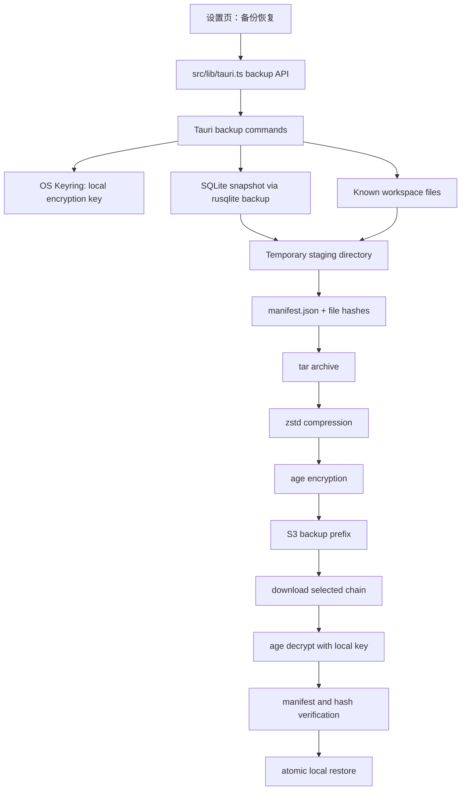

# feat: Encrypted backup and restore for app data

## Overview

在设置页新增“备份恢复”界面，支持把当前应用数据备份到指定对象存储。备份内容至少包含应用 SQLite 数据库、当前已知知识库目录中的 `.lake` 文件和目录结构。备份文件必须先在本地加密，再上传到 S3 兼容存储；加密密钥只保存在本机安全存储中，首次设置后不可查看，只能重置生成新密钥。手动备份支持首次全量、后续增量；恢复支持从备份列表选择版本并还原。

---

## Problem Frame

当前应用已经把文档、目录顺序、OSS 配置、资源引用等数据分散在本地知识库目录和应用 SQLite 中。用户需要一个能抵御对象存储泄露的备份方案：即使 S3 bucket 中的备份对象被读取，攻击者也不能直接看到文档内容、SQLite 配置或知识库结构。由于密钥只允许本地保存，恢复能力天然受限：同一台机器可直接恢复；如果本地密钥丢失，历史备份无法解密，除非用户重新输入当初的密钥，本计划第一版不提供云端密钥托管。

---

## Requirements Trace

- R1. 设置页必须新增“备份恢复”界面，与现有“上传配置”同级。
- R2. 用户首次启用备份时可以设置加密密钥；保存后不能再次查看密钥明文。
- R3. 加密密钥只保存在本地安全存储，不上传到 S3，不写入备份包，不以明文保存到 SQLite。
- R4. 用户可以重置加密密钥；重置后新备份使用新密钥，旧备份需要旧密钥才能恢复。
- R5. 备份目标第一版使用当前 S3 兼容 OSS 配置，并允许配置独立备份前缀。
- R6. 手动备份必须支持首次全量备份；后续默认增量备份，并允许强制全量。
- R7. 备份内容必须覆盖应用 SQLite 数据库和当前应用已知的知识库目录内容。
- R8. 恢复时必须先下载、解密、校验，再写入本地；不能在校验前覆盖当前数据。
- R9. 备份和恢复过程必须有明确错误提示，包含缺少 OSS 配置、未设置密钥、密钥不匹配、备份链不完整、磁盘写入失败。
- R10. 备份实现可引入成熟开源库，但加密、密钥保存、归档、S3 访问必须在 Tauri/Rust 后端执行，前端不直接处理 S3 secret 或长期密钥。

**Origin actors:** A1 个人用户, A2 桌面 App, A3 S3 兼容 OSS。
**Origin flows:** F1 选择知识库目录, F2 新建并编辑 Lake 文档, F3 图片上传到 OSS。
**Origin acceptance examples:** AE1, AE2, AE3 产生的本地知识库、SQLite 设置和资源引用是本计划备份对象。

---

## Scope Boundaries

- 第一版不做自动定时备份；只做手动触发。
- 第一版不做云端密钥托管、账号体系、多端密钥同步。
- 第一版不保证本地密钥丢失后的历史备份可恢复。
- 第一版不做跨存储 provider 抽象；备份目标复用当前 S3 兼容 OSS。
- 第一版不复制已上传到资源桶里的图片/附件对象；备份 `.lake` 文件和 SQLite 中的资源引用。后续如果需要“资源对象也随备份迁移”，单独扩展。
- 第一版不做复杂冲突合并；恢复是选择一个备份版本，把本地应用数据恢复到该版本。

### Deferred to Follow-Up Work

- 自动定时备份、备份保留策略、过期清理。
- 跨设备首次恢复时的外部密钥导入流程。
- 备份中包含并迁移 S3 资源对象本体。
- 按文档或单个知识库粒度恢复。

---

## Context & Research

### Relevant Code and Patterns

- `src/features/settings/OssSettingsPanel.tsx` 当前只有上传配置，需要扩展为多菜单设置面板。
- `src/features/settings/ossSettingsStore.ts` 负责设置默认值和校验，可新增备份配置默认值和校验函数。
- `src/app/AppController.tsx` 管理设置弹窗、OSS 设置和应用状态，是接入备份 API 和刷新状态的前端入口。
- `src/lib/tauri.ts` 已封装 Tauri 命令调用，需要新增 backup key、list、create、restore API。
- `src-tauri/src/storage/app_database.rs` 当前数据库文件位于 `database_path(app)`，并使用 `rusqlite` 管理 app settings 和 workspace order。
- `src-tauri/src/storage/s3.rs` 已有 `put_object`、`get_object_bytes`、`presign_get_object_url`，备份可复用同一 S3 client 构造方式。
- `src-tauri/src/commands/resources.rs` 已体现“私有资源由 Tauri 后端读取”的模式，备份命令应沿用这个安全边界。
- `src-tauri/src/models.rs` 集中定义前后端序列化模型，适合新增备份状态、备份记录、备份请求和恢复请求。

### Institutional Learnings

- Lake 编辑器和导出资源处理已形成“前端只处理会话态 URL，安全敏感 I/O 交给 Tauri 后端”的模式；备份也应保持这个边界。
- 当前 SQLite 在 debug 下写入 `src-tauri/dev-data`，release 下写入 `app_local_data_dir()`；备份计划必须通过 `database_path(app)` 获取真实路径，不能硬编码平台目录。

### External References

- `keyring` crate：跨平台把密码或二进制 secret 存入系统安全凭据存储，覆盖 macOS、Windows、Linux 等平台。
- `age` crate：实现 age 文件加密格式，支持流式加密/解密和用户口令加密，适合作为备份包加密层。
- `rusqlite::backup`：SQLite 在线备份 API，适合在应用运行时生成一致性数据库快照。
- `tar` crate：支持把目录递归写入归档，适合封装知识库文件和 manifest。
- `zstd` crate：提供流式压缩 encoder/decoder，适合在加密前压缩备份包。
- `tempfile` crate：支持自动清理临时目录/文件，适合恢复前 staging。

---

## Key Technical Decisions

- 备份包格式采用 `tar -> zstd -> age`：先归档和压缩，再加密上传。这样对象存储只能看到加密后的 blob，不能看到文件名、目录结构、SQLite 内容或 manifest。
- 加密密钥由 Rust 后端管理：前端只提交首次设置/重置时的密钥输入；后端用 `keyring` 存入 OS credential store，并只返回 key fingerprint、创建时间、是否已配置。
- 密钥 fingerprint 使用不可逆摘要：SQLite 只保存 fingerprint 和元数据，用于判断备份是否可能由当前密钥解密，不保存密钥明文。
- 备份对象存储前缀独立于图片/附件前缀：默认 `backups/`，避免和文档资源混在一起。
- 增量备份以 manifest 为依据：本地记录上一轮 manifest 的文件 hash；后续只打包新增/修改文件和 tombstone，恢复时按全量 + 增量链重放。
- SQLite 每次备份都先生成一致性快照：即使是增量备份，也把 SQLite 文件作为普通文件参与 hash 判断；SQLite 有变化则进入增量包。
- 恢复必须 staging：下载备份链后在临时目录解密、解压、校验 manifest，再替换本地数据或导入 SQLite；任何一步失败不触碰现有数据。
- 已知知识库需要显式追踪：现有 SQLite 只保存 recent workspace，不足以表达“当前所有知识库”。新增 known workspaces 表或 app setting，选择知识库时写入，首次迁移把 recent workspace 加入已知列表。
- 第一版不备份 S3 资源对象本体：`.lake` 中的 `yuque-resource://` 引用和 SQLite OSS 设置会被备份；资源对象仍依赖原 S3 bucket 存在。

---

## Open Questions

### Resolved During Planning

- 是否可以使用开源库：可以。优先采用成熟 Rust crate，不手写底层加密算法。
- 是否把加密密钥上传到 S3：不上传。
- 是否在界面中再次展示密钥：不展示，只显示已设置状态和 fingerprint。
- 首次备份是否必须全量：是。没有可用 base manifest 时，后端强制 full backup。

### Deferred to Implementation

- Linux 上 `keyring` 具体后端可用性：实现时需要在缺少 Secret Service/keyutils 时给出可操作错误提示。
- `age` passphrase API 与当前 MSRV/依赖兼容性：实现时锁定 crate 版本并验证 macOS/Windows/Linux 构建。
- 大知识库备份性能：第一版可以同步执行并展示进度文本，后续再做后台任务队列和取消。
- 恢复后是否要求重启：实现时根据 SQLite 替换策略决定；如果无法安全热替换，恢复命令应返回“需要重启”。

---

## High-Level Technical Design

> *This illustrates the intended approach and is directional guidance for review, not implementation specification. The implementing agent should treat it as context, not code to reproduce.*



### Backup Object Layout

```text
backups/
  device-<deviceId>/
    index/
      <backupId>.json
    objects/
      <backupId>.ylbackup
```

- `index/<backupId>.json`：非敏感索引，只包含 backup id、type、createdAt、baseBackupId、keyFingerprint、encryptedSize、archiveHash。
- `objects/<backupId>.ylbackup`：加密备份包，内部包含 manifest、SQLite snapshot、知识库文件增量内容。
- 文件名和知识库路径只出现在加密包内部。

---

## Implementation Units

- U1. **Add backup models, settings, and local key status**

**Goal:** 建立前后端共享的备份配置、密钥状态、备份记录和请求模型。

**Requirements:** R1, R2, R3, R4, R5, R9, R10

**Dependencies:** None

**Files:**
- Modify: `src/app/appState.ts`
- Modify: `src/features/settings/ossSettingsStore.ts`
- Modify: `src-tauri/src/models.rs`
- Test: `src/features/settings/ossSettingsStore.test.ts`
- Test: `src-tauri/tests/oss_settings.rs`

**Approach:**
- 扩展设置模型，新增 `backupPrefix`、可选默认备份策略字段。
- 新增 `BackupKeyStatus`、`BackupRecord`、`CreateBackupInput`、`RestoreBackupInput` 等模型。
- 备份 key status 只暴露 `configured`、`fingerprint`、`createdAt`，不暴露 secret。
- 现有 OSS 设置校验继续服务上传；备份操作前额外校验 backup prefix。

**Patterns to follow:**
- `OssSettings` / `UploadImageOutput` 在 `src/app/appState.ts` 与 `src-tauri/src/models.rs` 的 camelCase 对齐方式。
- `validateOssSettings` 的前端即时校验模式。

**Test scenarios:**
- Happy path: 默认备份前缀为 `backups`。
- Error path: 空备份前缀返回中文校验错误。
- Edge case: 已有设置缺少新增字段时 merge 后补默认值。
- Integration: Rust/TypeScript 字段命名保持 camelCase。

**Verification:**
- 设置保存不要求用户重新填写旧配置也能补齐备份默认值。

---

- U2. **Track known workspaces for complete app backup**

**Goal:** 让应用明确知道“当前所有知识库”集合，而不是只能备份 recent workspace。

**Requirements:** R7

**Dependencies:** U1

**Files:**
- Modify: `src-tauri/src/storage/app_database.rs`
- Modify: `src-tauri/src/commands/workspace.rs`
- Modify: `src-tauri/src/models.rs`
- Test: `src-tauri/tests/app_database.rs`
- Test: `src-tauri/tests/workspace_commands.rs`

**Approach:**
- 在 SQLite 中新增 `known_workspaces` 表或 app setting，保存 workspace root、name、lastOpenedAt。
- `set_workspace_root`、`rename_workspace`、legacy migration 都更新 known workspaces。
- 初始化时把 recent workspace 迁移到 known workspaces。
- 备份只纳入当前仍存在且可读取的 known workspaces；不可读路径写入备份诊断但不阻塞其他路径，除非所有知识库都不可读。

**Patterns to follow:**
- `workspace_order` 的 root key 写入方式。
- `migrate_legacy_app_settings` 的增量迁移方式。

**Test scenarios:**
- Happy path: 选择新知识库后，known workspaces 增加该 root。
- Happy path: rename workspace 后 known workspace root 跟随更新。
- Edge case: recent workspace 存在但 known workspaces 为空时自动迁移。
- Error path: 备份扫描遇到不存在的 workspace，记录 warning，不 panic。

**Verification:**
- 备份 manifest 中包含所有已知且可读知识库 root。

---

- U3. **Implement local-only backup key management**

**Goal:** 用本地安全存储保存备份密钥，并提供初始化、状态查询、重置能力。

**Requirements:** R2, R3, R4, R9, R10

**Dependencies:** U1

**Files:**
- Create: `src-tauri/src/storage/backup_key.rs`
- Create: `src-tauri/src/commands/backup.rs`
- Modify: `src-tauri/src/commands/mod.rs`
- Modify: `src-tauri/src/lib.rs`
- Modify: `src-tauri/Cargo.toml`
- Test: `src-tauri/tests/backup_key.rs`

**Approach:**
- 引入 `keyring` 存储密钥，service name 使用应用 identifier，account 固定为 `backup-encryption-key`。
- 设置密钥时后端接收用户输入，做最小长度校验，写入 keyring，并把 fingerprint/createdAt 写入 SQLite。
- 查询状态只读取 metadata 和 keyring 是否存在，不返回密钥。
- 重置密钥需要二次确认字段；重置后更新 fingerprint，保留旧备份记录但标记为“可能需要旧密钥”。
- 使用 `secrecy` / `zeroize` 类能力减少 secret 在内存中的暴露时间；如果 `age` 已 re-export secrecy，可复用。

**Patterns to follow:**
- `commands/settings.rs` 中设置校验和 Tauri command 错误返回方式。

**Test scenarios:**
- Happy path: 设置密钥后状态显示 configured + fingerprint。
- Error path: 密钥过短时拒绝保存。
- Error path: keyring 不可用时返回可读错误。
- Edge case: SQLite 有 fingerprint 但 keyring 中密钥不存在，状态为 needsKey。
- Security: 状态查询返回结构中不包含密钥明文。

**Verification:**
- 前端无法通过任何正常 API 读取密钥明文。

---

- U4. **Build encrypted full and incremental backup engine**

**Goal:** 在 Rust 后端生成一致性备份包，支持首次全量和后续增量。

**Requirements:** R5, R6, R7, R8, R9, R10

**Dependencies:** U2, U3

**Files:**
- Create: `src-tauri/src/storage/backup_archive.rs`
- Create: `src-tauri/src/storage/backup_manifest.rs`
- Create: `src-tauri/src/storage/backup_store.rs`
- Modify: `src-tauri/src/storage/mod.rs`
- Modify: `src-tauri/src/commands/backup.rs`
- Modify: `src-tauri/Cargo.toml`
- Test: `src-tauri/tests/backup_archive.rs`
- Test: `src-tauri/tests/backup_manifest.rs`
- Test: `src-tauri/tests/backup_commands.rs`

**Approach:**
- 引入 `rusqlite` 的 `backup` feature，用在线 backup API 生成 SQLite snapshot。
- 引入 `tar`、`zstd`、`age`、`blake3`、`tempfile`。
- 构建 manifest：包含 app version、schema version、backup type、baseBackupId、createdAt、keyFingerprint、文件路径、文件 hash、size、mtime、tombstones。
- 全量备份写入 SQLite snapshot 和所有已知 workspace 文件。
- 增量备份读取上一份本地 manifest，比较 BLAKE3 hash，只打包新增/修改文件和删除标记；如果没有可用 base，则自动降级为全量。
- 归档路径必须使用逻辑路径，不使用绝对路径；实际恢复目标由 manifest root mapping 决定。
- 加密包生成顺序为 `tar -> zstd -> age`，上传前本地只保留临时文件，成功后清理。

**Patterns to follow:**
- `src-tauri/src/storage/s3.rs` 的对象 key 构造和安全 path segment 清理方式。
- `src-tauri/src/storage/app_database.rs` 的数据库路径解析方式。

**Test scenarios:**
- Happy path: 首次备份生成 full archive，manifest 包含 SQLite 和 workspace 文件。
- Happy path: 修改一个 `.lake` 文件后生成 incremental archive，只包含 changed file 和 manifest。
- Happy path: 删除一个 `.lake` 文件后增量 manifest 包含 tombstone。
- Edge case: 上一份 manifest 丢失时，手动增量请求自动生成 full。
- Error path: 未设置密钥时拒绝备份。
- Error path: 某个 workspace 不可读时记录 warning；全部不可读时失败。
- Security: 解密前无法从 `.ylbackup` 中读出明文路径名或文件内容。

**Verification:**
- S3 上的备份对象是加密 blob；对象 key 不泄露知识库文件名。

---

- U5. **Upload, list, and index backups in S3**

**Goal:** 将备份包上传到当前 S3 兼容 OSS，并支持列出可恢复备份。

**Requirements:** R5, R6, R8, R9, R10

**Dependencies:** U4

**Files:**
- Modify: `src-tauri/src/storage/s3.rs`
- Modify: `src-tauri/src/storage/backup_store.rs`
- Modify: `src-tauri/src/commands/backup.rs`
- Test: `src-tauri/tests/backup_store.rs`

**Approach:**
- 在 `s3.rs` 增加 `list_objects`、backup object put/get/delete 所需的通用能力。
- 备份上传两个对象：非敏感 index JSON 和 encrypted archive。
- index JSON 不包含 workspace 路径、文档标题、SQLite 内容、资源引用明细。
- 列表页通过 S3 prefix list + index JSON 展示备份时间、类型、大小、key fingerprint、base backup。
- 远端 index 缺失但 archive 存在时，不在第一版做深度恢复，只提示备份索引不完整。

**Patterns to follow:**
- `presign_get_object_url` 的 S3 错误映射方式。

**Test scenarios:**
- Happy path: 上传 full backup 后可列出一条 backup record。
- Happy path: 上传 incremental backup 后记录 baseBackupId。
- Error path: OSS 未配置或配置不完整时返回中文错误。
- Edge case: index 中 keyFingerprint 与本地 key 不一致时列表标记为不可直接恢复。

**Verification:**
- 备份列表不需要下载解密全部 archive。

---

- U6. **Restore backups safely**

**Goal:** 支持从 full + incremental 链恢复 SQLite 和知识库文件，且失败不破坏当前数据。

**Requirements:** R4, R7, R8, R9, R10

**Dependencies:** U5

**Files:**
- Modify: `src-tauri/src/commands/backup.rs`
- Modify: `src-tauri/src/storage/backup_archive.rs`
- Modify: `src-tauri/src/storage/app_database.rs`
- Test: `src-tauri/tests/backup_restore.rs`

**Approach:**
- 用户选择某个 backupId 后，后端解析其 base chain，从最近 full 开始下载到目标增量。
- 使用本地 key 解密；key fingerprint 不匹配时提前提示，但仍允许用户明确尝试当前 key。
- 所有内容先解密到 `tempfile::TempDir`，校验 manifest hash 和链完整性。
- SQLite snapshot 先打开并校验 schema，再替换当前 `database_path(app)` 或导入现有表。
- workspace 文件恢复先写入临时目录，再按 manifest root mapping 覆盖目标路径；覆盖前可在应用 cache 下生成本地回滚副本。
- 恢复完成后前端重新 `boot()` 读取 recent workspace 和 settings；如果 SQLite 无法热替换，则提示重启。

**Patterns to follow:**
- `delete_lake_document`、`rename_lake_directory` 对 workspace payload 的刷新方式。
- `database_path(app)` 获取 release/debug 数据库路径的方式。

**Test scenarios:**
- Happy path: full backup 恢复后 SQLite 设置和 `.lake` 文件都回到备份版本。
- Happy path: full + incremental 链恢复后包含最新修改和删除。
- Error path: 使用错误密钥解密失败，本地数据不变。
- Error path: 增量链缺失 base backup，恢复失败且本地数据不变。
- Error path: manifest hash 不匹配，恢复失败且本地数据不变。
- Edge case: 恢复目标目录不存在时创建目录。

**Verification:**
- 任意恢复失败路径都不会留下半恢复状态。

---

- U7. **Add backup and restore UI in settings**

**Goal:** 在设置页提供备份密钥、备份目标、手动备份、备份列表和恢复入口。

**Requirements:** R1, R2, R4, R5, R6, R8, R9

**Dependencies:** U1, U3, U5, U6

**Files:**
- Modify: `src/features/settings/OssSettingsPanel.tsx`
- Create: `src/features/settings/BackupSettingsPanel.tsx`
- Create: `src/features/settings/backupSettingsStore.ts`
- Modify: `src/app/AppController.tsx`
- Modify: `src/lib/tauri.ts`
- Modify: `src/styles/app.css`
- Test: `src/features/settings/OssSettingsPanel.test.tsx`
- Test: `src/features/settings/BackupSettingsPanel.test.tsx`
- Test: `src/app/AppController.test.tsx`

**Approach:**
- 设置菜单改为两个 tab：`上传配置`、`备份恢复`。
- 备份恢复页展示密钥状态：未设置、已设置、key fingerprint、创建时间；提供“设置密钥”和“重置密钥”。
- 密钥输入使用 password 字段，提交后清空；不支持查看。
- 手动备份区提供“立即备份”和“强制全量备份”；如果没有 base，普通备份也显示为全量。
- 备份列表展示 createdAt、类型、大小、key fingerprint、状态；key 不匹配时恢复按钮禁用或要求确认。
- 恢复操作必须二次确认，确认文案说明会覆盖本地应用数据。
- 操作中禁用按钮并显示状态文本；错误通过现有 `appError` 或 panel 内错误区展示。

**Patterns to follow:**
- `OssSettingsPanel` 的 backdrop 点击关闭和表单保存模式。
- `TopBar` 导出菜单的资源策略选择文案。

**Test scenarios:**
- Happy path: 打开设置后可以切换到“备份恢复”。
- Happy path: 未设置密钥时显示“设置备份密钥”入口。
- Happy path: 已设置密钥时只显示 fingerprint，不显示密钥明文。
- Happy path: 点击立即备份调用 create backup API。
- Error path: 未配置 OSS 时备份按钮提示先配置上传/备份目标。
- Error path: 恢复前二次确认取消时不调用 restore API。

**Verification:**
- UI 不会把密钥写入 React 状态以外的可持久存储；提交后输入框清空。

---

- U8. **Wire Tauri capabilities, browser fallback, and tests**

**Goal:** 完成 Tauri 命令注册、前端 browser mock、权限配置和端到端验证入口。

**Requirements:** R8, R9, R10

**Dependencies:** U7

**Files:**
- Modify: `src-tauri/src/lib.rs`
- Modify: `src-tauri/capabilities/default.json`
- Modify: `src/lib/tauri.ts`
- Modify: `src/app/AppController.test.tsx`
- Test: `src-tauri/tests/backup_commands.rs`

**Approach:**
- 注册 `get_backup_key_status`、`set_backup_key`、`reset_backup_key`、`list_backups`、`create_backup`、`restore_backup`。
- Tauri capability 只开放上述命令，不给前端文件系统通用读写权限。
- Browser fallback 用 localStorage + fake encrypted records 支撑 UI 测试，不实现真实加密备份。
- 增加错误映射，保证 keyring、S3、decrypt、manifest mismatch 都能返回中文可读错误。

**Patterns to follow:**
- `src/lib/tauri.ts` 当前 browser fallback 和 Tauri invoke 分支。
- `src-tauri/src/error.rs` 的错误类型和显示文案。

**Test scenarios:**
- Integration: 前端调用 create backup API 时传递 forceFull 参数。
- Integration: restore 成功后 AppController 重新加载 workspace/settings。
- Error path: Tauri command 返回错误时设置页展示错误，不关闭弹窗。
- Security: capabilities 不包含额外文件系统命令。

**Verification:**
- `npm run test:run` 和 `cargo test` 通过。

---

## System-Wide Impact

- **Interaction graph:** 设置页新增备份 tab，经 `src/lib/tauri.ts` 调用 Rust backup commands；Rust commands 读取 SQLite、workspace files、OS keyring 和 S3。
- **Error propagation:** 后端安全相关错误必须返回用户可理解中文，前端不吞掉 key mismatch、missing base、manifest mismatch。
- **State lifecycle risks:** 恢复可能替换 SQLite 和 workspace 文件，必须 staging + 校验 + 原子替换，失败不改变现有数据。
- **API surface parity:** Browser fallback 只用于测试 UI，不提供真实备份安全能力；Tauri 桌面端是唯一真实实现。
- **Integration coverage:** 需要覆盖“设置密钥 -> full backup -> 修改文档 -> incremental backup -> restore latest”的跨层场景。
- **Unchanged invariants:** `.lake` 主存储格式不变；图片/附件上传和导出资源策略不变；前端仍不持有 S3 secret。

---

## Risks & Dependencies

| Risk | Mitigation |
|------|------------|
| 本地密钥丢失导致历史备份不可恢复 | UI 明确提示；备份列表用 fingerprint 标记；后续可规划导出恢复密钥 |
| Linux keyring 后端不可用 | command 返回可操作错误；文档说明需要 Secret Service/keyutils；不降级到明文文件 |
| 增量链缺失或对象被删除 | 恢复前完整检查 chain；缺失则失败且不覆盖本地数据 |
| 备份过程中文档正在保存 | 触发备份前先请求当前编辑器保存；SQLite 使用 backup API；workspace 文件按文件系统快照读取 |
| 大知识库备份耗时较长 | 第一版提供进行中状态；归档使用流式压缩和临时文件，避免全部读入内存 |
| 备份包泄露路径或文件名 | 路径只在加密 archive 内；S3 object key 使用 backupId，不使用文档名 |
| 恢复覆盖用户新数据 | 二次确认；恢复前可生成本地回滚副本；失败不改现有数据 |

---

## Documentation / Operational Notes

- 需要在用户文档或 README 中补充：备份密钥只保存在本地，丢失后无法解密旧备份。
- 需要说明备份目标复用当前 S3 配置，但备份 prefix 可单独配置。
- 需要说明第一版不复制 S3 资源对象本体，只备份本地知识库文件和应用 SQLite。

---

## Sources & References

- **Origin document:** `docs/brainstorms/2026-04-26-lake-first-notes-requirements.md`
- Related code: `src/features/settings/OssSettingsPanel.tsx`
- Related code: `src-tauri/src/storage/app_database.rs`
- Related code: `src-tauri/src/storage/s3.rs`
- Related code: `src-tauri/src/commands/resources.rs`
- External docs: `https://docs.rs/keyring/latest/keyring/`
- External docs: `https://docs.rs/age/`
- External docs: `https://docs.rs/rusqlite/latest/rusqlite/backup/struct.Backup.html`
- External docs: `https://docs.rs/tar/latest/tar/struct.Builder.html`
- External docs: `https://docs.rs/zstd/latest/zstd/`
- External docs: `https://docs.rs/tempfile/latest/tempfile/`
