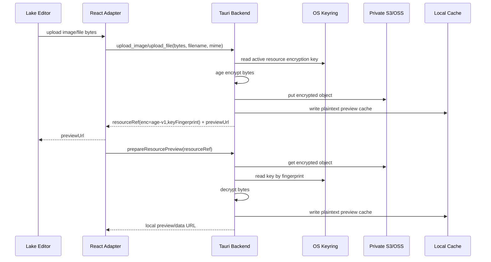

# feat: Encrypted upload for images and attachments

## Overview

当前图片和附件上传到 S3 兼容存储后，对象本体仍是明文。即使桶关闭公开读，只要存储凭据、备份配置或对象存储侧权限泄露，攻击者仍可直接读取图片和附件内容。本计划在上传前使用本地资源加密密钥对图片和附件进行客户端加密，上传到对象存储的永远是密文；编辑器预览、附件下载、导出资源包时由 Tauri 后端按需下载密文并在本地解密。

---

## Problem Frame

应用已经完成“私有桶 + resourceRef + 本地预览/导出处理”的资源访问模型，但对象存储里的资源仍然是明文。用户明确要求“附件上传的图片还有文件也支持在上传前通过本地密钥进行加密，就是说上传到存储里面的都是加密后上传的”。这意味着安全边界要从“对象存储访问控制”进一步提升为“对象存储只能保存密文”，并且编辑态、下载态、导出态都必须透明解密，不能破坏 Lake 编辑体验。

---

## Requirements Trace

- R1. 图片上传前必须在 Tauri 后端使用本地密钥加密，S3/OSS 中保存密文。
- R2. 附件上传前必须在 Tauri 后端使用本地密钥加密，S3/OSS 中保存密文。
- R3. 本地资源加密密钥不得上传到 S3，不得写入 `.lake`，不得明文保存到 SQLite。
- R4. 前端 WebView 不直接处理资源加密密钥；上传、下载、预览、导出读取都由 Tauri 后端处理密钥和明文 bytes。
- R5. 文档中继续保存 canonical `yuque-resource://...` 引用，但必须携带足够的加密元数据以便后续解密。
- R6. 新上传资源默认走加密路径；历史未加密资源仍可继续读取，避免破坏已有文档。
- R7. 重新打开文档时，图片预览必须能通过资源引用下载密文、解密、写入本地缓存并回显。
- R8. 附件下载时必须下载密文、解密后写入用户选择的原始文件名。
- R9. HTML/PDF/Markdown/知识库 ZIP 的本地资源包导出必须使用解密后的资源内容。
- R10. 短时签名链接导出不能直接签原始密文对象；必须先在本地解密资源，上传到对象存储临时明文 export 前缀，再对临时明文对象生成短时签名 URL。
- R11. 密钥重置不能让旧资源静默不可读；资源引用应记录 key fingerprint，并支持多版本本地资源密钥。
- R12. 缺失密钥、密钥不匹配、密文损坏、历史明文兼容路径都要有清晰错误提示。
- R13. 临时明文 export 对象必须使用隔离前缀、明确有效期和清理策略，不能覆盖或替代原始密文资源对象。

---

## Scope Boundaries

### In Scope

- 新增独立的“资源加密密钥”管理，不与现有“备份密钥”硬绑定。
- 新上传的图片和附件加密后再上传。
- 资源预览、下载、导出读取时透明解密。
- 历史明文资源兼容读取。
- 本地资源包导出和 HTML 图片 base64 内联继续输出明文可读资源。
- 短时签名链接导出加密资源时，解密后上传临时明文对象，再签临时明文对象。

### Out of Scope

- 不实现云端密钥托管。
- 不实现团队共享密钥、成员权限、资源访问审计。
- 不自动重加密历史已上传明文对象；可后续单独做迁移工具。
- 不实现服务端解密代理或在线分享服务。
- 不保证换一台机器后无需导入本地资源密钥即可读取旧资源。

### Deferred for Later

- 资源密钥导出/导入，用于跨设备迁移。
- 历史明文资源批量重加密迁移。
- 后台常驻式临时对象清理服务；第一版只提供 export 前缀、过期时间元数据、启动/导出时清理和对象存储 lifecycle 配置引导。
- 大文件流式加密/解密进度和取消。

---

## Context & Research

### Relevant Code and Patterns

- `src-tauri/src/commands/upload.rs` 是图片/附件上传入口，目前直接把 `input.bytes` 写入 S3，并把明文写入本地缓存。
- `src-tauri/src/commands/resources.rs` 是预览、下载、导出读取入口，目前直接读取 S3 bytes 并写入缓存/文件/导出链路。
- `src-tauri/src/storage/s3.rs` 提供 `put_object`、`get_object_bytes`、`presign_get_object_url`、`build_resource_ref`、`parse_resource_ref`、`validate_resource_key`。
- `src-tauri/src/storage/backup_key.rs` 已有系统钥匙串存取、本地密钥 fingerprint、启动不访问钥匙串的模式，可复用于资源密钥管理，但应使用独立 account。
- `src-tauri/src/storage/backup_archive.rs` 已用 `age::Encryptor::with_user_passphrase` / `age::Decryptor` 做本地加密备份，可复用 age crate 和错误映射方式。
- `src/features/lake-editor/resourceReference.ts` 已集中管理 `yuque-resource://` 解析、hydrate/dehydrate 和旧公开 URL 兼容。
- `src/features/lake-editor/lakeExport.ts` 已集中处理导出资源加载、图片 base64 内联、本地资源包、短时签名链接策略。
- `src/features/settings/OssSettingsPanel.tsx` 已有设置页多面板和备份密钥 UI，可以新增“资源加密”状态和操作。

### Institutional Learnings

- Lake 编辑器相关资源问题的主要落点是 adapter/export/resourceReference，而不是 React 渲染层。资源加密也应在上传、资源引用、预览和导出链路集中处理，避免散落到编辑器组件内部。

### External References

- `age` crate 官方文档说明支持 passphrase-based encryption，可使用 `Encryptor::with_user_passphrase` 和 `scrypt::Identity` 解密，适合复用当前备份加密依赖。
- AWS S3 安全最佳实践建议对敏感数据使用加密；AWS 也明确列出 client-side encryption 作为一种在上传前加密数据的方案。
- S3 presigned URL 只授权对象读取，不会对客户端密文做解密；因此加密资源的签名链接不能直接签原始密文对象，必须签解密后上传的临时明文对象。

---

## Key Technical Decisions

- **资源密钥独立于备份密钥。** 备份密钥服务于 app 数据备份；资源密钥服务于 S3 图片/附件对象。两者硬绑定会导致重置备份密钥后旧资源不可读，边界不清晰。
- **资源密钥支持多版本。** 每次设置或重置资源密钥生成一个 fingerprint；资源引用写入 `keyFingerprint`，解密时按 fingerprint 找对应本地密钥。重置密钥只影响新上传资源，不删除旧密钥。
- **第一版复用 age passphrase 加密。** 项目已依赖 `age = "0.11.3"` 并通过测试覆盖备份加密。资源对象可以直接保存 age binary ciphertext，避免新增低层 AEAD 使用风险。
- **资源对象不压缩。** 图片、PDF、zip 等常见附件通常已经压缩；资源上传路径优先保持简单，直接 `plain bytes -> age ciphertext -> S3`。
- **S3 Content-Type 使用密文类型。** 上传密文对象时不再把原 MIME 作为对象 Content-Type；原 MIME 保存在 resourceRef 元数据中。推荐密文 Content-Type 为 `application/vnd.local-lake.resource+age` 或 `application/octet-stream`。
- **resourceRef 是解密所需元数据的来源。** `yuque-resource://` 继续保存 bucket、key、kind、name、size、type，并新增 `enc=age-v1`、`keyFingerprint=<fingerprint>`。
- **历史明文资源保持兼容。** 没有 `enc` 的 resourceRef 走现有明文读取路径；有 `enc=age-v1` 的资源必须走解密路径。
- **短时签名链接签临时明文对象，不签原始密文对象。** 对 `enc=age-v1` 资源做在线短时链接导出时，后端先下载密文、使用本地资源密钥解密，再上传到 `tmp/exports/<exportId>/...` 这类隔离前缀，最后对临时明文对象生成 presigned GET。接收方拿到的是限时明文资源，原始 `images/`、`files/` 密文对象不会暴露为可读链接。
- **临时明文对象必须有明确生命周期。** 每次导出生成独立 `exportId`，临时对象 key 带过期时间或写入 metadata；应用在导出前后尝试清理过期 export 前缀，同时在设置/文档中引导用户给该前缀配置对象存储 lifecycle。不能在短时链接仍有效时立即删除对象，否则签名链接会失效。

---

## Open Questions

### Resolved During Planning

- 是否复用备份密钥：不硬绑定。新增独立资源加密密钥，复用 keyring 存储模式和 fingerprint 机制。
- 是否使用对象存储服务端加密：不作为本需求主路径。服务端加密仍允许存储服务或具备权限的人读取明文；用户要求的是上传前本地加密。
- 短时签名链接是否还能使用：可以继续支持，但加密资源的签名目标必须是临时明文对象，不能是原始密文对象。

### Deferred to Implementation

- age 加密大文件的内存占用是否可接受：当前上传接口已经把 bytes 全量传入 Rust，第一版保持一致；大文件流式处理后续规划。
- 资源密钥 UI 放在设置页哪个 tab：实现时可与“备份恢复”并列新增“资源加密”，或放在上传配置页内的安全区块。
- 缺失旧 key 时是否允许用户临时输入：第一版可提示缺失 fingerprint；导入/临时解密密钥后续规划。

---

## High-Level Technical Design

> 下面是实现方向说明，不是要求逐行照抄的代码。

---

## Implementation Units

### U1. Add resource encryption key model and settings UI

**Goal:** 提供独立资源加密密钥的本地管理能力，支持启用状态、active fingerprint、多版本密钥和重置。

**Requirements:** R3, R4, R11, R12

**Dependencies:** None

**Files:**
- Modify: `src-tauri/src/models.rs`
- Create: `src-tauri/src/storage/resource_key.rs`
- Modify: `src-tauri/src/storage/mod.rs`
- Modify: `src-tauri/src/lib.rs`
- Modify: `src/lib/tauri.ts`
- Modify: `src/app/appState.ts`
- Modify: `src/features/settings/OssSettingsPanel.tsx`
- Test: `src-tauri/tests/resource_key.rs`
- Test: `src/features/settings/OssSettingsPanel.test.tsx`
- Test: `src/app/AppController.test.tsx`

**Approach:**
- 新增 Rust 模型：`ResourceKeyStatus`、`SetResourceKeyInput`、`ResetResourceKeyInput`。
- 新增 `resource_key.rs`，复用 `backup_key.rs` 的 keyring 存取模式，但使用独立 account，例如 `resource-encryption-key:<fingerprint>` 和 active metadata。
- SQLite 保存非敏感 metadata：active fingerprint、createdAt、known fingerprints。密钥明文只在 keyring。
- UI 展示“资源加密已启用 / 未设置 / 缺少本地密钥”，允许设置和重置。重置不删除旧 fingerprint 对应密钥。
- 启动阶段只读 SQLite metadata，不访问钥匙串；只有上传、预览、下载、导出读取时按需访问。

**Test scenarios:**
- 设置资源密钥后返回 active fingerprint，SQLite 不保存明文。
- 重置资源密钥后 active fingerprint 改变，旧 fingerprint 仍保留为 known key。
- 启动状态读取不调用 keyring secret。
- 缺少 active key 时上传返回中文错误。
- 设置页能显示已启用状态和 fingerprint。

---

### U2. Add resource encryption/decryption helpers

**Goal:** 建立资源对象加密格式，提供明文 bytes 与密文 bytes 的可靠转换。

**Requirements:** R1, R2, R5, R12

**Dependencies:** U1

**Files:**
- Create: `src-tauri/src/storage/resource_crypto.rs`
- Modify: `src-tauri/src/storage/mod.rs`
- Test: `src-tauri/tests/resource_crypto.rs`

**Approach:**
- 使用 age passphrase 模式加密单个资源对象。
- 输出结构保持为纯密文字节，不把 JSON manifest 放入对象明文头；必要元数据放在 resourceRef。
- 为错误信息区分：密钥缺失、密钥不匹配、密文损坏。
- 保留 `is_encrypted_resource_ref` / `decrypt_resource_bytes_if_needed` 这类薄封装，供资源命令复用。

**Test scenarios:**
- 明文图片 bytes 加密后不包含原始内容片段。
- 使用同一密钥解密后与原 bytes 完全一致。
- 使用错误密钥解密失败。
- 空文件、二进制文件、非 UTF-8 bytes 都能 round-trip。

---

### U3. Extend resourceRef metadata for encrypted resources

**Goal:** 让 `.lake` 中的 resourceRef 能表达资源是否加密、使用哪个本地 key fingerprint、原始 MIME 和文件名。

**Requirements:** R5, R6, R11

**Dependencies:** U1, U2

**Files:**
- Modify: `src-tauri/src/storage/s3.rs`
- Modify: `src/features/lake-editor/resourceReference.ts`
- Test: `src/features/lake-editor/resourceReference.test.ts`
- Test: `src-tauri/tests/upload_commands.rs`

**Approach:**
- 扩展 `build_resource_ref` 参数，新增 `encryption` 元数据：`enc=age-v1`、`keyFingerprint=<fingerprint>`。
- TypeScript `LakeResourceReference` 新增 `encryption?: { algorithm: "age-v1"; keyFingerprint: string }` 或等价扁平字段。
- `parseResourceReference` 兼容没有 `enc` 的历史明文资源。
- `resourceReferenceFromPublicUrl` 只能生成未加密旧资源引用，不伪造加密元数据。

**Test scenarios:**
- 加密 resourceRef 序列化后包含 `enc=age-v1` 和 key fingerprint。
- 解析加密 resourceRef 能恢复 bucket、key、kind、name、size、mimeType、encryption。
- 历史无 `enc` resourceRef 解析结果 encryption 为空。
- malformed `enc` 或缺少 fingerprint 时返回不可用状态，不导致编辑器崩溃。

---

### U4. Encrypt uploads before S3 put_object

**Goal:** 修改图片和附件上传，使 S3 中的新对象都是密文，同时编辑器仍能立即回显。

**Requirements:** R1, R2, R3, R4, R5, R7

**Dependencies:** U1, U2, U3

**Files:**
- Modify: `src-tauri/src/commands/upload.rs`
- Modify: `src-tauri/src/storage/s3.rs`
- Test: `src-tauri/tests/upload_commands.rs`
- Test: `src/features/lake-editor/uploadAdapter.test.ts`

**Approach:**
- 上传命令读取 active resource encryption key。
- 用原始 bytes 生成本地预览缓存；用密文 bytes 调用 `put_object`。
- S3 对象 content type 使用密文类型；resourceRef 中保存原始 MIME。
- 返回给 Lake 编辑器的 previewUrl 仍是本地明文缓存路径；持久化内容仍保存 resourceRef。
- 如果资源密钥未设置，上传阻断并提示“请先设置资源加密密钥”；不自动回落明文上传，避免误以为已加密。

**Test scenarios:**
- 上传图片时传给 `put_object` 的 bytes 与输入明文不同。
- 上传附件时传给 `put_object` 的 bytes 与输入明文不同。
- 上传返回的 resourceRef 包含加密元数据。
- 上传后本地 cache 保存的是明文 bytes，保证立即预览。
- 未设置资源密钥时上传失败且不调用 `put_object`。

---

### U5. Decrypt resource preview, download, and export reads

**Goal:** 让所有资源读取入口根据 resourceRef 自动判断是否需要解密。

**Requirements:** R7, R8, R9, R12

**Dependencies:** U2, U3, U4

**Files:**
- Modify: `src-tauri/src/commands/resources.rs`
- Modify: `src/lib/tauri.ts`
- Test: `src-tauri/tests/resource_commands.rs`
- Test: `src/app/AppController.test.tsx`

**Approach:**
- `prepare_resource_preview` 读取 S3 对象后，如果 resourceRef 带 `enc=age-v1`，按 fingerprint 取 key 并解密，再写本地缓存和 data URL。
- `download_resource` 写入用户文件前解密，保证下载文件名和内容都是原始文件。
- `read_resource_bytes` 返回解密后 bytes，供 HTML/PDF/Markdown/ZIP 导出使用。
- 无 `enc` 的历史资源走原明文逻辑。
- 缺失 fingerprint 对应 key 时返回明确错误，不写空缓存、不生成损坏预览。

**Test scenarios:**
- 加密图片 preview 解密后生成正确 data URL。
- 加密附件 download 写出的 bytes 与原始 bytes 一致。
- 加密资源 `read_resource_bytes` 返回明文，导出链路可复用。
- 历史明文资源仍按原逻辑读取。
- 密钥缺失/错误时 preview、download、read 都返回中文错误。

---

### U6. Update export behavior for encrypted resources

**Goal:** 支持加密资源在线短时链接导出：解密资源后上传临时明文副本并签名，同时保证本地包导出继续可用。

**Requirements:** R9, R10, R13

**Dependencies:** U3, U5

**Files:**
- Modify: `src-tauri/src/commands/resources.rs`
- Modify: `src-tauri/src/storage/s3.rs`
- Modify: `src-tauri/src/models.rs`
- Modify: `src/features/lake-editor/lakeExport.ts`
- Modify: `src/components/TopBar.tsx`
- Modify: `src/app/AppController.tsx`
- Test: `src-tauri/src/commands/resources.rs`
- Test: `src-tauri/src/storage/s3.rs`
- Test: `src/features/lake-editor/lakeExport.test.ts`
- Test: `src/app/AppController.test.tsx`

**Approach:**
- 本地资源包和 HTML/PDF 导出继续调用 `loadResource`，此时后端已解密，输出给接收方的是明文资源或 base64 图片。
- `signed-url` 策略遇到 `enc=age-v1` 资源时不直接调用原始对象签名；前端改调用后端临时明文导出命令。
- 后端临时导出命令负责校验 TTL、下载原始密文对象、按 resourceRef 的 `keyFingerprint` 解密、上传明文 bytes 到 `tmp/exports/<exportId>/<kind>/<safeFilename>`，再对该临时明文对象生成 presigned URL。
- 临时明文对象使用原始 MIME Content-Type 和原始文件名派生的安全 key，便于浏览器展示和附件下载；原始密文对象 key 不出现在导出 HTML/PDF/Markdown 中。
- 导出结果只保存临时签名 URL，不把临时明文 URL 或临时对象 key 写回 `.lake` 文档内容。
- 每次导出记录本次生成的临时对象 key 和过期时间；应用在导出前后清理已过期的 `tmp/exports/` 对象，设置文案引导用户给该前缀配置对象存储 lifecycle。
- 历史未加密资源可继续沿用现有直接 signed-url 路径；如果用户选择“统一临时 export 前缀”，实现时可复用同一命令上传临时明文副本，但不能扩大本次必做范围。
- PDF 仍基于 HTML 转换；图片 base64 内联使用解密后的 bytes。

**Test scenarios:**
- HTML bundle 导出加密图片时生成 base64 明文图片。
- Markdown ZIP 导出加密附件时写入解密后的附件文件。
- signed-url 导出加密图片时上传临时明文对象，导出 URL 指向 `tmp/exports/...`，不包含原始密文对象 key。
- signed-url 导出加密附件时临时对象 bytes 等于解密后的原始附件 bytes，Content-Type 和文件名语义保留。
- signed-url 导出 TTL 超出允许范围时返回中文错误，不上传临时明文对象。
- 生成的临时 URL 和临时对象 key 不写回 `.lake` 文档。
- 历史明文 resourceRef 仍可使用 signed-url 导出。

---

### U7. Settings, migration messaging, and documentation updates

**Goal:** 让用户理解新资源加密行为、历史资源兼容边界和导出限制。

**Requirements:** R6, R10, R11, R12

**Dependencies:** U1-U6

**Files:**
- Modify: `README.md`
- Modify: `src/features/settings/OssSettingsPanel.tsx`
- Test: `src/features/settings/OssSettingsPanel.test.tsx`

**Approach:**
- README 补充：新上传资源会加密，S3 中对象不可直接预览；跨设备需要本地资源密钥。
- 设置页显示：历史未加密资源仍可读；重置资源密钥不会重加密旧资源；旧资源仍依赖旧 key。
- 导出 UI 文案说明：本地资源包导出不会上传临时明文；短时签名链接导出会创建限时明文临时对象，接收方在有效期内可直接访问这些资源。
- 设置页补充对象存储 lifecycle 建议：对 `tmp/exports/` 前缀配置自动过期删除，降低临时明文对象长期残留风险。

**Test scenarios:**
- 未设置资源密钥时设置页显示上传前置要求。
- 已设置资源密钥时显示 active fingerprint。
- signed-url 导出确认文案能说明会创建限时明文临时对象。
- 设置页能展示临时 export 前缀和 lifecycle 建议。

---

## Sequencing

1. U1：先建立资源密钥管理和状态 API，避免上传改造时缺少密钥来源。
2. U2：实现纯 Rust 加密/解密 helper，用独立测试把加密正确性锁住。
3. U3：扩展 resourceRef 元数据并保持历史兼容。
4. U4：改上传路径，让新资源开始写密文对象。
5. U5：改读取路径，保证重新打开、下载、导出读取都透明解密。
6. U6：实现临时明文 export 前缀并对临时明文对象签名，禁止签原始密文对象。
7. U7：补 UI 文案和 README，明确用户操作边界。

---

## Verification Plan

- `npm run test:run`
- `npm run build`
- `cargo test`
- 手动验证：设置资源密钥后上传图片，S3 对象 bytes 与原始图片不同，文档中保存 `yuque-resource://...enc=age-v1...`。
- 手动验证：退出并重新打开应用，图片能正常回显。
- 手动验证：上传 PDF 附件后下载，下载文件内容可正常打开且文件名保留。
- 手动验证：HTML/PDF 导出图片能显示，知识库 ZIP 中附件为明文可打开。
- 手动验证：短时签名链接导出加密资源时，生成 `tmp/exports/` 临时明文对象，导出 URL 指向临时对象，不暴露原始密文对象 key。

---

## Risks and Mitigations

- **风险：重置资源密钥后旧资源不可读。** 通过多版本 key fingerprint 和旧 key 保留规避。
- **风险：跨设备恢复后缺少资源密钥。** 第一版明确提示缺失 key；后续做密钥导出/导入。
- **风险：临时明文对象扩大暴露面。** 通过短 TTL、隔离 `tmp/exports/` 前缀、导出前后过期清理、lifecycle 引导和明确 UI 提示降低风险；原始资源对象始终保持密文。
- **风险：大文件内存占用。** 当前上传接口本身已全量持有 bytes，本计划不扩大现有级别；后续再做流式。
- **风险：历史明文资源迁移不完整。** 第一版兼容读取，不自动迁移；后续提供批量重加密工具。
