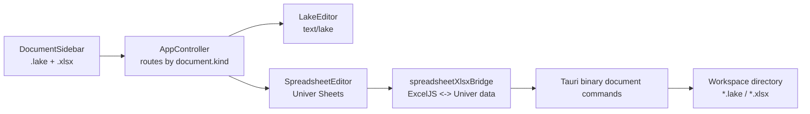

# feat: Univer spreadsheet documents

## Overview

在当前 Local Lake Notes 应用中新增表格文档能力：用户可以在知识库目录中创建、打开、编辑和保存 Excel 表格文件。表格编辑器使用 Univer 的开源 Sheets 能力承载，表格文件直接以 `.xlsx` 放在当前知识库目录里，和 `.lake` 文档、目录一起参与侧栏展示、搜索、拖拽排序、重命名、删除和备份。

XLSX 导入/导出能力只能使用开源依赖实现。官方 Univer Pro 的 exchange-client 路线需要 `@univerjs-pro/*` 包和 license 相关依赖，不纳入本计划。如果开源桥接无法满足最小验收，则宁可移除 XLSX 导入/导出入口，也不引入商业订阅、商业授权或远端转换服务。

---

## Problem Frame

当前应用是 Lake-first 的本地笔记软件，知识库目录里主要管理 `.lake` 文档。用户现在需要在同一个应用里创建和使用 Excel 表格，但仍保持“本地知识库目录即用户数据”的模式。表格不能成为云端能力，也不能依赖商业订阅；它应当像 Lake 文档一样，是本地目录中的一等文件。

这个需求扩展了原始需求文档里的“文件夹式知识库”和“独立桌面 App”方向，但不改变 `.lake` 作为富文本笔记主格式的定位，也不把应用改成通用 Office 套件。

---

## Requirements Trace

- R1. 用户必须能在当前知识库目录根目录或任意目录下新建表格文件。
- R2. 新建表格必须直接落盘为 `.xlsx` 文件，文件位于当前知识库目录内。
- R3. 侧栏必须能同时展示 `.lake` 文档和 `.xlsx` 表格，并支持按名称搜索。
- R4. `.xlsx` 表格必须支持打开、编辑、自动保存和手动保存。
- R5. 表格编辑器必须基于 Univer 开源 Sheets 能力实现，不依赖运行时 CDN。
- R6. XLSX 导入/导出只能使用开源依赖；不能引入需要订阅、license key、商业授权或远端商业服务的方案。
- R7. 如果开源 XLSX 桥接可行，用户必须能把外部 `.xlsx` 导入到当前知识库目录，也能把当前表格另存为 `.xlsx`。
- R8. 如果开源 XLSX 桥接无法达到最小可用保真度，则不得切到 Univer Pro exchange-client；导入/导出入口应禁用或不提供，并给出清晰限制说明。
- R9. `.lake` 文档现有编辑、导出、资源上传、目录拖拽和备份恢复行为不能被破坏。
- R10. 知识库 Markdown ZIP 导出只导出 Lake 文档，必须跳过 `.xlsx` 表格，避免把表格误当 Lake 内容读取。
- R11. 表格文件必须纳入现有加密备份恢复链路，恢复后仍在原知识库目录结构中。
- R12. 打包后的桌面应用必须能离线打开表格编辑器，不依赖外部脚本、样式或转换 API。

**Origin actors:** A1 个人用户，A2 桌面 App。
**Origin flows:** F1 选择知识库目录，F2 新建并编辑 Lake 文档。
**Origin acceptance examples:** AE1 目录文件展示能力，AE2 本地文件创建和保存能力。

---

## Scope Boundaries

- 不做在线协同表格。
- 不做语雀云端表格同步。
- 不做 VBA、宏、透视表、受保护工作簿、复杂图表的完整兼容。
- 不引入 `@univerjs-pro/exchange-client`、`@univerjs-pro/sheets-exchange-client` 或任何需要商业 license 的转换链路。
- 不把 `.xlsx` 嵌入 `.lake` 文档内部；第一版是知识库目录里的独立表格文件。
- 不改变 `.lake` 的保存阶段和 Lake 编辑器资源上传链路。

### Deferred to Follow-Up Work

- 表格内图片、图表、数据透视表的高保真导入导出：第一版只承诺基础单元格值、样式、合并单元格、公式表达式和多 Sheet 的最小可用集合。
- 表格全文搜索和单元格内容索引：第一版侧栏只按文件名搜索。
- 表格 PDF/HTML 导出：第一版只处理 `.xlsx` 文件本身。

---

## Context & Research

### Relevant Code and Patterns

- `src/features/workspace/workspaceStore.ts` 已经集中定义 `WorkspaceDocument`、目录树构建、搜索、拖拽排序和 `documentTitleFromPath`，适合扩展文档种类。
- `src-tauri/src/commands/workspace.rs` 当前只扫描 `.lake` 文件，并用 `document:<path>` 作为排序 ID。这里应扩展为支持 `.lake` 和 `.xlsx`，保持现有 order 结构。
- `src-tauri/src/commands/documents.rs` 当前负责 `.lake` 的创建、读写、重命名、删除和导出文件写入。表格文件可复用相同的安全路径校验和原子写思路，但需要二进制读写。
- `src/lib/tauri.ts` 当前有浏览器预览 fallback 和 Tauri invoke 封装。表格命令也要保持浏览器 fallback，避免测试环境破裂。
- `src/app/AppController.tsx` 当前只维护一个 `CurrentDocumentState`，打开时固定调用 `readLakeDocument`，渲染时固定使用 `LakeEditor`。新增表格后需要按文档类型路由到不同编辑器。
- `src/features/lake-editor/useLakeAutosave.ts` 已经提供编辑器无关的延迟保存状态模型，可复用于表格编辑器或抽出泛化命名。
- `src/components/DocumentSidebar.tsx` 已有搜索、目录折叠、拖拽、行级新建文档、重命名和删除操作。表格入口应扩展现有侧栏，而不是新建一套导航。
- `src/components/TopBar.tsx` 当前的导出菜单是 Lake 专用格式。表格打开时应显示 XLSX 另存入口，不展示 Markdown/HTML/PDF。
- `src-tauri/src/storage/backup_manifest.rs` 当前会扫描知识库目录下所有非隐藏文件，理论上 `.xlsx` 会自然进入备份包；仍需要补测试锁定该行为。

### Institutional Learnings

- Lake 编辑器历史问题主要来自运行时资源加载层。引入 Univer 时也要按同样标准处理：使用 Vite 打包 npm 资源，避免运行时远程 loader，构建后确认产物不依赖外部 CDN。

### External References

- Univer React 集成文档：React 18/19 下通过 `@univerjs/presets`、`@univerjs/preset-sheets-core`、`createUniver` 和 `UniverSheetsCorePreset` 初始化，并在组件卸载时 dispose。
- Univer Sheets Core preset 文档：`UniverSheetsCorePreset` 支持 container、toolbar、formulaBar、footer、ribbonType 等配置，适合嵌入当前编辑区域。
- Univer Import & Export 文档：官方 XLSX exchange 路线使用 `@univerjs-pro/exchange-client` 和 `@univerjs-pro/sheets-exchange-client`，并说明商业 license 配置。
- npm metadata：`@univerjs/presets` 和 `@univerjs/preset-sheets-core` 当前为 Apache-2.0；`@univerjs-pro/exchange-client` 依赖 `@univerjs-pro/license`，不符合本计划约束。
- ExcelJS：MIT 许可，支持读写 XLSX workbook，可作为开源 XLSX 与 Univer workbook snapshot 的桥接层。

---

## Key Technical Decisions

- **`.xlsx` 作为表格文档主文件格式。** 用户明确要求 Excel 文件直接放在文档目录中，因此第一版不新增 `.sheet.json` 或专有表格文件扩展。
- **Univer 只负责表格编辑体验。** Univer open-source Sheets 提供前端编辑器、公式栏、工具栏和画布；XLSX 文件读写由开源桥接层处理。
- **拒绝 Univer Pro exchange-client。** 官方 exchange-client 是 Pro 路线，并且 npm 包依赖 `@univerjs-pro/license`；这违反“如果需要订阅授权就不要”的约束。
- **使用 ExcelJS 做本地 XLSX 桥接。** 前端把 `.xlsx` bytes 解析为 ExcelJS workbook，再映射为 Univer workbook data；保存时从 Univer snapshot 映射回 ExcelJS workbook bytes。
- **第一版明确保真边界。** 支持基础单元格值、公式表达式、行列尺寸、合并单元格、基础样式、多 Sheet；对宏、透视表、复杂图表、受保护工作簿、复杂条件格式给出不保证保真的提示。
- **工作区文档类型显式化。** `WorkspaceDocument` 增加 `kind: "lake" | "spreadsheet"`，避免后续在 UI、导出和保存逻辑里反复靠扩展名猜行为。
- **排序 ID 保持 `document:<path>`。** 表格仍属于文档树中的文档节点，保持拖拽、排序和移动的最小改动；区分类型放在 `WorkspaceDocument.kind`。
- **知识库 Markdown ZIP 跳过表格。** 这是 Lake 文档导出功能，不应尝试把 `.xlsx` 转成 Markdown。

---

## Open Questions

### Resolved During Planning

- 是否需要 XLSX 导入/导出：需要，但只能走开源方案；商业订阅方案不做。
- 表格文件是否放进知识库目录：是，直接以 `.xlsx` 文件放在当前目录树中。
- 是否使用 Univer 官方 Pro exchange-client：不使用，因为它属于 Pro exchange 路线并依赖 license 相关包。
- 是否把表格嵌入 Lake 文档：不嵌入，第一版作为独立文档类型。

### Deferred to Implementation

- ExcelJS 与 Univer snapshot 字段映射的精确保真范围：实现时需要用样例 workbook 做 characterization，发现无法稳定 round-trip 的特性要降级为提示。
- 大型 XLSX 的性能上限：第一版可先用整文件 bytes 读写，若大文件卡顿再规划流式或 worker 化。
- Univer 中文 locale 和字体配置：实现时按当前 UI 风格选择中文 locale；若包体或字体异常，再单独处理。

---

## High-Level Technical Design

> This illustrates the intended approach and is directional guidance for review, not implementation specification. The implementing agent should treat it as context, not code to reproduce.

---

## Output Structure

    src/features/spreadsheet/
      SpreadsheetEditor.tsx
      spreadsheetAutosave.ts
      spreadsheetDocument.ts
      spreadsheetXlsxBridge.ts
      spreadsheetXlsxBridge.test.ts
      SpreadsheetEditor.test.tsx

---

## Implementation Units

- U1. **Introduce typed workspace documents**

**Goal:** 让工作区同时识别 `.lake` 和 `.xlsx`，并在前后端模型中显式标记文档类型。

**Requirements:** R1, R2, R3, R9, R10

**Dependencies:** None

**Files:**
- Modify: `src/features/workspace/workspaceStore.ts`
- Modify: `src-tauri/src/models.rs`
- Modify: `src-tauri/src/commands/workspace.rs`
- Modify: `src-tauri/src/commands/documents.rs`
- Modify: `src/lib/tauri.ts`
- Test: `src/features/workspace/workspaceStore.test.ts`
- Test: `src-tauri/tests/workspace_commands.rs`

**Approach:**
- `WorkspaceDocument` 增加 `kind: "lake" | "spreadsheet"`，`.lake` 映射为 `lake`，`.xlsx` 映射为 `spreadsheet`。
- `list_documents` 扫描 `.lake` 和 `.xlsx`，忽略 Excel 临时文件如 `~$*.xlsx`。
- `documentTitleFromPath` 同时剥离 `.lake` 和 `.xlsx`。
- `resolve_existing_lake_path` 保留给 Lake，新增通用文档路径或 spreadsheet 专用路径校验，避免 `.xlsx` 被 Lake 读写入口误处理。
- 目录移动、排序、搜索继续使用 `document:<path>`，但移动时允许 `.lake` 和 `.xlsx`。

**Patterns to follow:**
- `src/features/workspace/workspaceStore.ts` 的 `buildDocumentTree`、`resolveWorkspaceMove`、`applyWorkspaceMove`。
- `src-tauri/src/commands/workspace.rs` 的相对路径校验和目录遍历模式。

**Test scenarios:**
- Happy path: 目录中同时存在 `a.lake`、`budget.xlsx`，加载工作区后两个文件都出现在 `documents`，且 kind 正确。
- Edge case: 目录中存在 `~$budget.xlsx`，列表不展示该临时文件。
- Edge case: `documentTitleFromPath("notes/budget.xlsx")` 返回 `budget`。
- Integration: 拖拽 `document:notes/budget.xlsx` 到另一个目录后，磁盘路径、order 和当前文档绑定都更新。
- Error path: 通过 Lake 读写命令读取 `.xlsx` 返回明确错误，不进入 Lake 内容处理。

**Verification:**
- 侧栏能展示 `.lake` 与 `.xlsx`，搜索名称能命中两种文件。
- 现有 Lake 文档的拖拽、重命名、删除测试保持通过。

---

- U2. **Add XLSX document commands and import/export file I/O**

**Goal:** 提供 `.xlsx` 二进制文件的创建、读取、写入、导入、另存能力，并保证路径只在当前知识库内。

**Requirements:** R1, R2, R4, R7, R9

**Dependencies:** U1

**Files:**
- Modify: `src-tauri/src/commands/documents.rs`
- Modify: `src-tauri/src/commands/workspace.rs`
- Modify: `src-tauri/src/lib.rs`
- Modify: `src/lib/tauri.ts`
- Test: `src-tauri/tests/document_commands.rs`
- Test: `src/app/AppController.test.tsx`

**Approach:**
- 新增创建空 `.xlsx` 的 Tauri 命令，返回 `CreateDocumentPayload`。
- 新增读取和写入 `.xlsx` bytes 的命令，写入时使用临时文件加 rename，避免半写入损坏。
- 新增导入外部 `.xlsx` 的流程：前端用文件选择器选择路径，Tauri 校验扩展名并复制到当前知识库目标目录，冲突时自动追加 `-2`、`-3`。
- 当前表格另存为 `.xlsx` 复用已有 `saveBinaryExport`，但保存前必须先从编辑器读取最新 workbook bytes。
- 浏览器 fallback 使用 localStorage 或内存 map 保存 bytes 的 base64 字符串，保证组件测试不依赖 Tauri。

**Patterns to follow:**
- `create_lake_document` 的唯一文件名生成和 order 写入。
- `write_lake_document` 的原子写模型。
- `saveBinaryExport` 的导出保存交互。

**Test scenarios:**
- Happy path: 在根目录创建 `未命名表格.xlsx`，工作区返回 createdDocument.kind 为 `spreadsheet`。
- Happy path: 在 `reports` 目录导入 `budget.xlsx`，文件复制到 `reports/budget.xlsx` 并出现在侧栏。
- Edge case: 目标目录已有 `budget.xlsx`，导入生成 `budget-2.xlsx`。
- Error path: 导入 `.xlsm` 或 `.csv` 返回“只支持 .xlsx 表格”。
- Error path: 写入路径包含 `../` 时返回路径越界错误。
- Integration: 表格另存为 `.xlsx` 时使用当前编辑器最新 bytes，而不是打开时旧 bytes。

**Verification:**
- 新建、导入、保存和另存后的文件都能在操作系统中看到真实 `.xlsx`。
- 失败时不会留下 `.tmp` 文件或半写入文件。

---

- U3. **Build open-source XLSX bridge between ExcelJS and Univer**

**Goal:** 在不使用商业 exchange-client 的前提下，实现 ExcelJS workbook 与 Univer workbook data 的双向转换。

**Requirements:** R4, R6, R7, R8, R12

**Dependencies:** U2

**Files:**
- Modify: `package.json`
- Create: `src/features/spreadsheet/spreadsheetXlsxBridge.ts`
- Create: `src/features/spreadsheet/spreadsheetDocument.ts`
- Test: `src/features/spreadsheet/spreadsheetXlsxBridge.test.ts`
- Test fixture: `src/test/fixtures/basic-workbook.xlsx`

**Approach:**
- 增加开源依赖：`@univerjs/presets`、`@univerjs/preset-sheets-core`、`rxjs`、`exceljs`。继续遵守当前仓库忽略 `package-lock.json` 的约束。
- `spreadsheetXlsxBridge` 负责 bytes 到 Univer workbook data、Univer workbook data 到 bytes。
- 第一版支持基础类型：字符串、数字、布尔、日期、公式表达式、空单元格。
- 第一版支持基础布局：sheet 名称、sheet 顺序、行高、列宽、合并单元格、基础字体/颜色/对齐/边框。
- 对未映射特性收集 warning，展示在 UI 的导入提示或保存提示中；不得静默声称完整兼容。
- 不依赖 `@univerjs-pro/*`，并在测试中通过依赖扫描防止误加。

**Patterns to follow:**
- `src/features/lake-editor/lakeExport.ts` 的纯函数转换和单元测试组织方式。
- `src/features/lake-editor/resourceReference.test.ts` 的边界样例覆盖方式。

**Test scenarios:**
- Happy path: 包含两个 sheet、数字、文本、公式和基础样式的 workbook 导入后，Univer data 中 sheet 数量、单元格值、公式表达式和样式存在。
- Happy path: 从 Univer data 导出 `.xlsx`，再用 ExcelJS 读取，核心单元格值、公式、sheet 名称和合并单元格一致。
- Edge case: 空 workbook 导入后生成至少一个可编辑 sheet。
- Edge case: 中文 sheet 名称、中文单元格内容和长文本 round-trip 不乱码。
- Edge case: 日期单元格导入后保持可读值，不转成无意义序列号显示。
- Error path: 损坏的 `.xlsx` bytes 返回中文错误，并且不创建空表覆盖原文件。
- Guard: 依赖树或源码 import 中出现 `@univerjs-pro/` 时测试失败。

**Verification:**
- 不配置任何商业 license 或远端 exchange server 也能完成基础 XLSX 读写。
- 至少一个手工创建的 Excel/WPS `.xlsx` 样例可以导入、编辑一个单元格、保存并重新打开。

---

- U4. **Embed Univer SpreadsheetEditor**

**Goal:** 新增表格编辑器组件，负责 Univer 生命周期、加载 workbook、监听变更、保存和暴露最新 XLSX bytes。

**Requirements:** R4, R5, R9, R12

**Dependencies:** U3

**Files:**
- Create: `src/features/spreadsheet/SpreadsheetEditor.tsx`
- Create: `src/features/spreadsheet/spreadsheetAutosave.ts`
- Modify: `src/styles/app.css`
- Test: `src/features/spreadsheet/SpreadsheetEditor.test.tsx`

**Approach:**
- 按 Univer React 文档在 React effect 中初始化 `createUniver`，使用 `UniverSheetsCorePreset` 绑定编辑器容器，并在卸载时 dispose。
- 引入 `@univerjs/preset-sheets-core/lib/index.css`，通过 Vite 打包进应用，避免 CDN。
- 加载 `.xlsx` 时先经 U3 转成 Univer workbook data，再创建 workbook。
- 监听 workbook 变更后触发延迟保存；保存时从 Univer API 获取当前 workbook snapshot，再经 U3 转成 `.xlsx` bytes 写回磁盘。
- 表格编辑器注册 `saveNow`，让手动保存、切换文档前保存、备份前保存都能复用当前 AppController 机制。
- 如果 Univer 初始化失败，显示“表格编辑器加载失败”错误状态，不影响侧栏和设置页。

**Patterns to follow:**
- `src/features/lake-editor/LakeEditor.tsx` 的编辑器生命周期、手动保存注册和错误状态。
- `src/features/lake-editor/useLakeAutosave.ts` 的保存状态语义。

**Test scenarios:**
- Happy path: 打开 spreadsheet 文档时初始化 Univer，并把转换后的 workbook data 创建为当前 workbook。
- Happy path: 表格内容变更后状态变为 dirty，延迟后调用 `.xlsx` 写入。
- Integration: 触发手动保存时立即读取当前 workbook snapshot 并写入 bytes。
- Error path: Univer 初始化抛错时展示错误信息，并且不会调用写入命令。
- Error path: XLSX 转换失败时展示错误信息，不创建空白 workbook 覆盖原文件。
- Lifecycle: 切换到另一个文档时 dispose 上一个 Univer 实例，避免残留事件监听。

**Verification:**
- 打开、编辑、保存、关闭再打开表格后，修改过的单元格仍存在。
- 构建产物不需要访问 Univer CDN 或 exchange server。

---

- U5. **Wire spreadsheet UX into app shell**

**Goal:** 让用户可以从现有应用界面创建、导入、打开、重命名、删除、另存表格，并在打开表格时显示正确的工具栏动作。

**Requirements:** R1, R3, R4, R7, R9, R10

**Dependencies:** U1, U2, U4

**Files:**
- Modify: `src/app/appState.ts`
- Modify: `src/app/AppController.tsx`
- Modify: `src/components/DocumentSidebar.tsx`
- Modify: `src/components/TopBar.tsx`
- Modify: `src/components/AppRail.tsx`
- Modify: `src/styles/app.css`
- Test: `src/app/AppController.test.tsx`
- Test: `src/components/documentSidebar.test.tsx`
- Test: `src/components/TopBar.test.tsx`

**Approach:**
- `CurrentDocumentState` 支持 Lake 文本内容和 spreadsheet bytes/workbook 状态两类载荷。
- 侧栏顶部“新建”改为菜单或相邻图标：新建 Lake 文档、新建表格、导入 XLSX；目录行操作也支持在该目录中新建表格。
- 文档行按 kind 使用不同图标，例如 Lake 用 `FileText`，表格用 `FileSpreadsheet` 或 `Table`。
- `openDocument` 按 kind 调用 `readLakeDocument` 或 `readSpreadsheetDocument`。
- `AppController` 按 kind 渲染 `LakeEditor` 或 `SpreadsheetEditor`。
- `TopBar` 按 kind 切换导出动作：Lake 显示 Markdown/HTML/PDF；Spreadsheet 显示“另存 XLSX”，不显示 Lake 资源策略选项。
- 知识库 Markdown ZIP 导出过滤 `kind === "lake"` 的文档。

**Patterns to follow:**
- `src/components/DocumentSidebar.tsx` 的现有 header action、row action 和搜索样式。
- `src/components/TopBar.tsx` 的导出菜单和 busy 状态。
- `src/app/AppController.tsx` 的 active operation loading 横幅。

**Test scenarios:**
- Happy path: 点击“新建表格”后创建 `.xlsx`，侧栏展示表格图标，并自动打开表格编辑器。
- Happy path: 在目录行点击“新建表格”后，新表格 parentPath 是该目录。
- Happy path: 导入 `.xlsx` 后出现在当前目录树，点击可打开表格编辑器。
- Happy path: 打开 `.xlsx` 时 TopBar 只展示保存和另存 XLSX，不展示 Markdown/HTML/PDF。
- Edge case: 搜索文件名时 `.lake` 和 `.xlsx` 都能命中，目录父级保留展示。
- Integration: 知识库 Markdown ZIP 导出只读取 Lake 文档，不调用 spreadsheet 读取命令。
- Error path: 当前表格保存失败时，切换文档被拦截并提示先处理保存失败。

**Verification:**
- 用户不用离开当前知识库界面即可完成新建表格、编辑、保存、关闭重开。
- Lake 文档现有顶部导出和资源策略菜单保持原行为。

---

- U6. **Update backup coverage, docs, and build verification**

**Goal:** 锁定 `.xlsx` 与现有备份、恢复、构建和文档说明的关系，避免功能可用但迁移/打包不完整。

**Requirements:** R9, R11, R12

**Dependencies:** U1, U2, U5

**Files:**
- Modify: `src-tauri/src/storage/backup_manifest.rs`
- Modify: `README.md`
- Test: `src-tauri/tests/backup_manifest.rs`
- Test: `src/App.test.tsx`

**Approach:**
- 为备份 manifest 增加测试，确认 `.xlsx` 文件包含在备份文件列表中，Excel 临时文件可按工作区扫描规则跳过或明确保留。
- README 补充表格能力：`.xlsx` 直接保存在知识库目录、支持基础编辑、XLSX 导入/另存使用开源桥接、复杂 Excel 特性不保证完整保真。
- 构建验证关注两点：Vite/Tauri build 不依赖 CDN；依赖中没有 `@univerjs-pro/*`。

**Test scenarios:**
- Happy path: 含 `.lake` 和 `.xlsx` 的知识库执行备份 manifest 构建，两个文件都在备份条目中。
- Integration: 恢复后 `.xlsx` 文件路径和 hash 与备份前一致。
- Guard: README 说明不承诺宏、透视表、复杂图表的完整兼容。
- Guard: 依赖扫描没有 `@univerjs-pro/` 包。

**Verification:**
- 构建后的桌面端离线打开表格页面不会出现缺脚本或缺样式。
- 备份恢复后的知识库目录中能看到原 `.xlsx` 文件。

---

## System-Wide Impact

- **Interaction graph:** `DocumentSidebar`、`AppController`、`TopBar`、`LakeEditor` 会从单一 Lake 文档流变成按 document kind 分发的双编辑器流。
- **Error propagation:** XLSX 解析、Univer 初始化、保存 bytes 写入失败都必须进入现有 `SaveStatus` 和 `appError`，不能只在控制台报错。
- **State lifecycle risks:** 表格保存是二进制转换后写入，比 Lake 文本保存更重；切换文档、备份前保存、手动保存必须确保读取的是当前 workbook snapshot。
- **API surface parity:** 浏览器 fallback、Tauri invoke、Rust models、TypeScript models 必须同步增加 spreadsheet 文档类型，避免测试环境和桌面端行为不一致。
- **Integration coverage:** 单元测试不能完全证明 XLSX 兼容性，需要至少保留一个真实 `.xlsx` fixture 做导入、编辑、导出 round-trip。
- **Unchanged invariants:** `.lake` 仍以 `text/lake` 保存；资源上传、加密资源引用、Lake HTML/PDF/Markdown 导出不纳入本次修改。

---

## Risks & Dependencies

| Risk | Mitigation |
|------|------------|
| ExcelJS 与 Univer 数据模型无法高保真覆盖复杂 Excel 特性 | 第一版限定保真范围；不支持项显示 warning，不引入 Pro 方案 |
| Univer 包体和样式影响桌面启动或编辑器布局 | 只引入 Sheets Core preset，使用懒加载 SpreadsheetEditor，验证构建产物 |
| 保存 `.xlsx` 比保存 `.lake` 慢 | 延迟保存、手动保存 loading，后续根据大文件测试再考虑 worker 化 |
| `.xlsx` 加入 workspace.documents 后影响 Markdown ZIP 导出 | 导出函数按 `kind === "lake"` 过滤 |
| 路径校验复用不当导致 `.xlsx` 被 Lake 命令处理 | Rust 增加 spreadsheet 专用 path validator 和错误测试 |
| package-lock 被重新生成并误提交 | 依赖安装时遵守当前仓库忽略 package-lock 的约束，提交前确认不纳入 git |

---

## Documentation / Operational Notes

- 更新 `README.md` 的本地知识库说明，明确 `.lake` 是富文本文档，`.xlsx` 是表格文档，两者都直接保存在用户选择的目录中。
- 说明 XLSX 支持边界：基础编辑可用，复杂 Excel 特性不保证完整保真。
- 说明不会使用 Univer Pro exchange-client，也不需要商业订阅或 license key。

---

## Sources & References

- Origin requirements: `docs/brainstorms/2026-04-26-lake-first-notes-requirements.md`
- Univer GitHub: https://github.com/dream-num/univer
- Univer React integration: https://docs.univer.ai/guides/sheets/getting-started/integrations/react
- Univer Sheets Core preset: https://docs.univer.ai/reference/packages/presets/univerjs/preset-sheets-core
- Univer import/export docs: https://docs.univer.ai/guides/sheets/features/import-export
- ExcelJS GitHub: https://github.com/exceljs/exceljs
