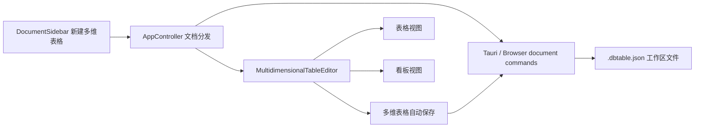

# Add Multidimensional Project Table

## Task Summary

实现一个类似截图中的多维表格能力，用于项目管理、上线记录、任务跟踪等结构化场景。首期支持创建多维表格文档，并提供「表格视图」和「看板视图」；明确不做表单视图和日历视图。

## Requirements Trace

- R1: 可以在知识库目录和子目录中创建「多维表格」文档，并支持打开、重命名、删除、移动等现有目录树能力。
- R2: 多维表格以结构化记录存储，支持字段、记录、视图配置随文档保存。
- R3: 支持表格视图，用户可以编辑字段值、添加记录、添加字段。
- R4: 支持看板视图，按状态类字段分组展示卡片，卡片展示标题、类型、主要内容、上线日期、附件摘要等字段。
- R5: 支持看板中新增分组、新增记录，以及拖动卡片切换状态。
- R6: 多维表格沿用现有保存状态和自动保存体验，避免输入时被保存流程抢焦点。
- R7: 批量导出工作区时不能遗漏多维表格文档，首期按原始 JSON 文件导出。
- R8: 表单视图和日历视图不在本次范围内。

## Scope Boundaries

- 不实现表单视图。
- 不实现日历视图。
- 不实现公式、关联记录、汇总字段、权限字段等 Airtable 级高级能力。
- 不替换现有 Univer 表格；多维表格是新的文档类型，不复用电子表格编辑器。
- 不做 Excel 导入导出；现有普通表格的 Excel 能力保持不变。
- 附件字段首期只做字段展示和数据结构预留，不扩展完整附件上传管理。

## Existing System Context

当前应用已经有基于文件的文档模型：

- `src/features/workspace/workspaceStore.ts` 定义文档类型和目录树状态。
- `src-tauri/src/models.rs` 定义 Rust 侧 `WorkspaceDocumentKind`。
- `src-tauri/src/commands/workspace.rs` 负责根据文件路径和内容识别文档类型。
- `src-tauri/src/commands/documents.rs` 负责创建、读取、写入文档。
- `src/lib/tauri.ts` 提供 Tauri 命令和浏览器降级实现。
- `src/app/AppController.tsx` 根据 `document.kind` 分发到 Lake 编辑器或 Univer 表格编辑器。
- `src/components/DocumentSidebar.tsx` 提供新建文档、新建表格等入口。
- `src/components/TopBar.tsx` 根据文档类型展示导入导出和保存状态。

多维表格和现有普通表格的核心差异是：普通表格是 cell-based workbook，多维表格是 record-based database。为了避免把两种模型混在一起，首期应新增独立文档类型和独立 React 编辑器。

## Data Model Decision

新增文档类型建议命名为 `multidimensional-table`，文件扩展名使用 `.dbtable.json`，并在文件内容中加入显式判别字段，避免和现有 Univer workbook JSON 冲突。

```ts
type MultidimensionalTableDocument = {
  kind: "multidimensional-table";
  version: 1;
  fields: MultidimensionalTableField[];
  records: MultidimensionalTableRecord[];
  views: MultidimensionalTableView[];
  activeViewId: string;
};
```

默认项目管理模板字段：

- `title`: 标题，文本字段，作为卡片主标题。
- `status`: 上线状态，单选字段，默认选项包括 `待上线`、`进行中`、`搁置`、`已上线`。
- `type`: 类型，多选标签字段。
- `description`: 主要内容，长文本字段。
- `launchDate`: 上线日期，日期字段。
- `attachment`: 附件，附件摘要字段。

默认视图：

- `table`: 表格视图。
- `board`: 看板视图，默认按 `status` 分组。

## High-Level Design



## Implementation Units

### U1: Add Workspace Document Kind And File Commands

**Files**

- Modify: `src/features/workspace/workspaceStore.ts`
- Modify: `src-tauri/src/models.rs`
- Modify: `src-tauri/src/commands/workspace.rs`
- Modify: `src-tauri/src/commands/documents.rs`
- Modify: `src-tauri/src/lib.rs`
- Modify: `src/lib/tauri.ts`
- Modify tests: `src/features/workspace/workspaceStore.test.ts`

**Approach**

- 在 TypeScript 和 Rust 两侧新增 `multidimensional-table` 文档类型。
- 新建文件扩展名使用 `.dbtable.json`。
- 文档标题解析需要去掉 `.dbtable.json` 后缀。
- Tauri 命令新增创建、读取、写入多维表格文档的能力。
- 浏览器降级模式也要支持多维表格，保证开发和测试环境一致。
- `document_kind_from_path` 先识别 `.dbtable.json` 和内容判别字段，再走现有 `.json` Univer workbook 识别逻辑。

**Test Scenarios**

- 创建根目录多维表格后，工作区树出现对应文档。
- 创建子目录多维表格后，父子层级正确。
- `.dbtable.json` 被识别为多维表格。
- 普通 Univer workbook JSON 不被误识别为多维表格。
- 非法路径和目录穿越仍被拒绝。

### U2: Add Multidimensional Table Domain Model

**Files**

- Add: `src/features/multidimensional-table/multidimensionalTableDocument.ts`
- Add tests: `src/features/multidimensional-table/multidimensionalTableDocument.test.ts`

**Approach**

- 定义字段、记录、视图、选项等核心类型。
- 提供默认项目管理模板。
- 提供 `parseMultidimensionalTableDocument` 和 `serializeMultidimensionalTableDocument`。
- 解析时做 schema version 和必填字段校验，缺失可恢复字段使用默认值补齐。
- 字段值用 `record.values[fieldId]` 存储，方便新增字段和视图复用。

**Test Scenarios**

- 空内容可以生成默认模板。
- 有效 JSON 可以稳定解析和序列化。
- 缺失 `views`、`activeViewId` 等可恢复字段时能补默认值。
- 错误 `kind` 或版本不匹配时返回明确错误。

### U3: Integrate Creation, Opening, And Save Lifecycle

**Files**

- Modify: `src/app/AppController.tsx`
- Modify: `src/app/appState.ts`
- Modify: `src/components/DocumentSidebar.tsx`
- Modify: `src/components/TopBar.tsx`
- Modify tests: `src/app/AppController.test.tsx`
- Modify tests: `src/components/documentSidebar.test.tsx`
- Modify tests: `src/components/TopBar.test.tsx`

**Approach**

- `DocumentSidebar` 增加「新建多维表格」入口，根目录和目录行操作都支持。
- `AppController` 增加创建和打开多维表格分支。
- 新增编辑器 lazy import，按 `currentDocument.kind === "multidimensional-table"` 渲染。
- `TopBar` 对多维表格保留标题和保存状态，不显示普通表格的 Excel 导入导出入口。
- 保存状态继续由 AppController 管理，避免每个视图重复实现状态逻辑。

**Test Scenarios**

- 点击新建多维表格后调用正确创建函数。
- 新建成功后当前文档切换到多维表格。
- 打开多维表格时渲染多维表格编辑器，而不是 Lake 或 Univer。
- 多维表格顶部不出现 Excel 导入导出按钮。
- 保存失败时沿用现有错误提示路径。

### U4: Build Table View Editor

**Files**

- Add: `src/features/multidimensional-table/MultidimensionalTableEditor.tsx`
- Add: `src/features/multidimensional-table/MultidimensionalTableGrid.tsx`
- Modify: `src/styles/app.css`
- Add tests: `src/features/multidimensional-table/MultidimensionalTableEditor.test.tsx`

**Approach**

- 编辑器内部提供视图切换控件：`表格`、`看板`。
- 表格视图用记录行和字段列展示数据。
- 文本、长文本、单选、多选、日期字段提供基础编辑控件。
- 支持新增记录和新增字段。
- 输入使用本地 draft 状态，保存用防抖提交，避免输入过程中频繁写盘造成卡顿和焦点丢失。
- 样式保持工作台型 UI：密集、克制、可扫描，避免营销式大卡片布局。

**Test Scenarios**

- 渲染默认字段和默认视图。
- 编辑文本字段后触发保存回调。
- 修改单选和多选字段后记录值正确更新。
- 新增记录后出现在表格底部。
- 新增字段后所有记录保持可编辑。

### U5: Build Kanban Board View

**Files**

- Add: `src/features/multidimensional-table/MultidimensionalTableBoard.tsx`
- Modify: `src/features/multidimensional-table/MultidimensionalTableEditor.tsx`
- Modify: `src/styles/app.css`
- Add tests: `src/features/multidimensional-table/MultidimensionalTableBoard.test.tsx`

**Approach**

- 看板视图按 `board.groupByFieldId` 指定的单选字段分组。
- 每个分组展示状态名、记录数量和新增记录按钮。
- 卡片展示标题、类型标签、主要内容、上线日期、附件摘要。
- 支持新增分组，本质是给分组字段新增一个单选选项。
- 支持拖动卡片到其他分组，更新该记录的分组字段值。
- 拖拽优先复用项目已有的 `@dnd-kit` 依赖，避免新增拖拽库。

**Test Scenarios**

- 记录按状态字段正确分组。
- 没有状态值的记录进入未分组列。
- 在某一列新增记录时自动设置该列状态。
- 拖动卡片到其他列后记录状态更新。
- 新增分组后字段选项和看板列同步变化。

### U6: Preserve Multidimensional Tables In Batch Export

**Files**

- Modify: `src/app/AppController.tsx`
- Modify tests: `src/app/AppController.test.tsx`

**Approach**

- 批量导出工作区时，把 `.dbtable.json` 原始文件纳入 ZIP。
- 普通 Lake 文档继续导出 Markdown。
- 普通 Univer 表格继续导出 Excel。
- 多维表格首期不转换 Excel，避免和 record-based schema 混淆。

**Test Scenarios**

- 同时存在 Lake、普通表格、多维表格时，批量导出 ZIP 包含三类文件。
- 多维表格导出文件保持 `.dbtable.json` 后缀。
- 多维表格导出内容可再次解析为有效 schema。

## Cross-Cutting Concerns

### Autosave And Input Performance

多维表格编辑器不能在每次键盘输入时立即触发完整文档重建和写盘。建议策略：

- 单元格编辑先写入本地 draft。
- 防抖后批量提交到 AppController。
- 保存中的状态更新不重建编辑器根组件。
- 拖拽结束后只提交一次状态变化。

这点和之前普通表格输入卡顿、保存抢焦点问题属于同类风险，本功能首期就要规避。

### Schema Collision

现有普通表格也使用 JSON，因此多维表格必须同时使用文件后缀和内容判别字段：

- 文件名后缀：`.dbtable.json`
- 内容字段：`kind: "multidimensional-table"`

识别顺序需要先判断多维表格，再判断 Univer workbook。

### Browser Fallback Parity

测试和开发环境会走 `src/lib/tauri.ts` 的浏览器降级逻辑。新增 Tauri 命令后，也要同步补齐 localStorage fallback，否则组件测试会出现 Tauri 可用、浏览器不可用的分歧。

## Verification Plan

- Run focused unit tests for workspace store, sidebar, topbar, app controller, and multidimensional table components.
- Run full frontend test suite.
- Run production build.
- Manually verify these flows in the desktop app:
  - 根目录创建多维表格。
  - 子目录创建多维表格。
  - 表格视图编辑文本、标签、日期。
  - 看板视图新增列、新增记录、拖动卡片。
  - 关闭应用后重新打开，多维表格内容保留。
  - 批量导出包含 `.dbtable.json`。

## Deferred Work

- 表单视图。
- 日历视图。
- Excel 导入导出。
- 附件上传和资源库联动。
- 字段排序、筛选、隐藏、颜色配置。
- 关联记录、公式、汇总字段。
- 大数据量虚拟滚动。
