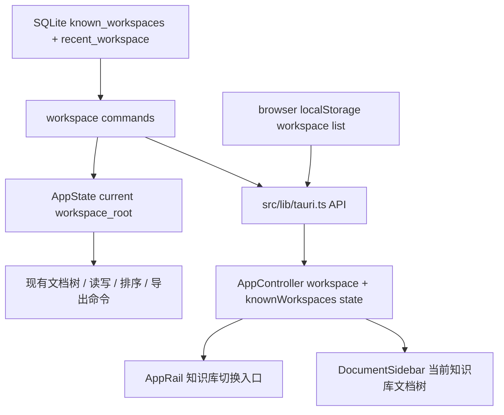

# feat: 支持多知识库切换与管理

## Overview

当前应用以一个当前知识库目录为中心工作。已有 SQLite 层已经记录 `known_workspaces`，但前端启动、切换、浏览器降级和工作台 UI 仍只暴露单个最近知识库。本计划把“单知识库入口”扩展为“多个已知知识库 + 单个当前激活知识库”：用户可以在类似语雀的左侧知识库列表中选择一个知识库激活进入，也可以在指定位置创建一个新目录作为新知识库。

本次不改变文档树、编辑器、保存、导出等命令的基本工作方式。所有文档操作仍只作用于当前激活知识库，避免把多知识库支持扩大成跨库移动、跨库搜索或多编辑器并行工作。

---

## Problem Frame

上游需求文档的首版范围要求用户选择本地目录作为知识库，并展示、创建和编辑 `.lake` 文档。该文档同时把“多知识库管理”列为后续范围（see origin: `docs/brainstorms/2026-04-26-lake-first-notes-requirements.md`）。现在用户需要从单目录模式升级：个人用户通常会把不同项目、公司资料、个人笔记拆成多个目录，需要在应用内直接切换，而不是每次重新选择目录覆盖最近知识库。

核心产品语义保持不变：这是一个本地文件夹式 Lake 笔记 App，不是云端多空间协作平台，也不是跨知识库知识图谱系统。

---

## Requirements Trace

- R1. App 必须能记录多个已知知识库目录，并在重启后保留列表。
- R2. App 必须提供当前已知知识库列表，用户点击某个知识库后激活进入该知识库。
- R3. App 必须能把已有本地目录添加为知识库；添加后该目录成为当前激活知识库。
- R4. App 必须能在用户指定位置创建一个新目录作为新知识库；创建成功后写入已知知识库列表并激活进入。
- R5. 文档读写、新建、重命名、删除、拖拽排序、导出等现有操作仍只作用于当前激活知识库。
- R6. 每个知识库保留独立的文档树排序数据，不因切换其他知识库而串库。
- R7. 删除/移除知识库入口必须是非破坏性的“从列表移除”，不能删除用户本地目录或目录内文档。
- R8. 浏览器预览和前端测试环境必须支持多知识库列表，避免只在 Tauri 运行时可用。
- R9. 现有备份行为应继续基于已知知识库集合，不因 UI 增加多知识库入口而漏备或误删。

**Origin actors:** A1 个人用户, A2 桌面 App, A4 语雀编辑器
**Origin flows:** F1 选择知识库目录, F2 新建并编辑 Lake 文档
**Origin acceptance examples:** AE1 覆盖选择目录和展示文档, AE2 覆盖当前知识库中新建和保存文档

---

## Scope Boundaries

### Deferred for later

- Markdown / HTML 导出命令。
- 附件、音频、视频上传。
- WebDAV 存储 provider。
- 全文搜索、标签、反链、图谱、索引。
- 复杂配置迁移、公开发布插件或应用市场发布。
- Markdown 导入或从 Obsidian 迁移。

### Outside this product's identity

- 不做 Obsidian 插件。
- 不做 Markdown-first 笔记软件。
- 不做云端协作文档平台。
- 不做语雀 OpenAPI 客户端或语雀云同步工具。

### Plan-local Non-goals

- 不做多个知识库同时打开多个编辑画布。
- 不做跨知识库拖拽、移动、复制文档。
- 不做跨知识库全文搜索、统一标签或全局索引。
- 不做每个知识库独立 OSS / 资源密钥 / 备份密钥配置；这些设置仍保持应用级。
- 不改变 `.lake`、普通表格、多维表格的文件格式。
- 不重写备份架构；只保证已知知识库列表和备份输入保持一致。

---

## Context & Research

### Relevant Code and Patterns

- `src-tauri/src/storage/app_database.rs` 已有 `known_workspaces` 表、`KnownWorkspace` 查询、最近知识库迁移、`set_recent_workspace_root_at` 写入时 upsert 已知知识库。
- `src-tauri/src/models.rs` 已定义 `KnownWorkspace { root, name, last_opened_at }`，但前端类型和命令层还没有完整暴露。
- `src-tauri/src/state.rs` 当前只保存一个 `workspace_root`。这可以保留为“当前激活知识库”，不需要把所有文档命令改成显式传 root。
- `src-tauri/src/commands/workspace.rs` 的 `get_recent_workspace`、`set_workspace_root`、`list_lake_documents` 和全部目录/文档树命令都依赖当前 `AppState.workspace_root()`。
- `src/lib/tauri.ts` 浏览器降级只保存一个 `yuque-lake-notes.browser-workspace`，需要补多知识库列表，否则测试和预览无法覆盖切换行为。
- `src/app/AppController.tsx` 使用 `workspace: WorkspacePayload | null` 表示当前知识库；启动只拉 `getRecentWorkspace()`，选择目录后直接覆盖当前 workspace。
- `src/components/AppRail.tsx` 当前有“选择目录”和“新建文档”入口，适合承载轻量知识库切换入口。
- `src/components/DocumentSidebar.tsx` 已以当前 `workspaceRoot` 展示标题、文档树和当前库内操作，应继续只显示当前激活知识库内容。
- `src-tauri/src/commands/backup.rs` 已经通过 `list_known_workspaces(&app)` 创建备份，说明持久层已经把“已知知识库集合”视为备份输入。
- `src/app/AppController.test.tsx` 已 mock Tauri API 和编辑器保存生命周期，适合覆盖前端启动、添加、切换知识库。
- `src/components/workbenchLayout.test.tsx` 覆盖工作台关键可访问入口，需要随 AppRail 入口更新。
- `src-tauri/tests/app_database.rs` 已覆盖最近知识库迁移为已知知识库，可扩展多条记录排序和移除行为。

### Institutional Learnings

- `docs/solutions/` 当前没有可复用的历史沉淀。
- 用户提供的 AGENTS 约束要求保持实现简洁、优先编辑现有文件、中文说明和关键逻辑中文注释。该功能应尽量复用现有存储表和 AppState，不引入新的状态管理库或多窗口架构。

### External References

- 未使用外部资料。该功能主要是已有 Tauri/React/SQLite 本地模式的延展，本地代码已经提供足够直接的实现样例。

---

## Key Technical Decisions

| Decision | Rationale |
|---|---|
| 保留单个当前 `workspace_root` | 现有文档命令、保存、导出、拖拽排序都围绕当前知识库设计；保留单活跃模型可以最小化改动面。 |
| 将 `setWorkspaceRoot` 继续作为添加已有目录/切换入口 | 该命令已负责规范化目录、保存最近知识库并 upsert 已知知识库，适合作为添加已有库和切换已有库的统一后端路径。 |
| 新建知识库走独立后端命令 | 新建知识库需要在用户指定父目录下创建子目录，必须做目录名校验、同名冲突处理和创建后激活；这和选择已有目录不是同一个动作。 |
| 新增已知知识库列表命令，而不是把列表塞进 `getRecentWorkspace` | 启动时可以并行获取当前 workspace 和 known list；现有调用方不需要被迫处理组合 payload。 |
| “移除知识库”只移除应用记录，不删除本地文件 | 用户数据是本地透明目录；管理列表不能做破坏性删除。 |
| 浏览器降级也维护多 workspace map/list | 前端测试大量依赖 browser fallback 和 mocked API；两端一致可以避免 Tauri-only 行为漂移。 |
| 切换知识库前先处理当前保存状态 | 若当前保存失败，继续沿用现有“保存失败时不能切换文档”的策略；否则尝试调用已注册的即时保存回调后再切库。 |
| 不使用 Tauri dialog confirm 做危险确认 | 当前 ACL 只允许 message/open/save。知识库移除确认应使用应用内 UI 或无确认的非破坏性菜单，不引入 `plugin:dialog|confirm` 依赖。 |

---

## Open Questions

### Resolved During Planning

- 多知识库是否需要同时打开多个知识库？Resolved: 不需要。第一版只支持多已知知识库列表和单当前知识库。
- 已知知识库移除是否删除本地目录？Resolved: 不删除，只从 App 列表移除。
- 是否需要数据库 schema 迁移？Resolved: 不需要新增表；已有 `known_workspaces` 足够。只在需要移除时补删除 helper。
- 切换知识库是否需要跨库保留当前文档？Resolved: 不保留。切换后关闭当前文档，用户从新知识库文档树重新打开。

### Deferred to Implementation

- 已知知识库缺失路径在列表中展示为“失效”还是切换时报错：后端应返回可控错误；UI 是否预校验文件存在由实现时根据命令可用性决定。

---

## High-Level Technical Design

> *This illustrates the intended approach and is directional guidance for review, not implementation specification. The implementing agent should treat it as context, not code to reproduce.*

---

## Implementation Units

- U1. **Expose Known Workspace Commands**

**Goal:** 后端暴露已知知识库列表和非破坏性移除能力，同时保留现有单当前知识库状态模型。

**Requirements:** R1, R2, R3, R4, R6, R7, R9

**Dependencies:** None

**Files:**
- Modify: `src-tauri/src/storage/app_database.rs`
- Modify: `src-tauri/src/commands/workspace.rs`
- Modify: `src-tauri/src/state.rs`
- Modify: `src-tauri/src/lib.rs`
- Test: `src-tauri/tests/app_database.rs`
- Test: `src-tauri/tests/bootstrap.rs`

**Approach:**
- 复用现有 `known_workspaces` 表和 `KnownWorkspace` model，新增命令层入口获取已知知识库列表。
- `set_workspace_root` 继续承担“添加已有目录/切换知识库”职责：规范化目录、保存 recent、upsert known、更新 `AppState`、返回当前 workspace payload。
- 新增创建知识库命令：接收父目录和知识库名称，校验安全目录名，创建目录，保存 recent，upsert known，更新 `AppState`，返回新 workspace payload。
- 补一个存储层删除已知知识库记录的 helper，用于“从列表移除”。该操作只删除数据库记录，不碰用户本地目录。
- 若移除的是当前激活知识库，后端应清空当前 `AppState`，并清掉或重置 `recent_workspace`，避免下一次启动又自动打开已移除条目。
- `rename_workspace` 继续同步迁移 `known_workspaces` 和 workspace order；现有 `move_workspace_order` 已做了关键工作，需要保留这一行为。
- 后端错误保持现有 `AppResult` 传播，不把缺失目录包装成前端难以区分的 panic 或白屏。

**Execution note:** 先补存储层测试，再补命令/状态行为，避免 UI 实现时才发现 active workspace 生命周期不清晰。

**Patterns to follow:**
- `set_recent_workspace_root_at` 的 upsert 行为。
- `move_known_workspace_at` 的重命名同步行为。
- `clear_backup_last_manifest` 对公开删除 helper 的组织方式。

**Test scenarios:**
- Happy path: 写入两个不同 recent workspace 后，列表返回两条已知知识库，最近打开的排在前面。
- Happy path: 切换到已知知识库时，`recent_workspace` 和 `AppState.workspace_root()` 都更新为目标目录。
- Happy path: 在指定父目录创建名为 `work` 的新知识库后，磁盘出现 `work/` 目录，known list 包含该 root，并激活为当前 workspace。
- Edge case: 新建知识库名称为空、包含路径分隔符或目标目录已存在时返回受控错误，不改变当前 active workspace。
- Edge case: 移除非当前知识库后，本地目录仍存在，列表不再包含该 root。
- Edge case: 移除当前知识库后，`AppState.workspace_root()` 为空，recent 不再指向被移除 root。
- Error path: 切换到不存在或不可规范化目录时返回受控错误，不能改变当前 active workspace。
- Integration: 重命名当前知识库后，known workspace 记录和 workspace order root 一起迁移。

**Verification:**
- 后端可以列出、切换、移除已知知识库；已有文档树命令继续只读取当前 active root。

---

- U2. **Add TypeScript API And Browser Parity**

**Goal:** 前端 Tauri API 层暴露已知知识库类型和操作，并让浏览器预览模式支持多个知识库。

**Requirements:** R1, R2, R3, R4, R8

**Dependencies:** U1

**Files:**
- Modify: `src/features/workspace/workspaceStore.ts`
- Modify: `src/lib/tauri.ts`
- Test: `src/lib/tauri.test.ts`
- Test: `src/app/AppController.test.tsx`

**Approach:**
- 在 TypeScript workspace 类型旁边补 `KnownWorkspace`，字段与 Rust model 保持 camelCase 对齐。
- 新增前端 API 包装：获取已知知识库列表、移除已知知识库、创建新知识库；继续复用 `setWorkspaceRoot` 做添加已有目录/切换。
- 浏览器降级从单个 `browserWorkspaceKey` 扩展为“当前 workspace key + known workspace list/map”。保存当前 workspace 时按 root 保留每个知识库的目录、文档和排序。
- `getRecentWorkspace` 在浏览器模式中返回当前 root 对应 payload；`listLakeDocuments` 也读取当前 root，不再总是单个固定 payload。
- 浏览器文档内容 key 需要纳入 workspace root 或 workspace id；当前只按相对路径存储，同名文档在不同知识库会互相覆盖。
- 浏览器模式中的 `renameWorkspace` 要同步更新 known list 中的 root/name，并迁移当前 workspace payload。
- 保持旧 localStorage key 的兼容读取：如果只存在旧单 workspace，首次读取时迁移成 known list。

**Patterns to follow:**
- 当前 `normalizeBrowserWorkspace`、`saveBrowserWorkspace` 的容错风格。
- `WorkspacePayload` 的 root/directories/documents/order 结构。

**Test scenarios:**
- Happy path: 浏览器模式添加两个 root 后，known list 返回两条，切回第一条时恢复第一条的文档树。
- Happy path: 浏览器模式创建新知识库时，在指定父路径和名称下生成 root，并加入 known list。
- Happy path: 旧 `browserWorkspaceKey` 存在时，首次读取迁移成 known workspace，并保持当前 workspace 不丢失。
- Edge case: 两个浏览器知识库都存在 `a.lake` 时，各自读写内容互不覆盖。
- Edge case: 删除浏览器 known workspace 只删除列表记录和对应 payload，不影响其他 root 的 payload。
- Integration: `AppController` mock API 可以覆盖启动加载 known list 与 recent workspace 的组合行为。

**Verification:**
- Tauri 和非 Tauri 环境暴露同一组多知识库 API，前端不需要按运行时写两套逻辑。

---

- U3. **Wire AppController Workspace Lifecycle**

**Goal:** 工作台启动、添加、切换、移除知识库时维护 `workspace`、`knownWorkspaces`、当前文档和保存状态的一致性。

**Requirements:** R1, R2, R3, R4, R5, R7

**Dependencies:** U2

**Files:**
- Modify: `src/app/AppController.tsx`
- Modify: `src/app/AppController.test.tsx`

**Approach:**
- 新增 `knownWorkspaces` 前端状态；启动时并行加载 recent workspace、known list、设置、密钥状态、数据库位置。
- `chooseWorkspace` 添加目录后刷新 known list，并把返回 payload 设置为当前 `workspace`。
- 新增 `createWorkspace(parentDirectory, name)` 流程：选择父目录、输入知识库名称，调用创建命令，刷新 known list，并把新库设为当前 `workspace`。
- 新增 `switchWorkspace(root)`：如果当前保存状态为 error，阻止切换并提示；否则调用已注册的 editor save-now 回调，成功后调用 `setWorkspaceRoot(root)`，关闭当前文档并重置保存状态。
- 新增 `forgetWorkspace(root)`：调用后端移除记录并刷新 known list；如果移除的是当前 workspace，前端同步清空 `workspace`、`currentDocument`、`saveStatus`。
- 切换过程中不复用上一个知识库的 `currentDocument`，避免同名路径在不同 root 下误读。
- 备份记录刷新继续保持应用级，不因切库清空；导出知识库 ZIP 仍基于当前 `workspace`。

**Execution note:** 对保存失败、保存回调 reject、切库成功三个路径先补前端行为测试。

**Patterns to follow:**
- `openDocument` 对 `saveStatus.state === "error"` 的保护。
- `refreshCurrentDocumentFromDisk` 失败时清空当前文档的恢复策略。
- 当前 `chooseWorkspace` 设置 workspace/currentDocument/saveStatus 的顺序。

**Test scenarios:**
- Happy path: 启动时 recent workspace 和 known list 都渲染，当前文档为空。
- Happy path: 选择新目录后调用 `setWorkspaceRoot`，刷新 known list，文档树显示新 root。
- Happy path: 新建知识库后调用创建命令，known list 多出新条目，侧栏显示新 root 的空文档树。
- Happy path: 点击已知知识库切换后，当前文档关闭，侧栏显示目标 root 文档。
- Edge case: 当前保存状态为 error 时，切换知识库被阻止，并展示“先处理保存失败”的错误。
- Error path: save-now 回调 reject 时不切换知识库，保留当前 workspace 和 currentDocument。
- Edge case: 从列表移除当前知识库后，工作台回到未选择目录状态。
- Integration: 切库后新建文档调用仍落在新 active root 对应的 workspace payload。

**Verification:**
- 用户可以在不重启应用的情况下添加和切换知识库；保存失败不会导致上下文丢失或串库。

---

- U4. **Add Workspace Switcher UI**

**Goal:** 在工作台提供清晰、可访问的多知识库入口，支持列表选择、添加已有目录、新建知识库和从列表移除。

**Requirements:** R1, R2, R3, R4, R7

**Dependencies:** U3

**Files:**
- Modify: `src/components/AppRail.tsx`
- Modify: `src/components/workbenchLayout.test.tsx`
- Modify: `src/styles/app.css`
- Create: `src/components/WorkspaceSwitcher.tsx`
- Test: `src/components/WorkspaceSwitcher.test.tsx`

**Approach:**
- 在左侧窄图标栏增加“知识库”入口，点击后展示类似语雀的轻量弹层/菜单：当前知识库、已知知识库列表、添加已有知识库、新建知识库。
- 已知知识库条目显示名称和必要的路径提示；当前激活条目有明确选中态。
- “添加已有知识库”继续复用选择目录能力。
- “新建知识库”先选择父目录，再输入知识库名称；创建成功后直接激活进入。
- “从列表移除”必须表达为非破坏性动作，文案避免“删除知识库”造成误解；不调用 Tauri confirm 插件。
- `WorkspaceSwitcher.tsx` 承担弹层展开、列表项、移除入口和可访问状态，`AppRail.tsx` 只负责放置入口和传递回调，避免窄栏组件继续膨胀。
- 保持工作台型 UI：窄栏入口、紧凑列表、浅边框和清晰 hover/active 状态，不做营销式卡片。

**Patterns to follow:**
- `IconButton` 的 label/tooltip/accessibility 模式。
- `DocumentSidebar` header 中的知识库名称展示。
- `src/styles/app.css` 现有 rail/sidebar 布局变量和按钮样式。

**Test scenarios:**
- Happy path: 工作台有可访问的“知识库”按钮，菜单打开后显示已知知识库条目。
- Happy path: 点击某个已知知识库条目触发切换回调。
- Happy path: 点击“添加已有知识库”触发选择目录回调。
- Happy path: 点击“新建知识库”完成父目录选择和名称输入后触发创建回调。
- Edge case: 没有已知知识库时，菜单显示空态和添加入口。
- Edge case: 当前知识库条目有选中态，不重复触发无意义切换。
- Error path: 移除入口文案明确为“从列表移除”，不出现会误导为删除本地文件的交互。

**Verification:**
- 用户可以通过左侧工作台入口完成多知识库切换；键盘和辅助技术能识别核心按钮和列表项。

---

- U5. **Preserve Backup And Regression Coverage**

**Goal:** 确认多知识库列表与备份、重命名、现有文档操作保持一致，不引入跨库副作用。

**Requirements:** R5, R6, R9

**Dependencies:** U1, U3

**Files:**
- Modify: `src-tauri/tests/app_database.rs`
- Modify: `src-tauri/tests/backup_manifest.rs`
- Modify: `src-tauri/tests/backup_archive.rs`
- Modify: `src-tauri/tests/workspace_commands.rs`
- Modify: `src/components/documentSidebar.test.tsx`
- Modify: `src/app/AppController.test.tsx`

**Approach:**
- 备份命令已经通过 known workspaces 构建归档；需要补充多 workspace 场景，证明多个 known root 都会进入 manifest/archive。
- 若实现“从列表移除”，补充测试证明被移除 root 不再作为备份输入，同时不删除本地文件。
- 文档树排序继续按 `workspace_order.workspace_root` 隔离；在多 root 场景中验证 root A 和 root B 的 order 不串。
- `DocumentSidebar` 不需要知道全部知识库；测试应确保它只接收当前 active workspace 的文档和目录。

**Patterns to follow:**
- `backup_manifest.rs` 使用 `KnownWorkspace` 构造归档输入的测试方式。
- `app_database.rs` 对 `workspace_order` root 隔离的测试方式。
- `documentSidebar.test.tsx` 对文档树结构和拖拽意图的纯函数测试方式。

**Test scenarios:**
- Integration: 两个 known workspace 各有文档时，备份 manifest 包含两个 workspace 条目和各自文件。
- Integration: 移除一个 known workspace 后，下一次备份不包含该 root，但该 root 本地文件仍存在。
- Edge case: root A 保存的 order 不影响 root B 的 order。
- Regression: 当前知识库内的新建、打开、拖拽排序、导出仍使用当前 root 的 payload。
- Regression: 切换知识库不会改变当前 OSS 设置、数据库位置设置或密钥状态。

**Verification:**
- 多知识库支持不会破坏备份集合、当前库文档操作和应用级设置。

---

## System-Wide Impact

- **Interaction graph:** 启动流程从“recent workspace”扩展为“recent workspace + known workspace list”；文档树和编辑器仍只消费当前 active workspace。
- **Error propagation:** 目录不存在、保存失败、移除失败都应走 `setAppError` 或现有错误 UI，不允许未处理 Promise 导致白屏。
- **State lifecycle risks:** 切库时必须先处理当前保存状态，再清空 currentDocument；不能让旧 root 的相对路径在新 root 下被继续读取。
- **API surface parity:** Rust Tauri commands、`src/lib/tauri.ts`、browser localStorage fallback 和测试 mock 都需要同名能力。
- **Integration coverage:** 至少覆盖启动加载、添加、切换、移除当前库、备份多 root、排序 root 隔离。
- **Unchanged invariants:** 文档命令仍不接收任意 root 参数；调用者必须通过切换 active workspace 改变上下文。`.lake` 主格式、文档树相对路径、workspace order item 格式保持不变。

---

## Risks & Dependencies

| Risk | Mitigation |
|------|------------|
| 切换时当前编辑器内容未保存 | 复用 `saveCurrentEditorNowRef`，保存失败则阻止切换。 |
| 旧 workspace 相对路径在新 root 下误读 | 切换成功后立即清空 `currentDocument` 和保存状态。 |
| 已知知识库列表和备份集合不一致 | 继续以 `known_workspaces` 作为备份来源，移除列表项时同步影响备份输入。 |
| 浏览器预览仍只有单 workspace | U2 明确补 browser parity，并通过 AppController 测试覆盖。 |
| 移除知识库被误解为删除文件 | UI 文案使用“从列表移除”，后端只删除数据库记录，测试验证本地目录仍存在。 |
| 引入 Tauri confirm ACL 错误 | 不使用 `plugin:dialog|confirm`，采用应用内菜单/状态提示。 |

---

## Documentation / Operational Notes

- 本计划本身是多知识库实现的交接文档；功能落地后如 README 或用户手册已有知识库选择说明，需要同步“添加/切换/从列表移除”的表述。
- 不需要数据库 schema 发布说明；`known_workspaces` 已存在。若实现新增删除 helper，只影响应用数据库记录。
- 不需要数据迁移脚本；现有 `migrate_recent_workspace_to_known` 已能把旧 recent workspace 纳入 known list。

---

## Sources & References

- **Origin document:** [docs/brainstorms/2026-04-26-lake-first-notes-requirements.md](../brainstorms/2026-04-26-lake-first-notes-requirements.md)
- Related code: `src-tauri/src/storage/app_database.rs`
- Related code: `src-tauri/src/commands/workspace.rs`
- Related code: `src-tauri/src/state.rs`
- Related code: `src/lib/tauri.ts`
- Related code: `src/app/AppController.tsx`
- Related code: `src/components/AppRail.tsx`
- Related tests: `src/app/AppController.test.tsx`
- Related tests: `src-tauri/tests/app_database.rs`
- Related tests: `src-tauri/tests/backup_manifest.rs`
