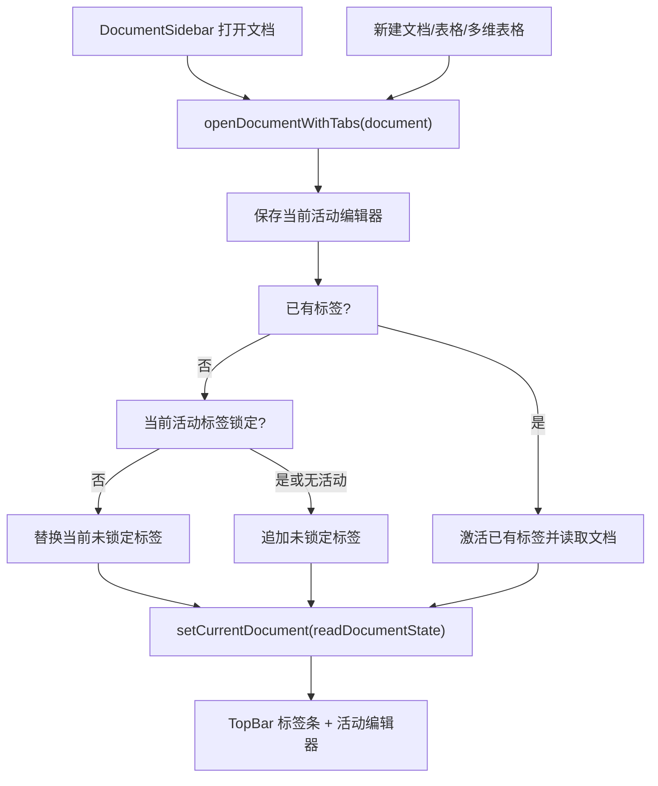

# feat: 单知识库内支持多文档标签与锁定

## Overview

当前应用在一个知识库内同时只能打开一个文档，用户点击侧边栏其他文档时会直接替换当前编辑区。这个计划把单文档编辑状态扩展为“同一知识库内的打开文档标签”：用户可以把当前文档标签锁定，锁定后再打开其他文档时，新文档进入第二个标签；如果当前活动标签未锁定，再打开文档会复用并替换这个未锁定标签。

这不是多窗口、多知识库并行或后台多编辑器同时挂载。第一版只显示一个活动编辑器，标签页负责保留打开入口和锁定策略，避免同时挂载多个 Lake / Univer / 多维表格编辑器带来的生命周期和性能风险。

---

## Problem Frame

上游需求要求应用支持选择知识库目录、展示并打开 `.lake` 文档，以及提供接近语雀工作台的编辑体验（see origin: `docs/brainstorms/2026-04-26-lake-first-notes-requirements.md`）。随着表格、多维表格和多知识库能力加入，用户在单个知识库内会频繁对照多个文档。现有单 `currentDocument` 模式会让用户在打开第二个文档时失去第一个文档的上下文。

用户期望的行为更接近“锁定标签”而不是传统浏览器无限开标签：未锁定标签是临时阅读位，打开新文档会替换；锁定标签是保留位，打开新文档不会覆盖它。

---

## Requirements Trace

- R1. 单个当前知识库内可以显示多个已打开文档标签。
- R2. 当前活动文档标签可以被锁定；锁定入口至少包括标签右键菜单。
- R3. 锁定状态可见，标签上展示锁定图标或等价视觉标记。
- R4. 打开一个未在标签中存在的文档时，如果当前活动标签未锁定，则用新文档替换当前活动标签。
- R5. 打开一个未在标签中存在的文档时，如果当前活动标签已锁定或当前没有活动标签，则新增一个未锁定标签并激活它。
- R6. 打开一个已经在标签中存在的文档时，直接激活已有标签，不创建重复标签。
- R7. 未锁定标签可以关闭；关闭活动标签后应切换到相邻标签，若没有剩余标签则清空编辑区。
- R8. 标签锁定、关闭、切换前必须遵守现有保存失败保护：当前文档保存失败时不能静默切走。
- R9. 文档重命名、移动、目录重命名、删除后，打开标签必须同步更新路径、标题或关闭失效标签。
- R10. 切换知识库、移除当前知识库、创建/选择新知识库时，清空当前知识库的打开标签。
- R11. 保存、导出、Excel 导入导出、资源上传等现有操作只作用于当前活动标签对应的文档。

**Origin actors:** A1 个人用户, A2 桌面 App, A4 语雀编辑器
**Origin flows:** F1 选择知识库目录, F2 新建并编辑 Lake 文档
**Origin acceptance examples:** AE1 覆盖打开已有文档, AE2 覆盖新建和保存文档

---

## Scope Boundaries

### In Scope

- 单个当前知识库内的打开文档标签。
- 标签锁定/解除锁定、关闭、激活。
- 侧边栏打开文档、新建文档/表格/多维表格时遵循锁定替换规则。
- 当前活动标签对应文档的保存、重命名、删除、移动同步。
- 标签条基础样式、右键菜单和键盘可访问性。

### Out of Scope

- 多个知识库同时打开标签。
- 多窗口或拆分视图。
- 同时挂载多个编辑器实例并保持后台编辑器运行。
- 跨标签拖拽排序或持久化标签会话到磁盘。
- 文档内容差异对比、分屏预览、跨文档搜索。
- 改变 `.lake`、普通表格、多维表格的文件格式。

---

## Context & Research

### Relevant Code and Patterns

- `src/app/AppController.tsx` 当前使用 `currentDocument: CurrentDocumentState | null` 表示唯一活动文档；`openDocument` 会直接 `setCurrentDocument(await readDocumentState(document))`。
- `src/app/appState.ts` 已集中定义 `CurrentDocumentState`，适合新增 UI 层的 `OpenDocumentTab` 类型或相关辅助类型。
- `src/components/TopBar.tsx` 当前负责标题、保存状态、保存按钮、导出菜单和标题双击重命名；标签条最适合放在这里，避免新增全局布局层。
- `src/components/DocumentSidebar.tsx` 已通过 `currentPath` 标记当前文档；多标签后仍只需把活动标签路径传给侧边栏。
- `src/styles/app.css` 已有 `.top-bar`、`.top-bar__title`、`.title-edit-input`、`.export-menu` 样式，可以在同一区域扩展紧凑标签条。
- `src/app/AppController.test.tsx` 已 mock `DocumentSidebar`、`AppRail`、`SpreadsheetEditor`、`MultidimensionalTableEditor`，能覆盖打开、保存、移动、删除和导出行为。
- `src/components/TopBar.test.tsx` 已覆盖标题重命名、文档导出、Excel 菜单、多维表格菜单隐藏，适合补标签 UI 测试。
- `src/features/spreadsheet/SpreadsheetEditor.tsx` 和 `src/features/lake-editor/LakeEditor.tsx` 都通过 `onRegisterSaveNow` 注册当前编辑器即时保存回调；第一版应继续只挂载一个活动编辑器。

### Institutional Learnings

- 用户偏好只做必要的事、优先编辑现有文件。计划采用扩展 `AppController` + `TopBar` 的方式，不先抽新状态库或多编辑器容器。
- 之前多知识库计划明确保持“单个当前激活知识库”，本功能应继续遵守这个边界，不把打开标签跨知识库持久化。

### External References

- 未使用外部资料。此功能主要是当前 React 状态模型和本地文件编辑流的延展，代码库已有足够实现样例。

---

## Key Technical Decisions

| Decision | Rationale |
|---|---|
| 只挂载一个活动编辑器 | Lake、Univer 表格和多维表格都有复杂生命周期，同时挂载多个实例风险高；标签切换前保存当前编辑器，激活时重新读取目标文档即可。 |
| 用 `openTabs + activeTabId + currentDocument` 扩展现有状态 | 保留 `currentDocument` 给现有编辑器和导出逻辑使用，新增标签数组只管理路径、锁定状态和 UI 顺序，减少改动面。 |
| 标签 id 第一版使用文档路径 | 当前知识库内文档路径唯一；重命名/移动时同步改路径即可，不需要新增持久化 id。 |
| 打开文档优先激活已有标签 | 防止同一文档重复开多个标签造成保存状态和标题同步混乱。 |
| 替换规则只看当前活动标签 | 用户说“目前没有锁定的文档页”时语义指当前打开位；如果当前活动标签锁定，则新增未锁定标签。 |
| 新建文档也走同一打开策略 | 新建文档后本质上也是打开一个新文档；如果当前标签未锁定就替换，若当前锁定则新增标签。 |
| 标签切换/关闭/打开前复用现有保存失败保护 | 当前保存状态为 `error` 时继续阻止切换，避免未落盘内容被隐藏或替换。 |
| 锁定是 UI 会话状态，不写入文档或知识库配置 | 用户没有要求重启恢复标签；首期不引入额外持久化和迁移。 |
| 锁定标签默认不显示关闭按钮 | 与示例一致，降低误关概率；可在右键菜单提供“解除锁定”后再关闭。 |

---

## Open Questions

### Resolved During Planning

- 是否需要多个编辑器同时保持挂载？Resolved: 不需要。只挂载活动编辑器，切换前保存，切换后读取。
- 是否要跨知识库保留标签？Resolved: 不需要。切换知识库时清空标签。
- 是否需要持久化标签会话？Resolved: 首期不需要。
- 右键菜单是否必须支持锁定？Resolved: 必须，用户明确要求“右键菜单可以锁定”。

### Deferred to Implementation

- 标签右键菜单是否也提供“关闭标签”：实现时可以加，但锁定标签应优先展示“解除锁定”。
- 多个锁定标签过多时是否需要横向滚动：实现时按 `overflow-x: auto` 处理即可，不做复杂溢出菜单。

---

## High-Level Technical Design

> This illustrates the intended approach and is directional guidance for review, not implementation specification.

---

## Implementation Units

### U1. 扩展应用层打开文档状态

**Goal:** 在 `AppController` 中引入打开标签状态，同时保留当前活动文档的现有渲染路径。

**Requirements:** R1, R4, R5, R6, R8, R10, R11

**Dependencies:** None

**Files:**
- Modify: `src/app/appState.ts`
- Modify: `src/app/AppController.tsx`
- Test: `src/app/AppController.test.tsx`

**Approach:**
- 在 `appState.ts` 新增轻量类型，例如 `OpenDocumentTab { id, path, locked }`。`id` 首期可等于 `path`。
- `AppController` 增加 `openTabs` 和 `activeTabId` 状态；`currentDocument` 继续表示活动标签实际内容。
- 新增辅助函数：
  - 根据 `workspace.documents` 和 tab path 找到当前文档 entry。
  - 打开文档时决定“激活已有 / 替换当前未锁定 / 追加新标签”。
  - 切换活动标签前保存当前编辑器并处理保存失败。
  - 工作区变化时清空标签和 `currentDocument`。
- `openDocument`、`createDocument`、`createSpreadsheet`、`createMultidimensionalTable` 统一走打开策略。
- `saveCurrentEditorNowRef` 仍只代表当前活动编辑器；每次标签切换前调用，成功后再读取目标文档。
- `currentPath` 改为活动标签对应 `currentDocument?.entry.path`，侧边栏仍只高亮活动文档。

**Test scenarios:**
- 打开 `a.lake` 后再打开 `b.lake`，当前标签未锁定时只保留一个标签，活动路径变为 `b.lake`。
- 打开 `a.lake` 后锁定该标签，再打开 `b.lake`，出现两个标签，`a.lake` 保持锁定，活动路径是 `b.lake`。
- 已经打开 `a.lake` 的情况下再次点击 `a.lake`，只激活已有标签，不重复读取或新增同名标签。
- 当前活动标签锁定时新建表格，新增一个未锁定表格标签并激活。
- 当前活动标签未锁定时新建文档，替换当前标签并激活新文档。
- 当前 `saveStatus.state === "error"` 时打开或切换标签被阻止，并展示现有错误提示语义。
- 切换知识库、移除当前知识库、新建知识库后，`openTabs`、`activeTabId`、`currentDocument` 全部清空。

**Verification:**
- `npm run test:run -- src/app/AppController.test.tsx`

---

### U2. 顶部标签条与右键锁定菜单

**Goal:** 在顶部栏展示文档标签，支持激活、锁定/解除锁定、关闭未锁定标签，并保持现有保存/导出操作。

**Requirements:** R1, R2, R3, R7, R11

**Dependencies:** U1

**Files:**
- Modify: `src/components/TopBar.tsx`
- Modify: `src/styles/app.css`
- Test: `src/components/TopBar.test.tsx`
- Test: `src/components/workbenchLayout.test.tsx`

**Approach:**
- 扩展 `TopBar` props，接收：
  - `openTabs`
  - `activeTabId`
  - `documents`
  - `onActivateTab`
  - `onToggleTabLocked`
  - `onCloseTab`
- 顶部左侧由单标题改成标签条；无文档时仍展示 `Lake 本地笔记`。
- 活动标签使用圆角 pill 风格；锁定标签显示 `Pin` 图标，未锁定活动标签显示关闭按钮。
- 标签右键打开轻量菜单，提供“锁定标签”或“解除锁定”。未锁定标签可额外提供“关闭标签”。
- 标题双击重命名只作用于活动标签对应文档；可以保留在活动标签标题上，或在标签条下方保留小标题输入区。优先选择不破坏现有重命名测试的实现。
- 样式保持语雀工作台克制风格：白底、浅灰背景、紧凑 pill，不新增大卡片或装饰背景。
- 键盘可访问性：标签容器用 `role="tablist"`，每个标签用 `role="tab"` 和 `aria-selected`；右键菜单用 `role="menu"`。

**Test scenarios:**
- 有两个标签时，`TopBar` 渲染两个 `tab`，活动标签 `aria-selected=true`。
- 点击非活动标签调用 `onActivateTab(tab.id)`。
- 右键活动标签后点击“锁定标签”，调用 `onToggleTabLocked(tab.id)`。
- 锁定标签显示锁定图标或可访问文本，且不显示普通关闭按钮。
- 未锁定标签点击关闭按钮调用 `onCloseTab(tab.id)`。
- 双击活动标签标题仍可提交重命名。
- 表格活动标签仍显示 Excel 导入导出菜单；多维表格活动标签仍不显示文档/Excel 导出菜单。

**Verification:**
- `npm run test:run -- src/components/TopBar.test.tsx src/components/workbenchLayout.test.tsx`

---

### U3. 文档生命周期变更同步标签

**Goal:** 文档重命名、删除、目录重命名、拖拽移动后，标签状态和活动文档保持一致。

**Requirements:** R7, R8, R9, R11

**Dependencies:** U1, U2

**Files:**
- Modify: `src/app/AppController.tsx`
- Test: `src/app/AppController.test.tsx`

**Approach:**
- 把现有 `rebindCurrentDocument` 扩展为标签级 rebind：
  - 文档重命名后更新对应 tab path/id，并重新读取或 rebind 活动文档 entry。
  - 目录重命名后更新所有子路径 tab。
  - 拖拽移动文档或文档子级容器后，按 `WorkspaceMoveResolution` 同步改 tab path。
  - 删除文档后移除对应 tab；如果删除的是活动标签，激活相邻标签或清空编辑区。
  - 删除目录后移除其下所有文档标签；活动标签若被移除，切到相邻可用标签或清空。
- 关闭活动标签时同样需要先保存当前编辑器；保存失败则不关闭。
- 非活动标签关闭不需要调用当前编辑器保存，因为非活动标签没有挂载编辑器。
- 活动标签对应文档丢失时，清空 `currentDocument` 并展示已有“找不到当前文档，已关闭编辑区”类提示。

**Test scenarios:**
- 重命名当前活动文档后，标签标题和路径同步为新名称，编辑器仍打开新路径。
- 重命名非活动锁定文档后，锁定标签标题同步，当前活动文档不变。
- 删除非活动标签对应文档后，该标签消失，活动标签不变。
- 删除活动标签对应文档后，切换到右侧相邻标签；没有相邻标签时清空编辑区。
- 目录重命名后，目录下打开标签的路径全部更新。
- 拖拽移动当前文档到目录后，活动标签路径和侧边栏高亮同步到新路径。
- 关闭活动未锁定标签后，切换到相邻标签并重新读取文档内容。
- 保存失败时关闭/切换活动标签被阻止。

**Verification:**
- `npm run test:run -- src/app/AppController.test.tsx`

---

### U4. 回归验证与浏览器视觉检查

**Goal:** 确认多标签不会破坏现有编辑器、导出和工作台布局。

**Requirements:** R1-R11

**Dependencies:** U1, U2, U3

**Files:**
- No production files expected.
- Test: existing affected test suites.

**Approach:**
- 跑受影响前端测试，重点覆盖 AppController、TopBar、DocumentSidebar 工作台布局、LakeEditor、SpreadsheetEditor、多维表格编辑器。
- 跑完整构建，确认懒加载编辑器类型和 CSS bundle 没有问题。
- 启动本地 dev server，用浏览器验证：
  - 打开第一个文档，锁定标签。
  - 打开第二个文档，出现第二个标签。
  - 未锁定第二个标签时打开第三个文档，第二个标签被替换。
  - 右键菜单锁定/解除锁定可用。
  - 普通文档、表格、多维表格各自顶部操作仍按当前活动标签显示。

**Verification:**
- `npm run test:run -- src/app/AppController.test.tsx src/components/TopBar.test.tsx src/components/workbenchLayout.test.tsx`
- `npm run test:run -- src/features/lake-editor/LakeEditor.test.tsx src/features/spreadsheet/SpreadsheetEditor.test.tsx src/features/multidimensional-table/MultidimensionalTableEditor.test.tsx`
- `npm run build`

---

## Sequencing

1. 先做 U1，确保打开/替换/新增标签的核心状态规则正确。
2. 再做 U2，把标签条和右键锁定菜单接到 `TopBar`。
3. 然后做 U3，补齐重命名、移动、删除、关闭标签的同步边界。
4. 最后做 U4，进行测试和浏览器视觉复核。

---

## Risks And Mitigations

- **风险：切换标签时未保存内容丢失。** 继续复用 `saveCurrentEditorNowRef`，所有活动标签切换/替换/关闭前先保存，保存失败则阻止操作。
- **风险：后台标签内容缓存过期。** 首期不缓存后台内容，激活标签时重新读取磁盘内容。
- **风险：文档路径变化导致标签失效。** 所有 rename/move/delete 入口都集中在 `AppController`，同步维护 `openTabs`。
- **风险：TopBar 过载。** 标签条第一版直接放在 `TopBar`，若实现明显过长，再按局部组件拆分，但不先新建抽象。
- **风险：Univer 表格切换生命周期问题。** 保持单编辑器挂载，切换时通过 `currentDocument` 变化触发现有 SpreadsheetEditor 清理/重建逻辑。

---

## Definition Of Done

- 单知识库内可以打开多个标签，锁定标签不会被新打开文档替换。
- 未锁定活动标签会被新打开文档复用替换。
- 已打开文档不会重复创建标签。
- 标签右键菜单可以锁定/解除锁定。
- 关闭、重命名、移动、删除文档后标签状态一致。
- 普通文档、表格、多维表格的现有保存、导出、导入操作仍作用于活动标签。
- 受影响测试和生产构建通过。
