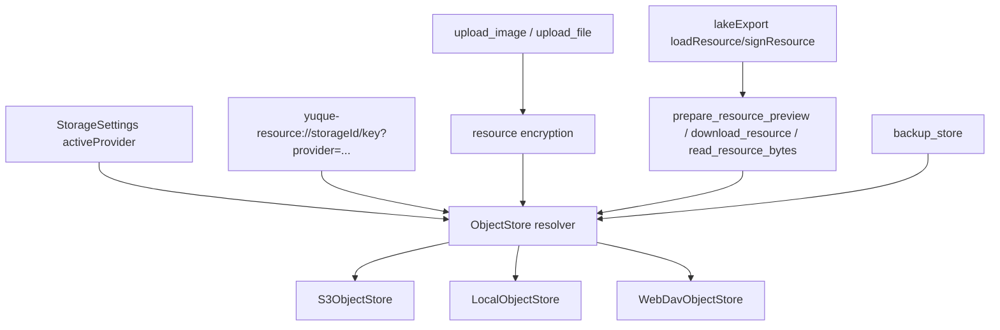

# feat: 支持多存储 provider（S3 / 本地 / WebDAV）

## Overview

当前应用的图片、附件、短时导出临时对象和备份对象都绑定在 S3 兼容存储配置上。用户希望在现有 S3 能力基础上，扩充支持本地存储和 WebDAV 存储。本计划把现有 `OssSettings + storage/s3.rs` 拆成“存储 provider 配置 + 统一对象存储接口”：S3 继续保持兼容；本地 provider 把加密后的资源和备份对象写入用户指定目录；WebDAV provider 通过标准 WebDAV 方法读写对象。

第一版保持“一个当前激活存储 provider 用于新上传和新备份”的产品语义，但 resourceRef 会记录 provider/storageId，使历史资源在后续切换 provider 后仍有解析边界。资源从旧 provider 批量迁移到新 provider 作为第二阶段能力纳入本计划研究：先完成 provider 抽象，再基于统一 object store 做资源清点、复制、校验和文档引用重写。数据库位置、知识库目录和 `.lake` 主文件存储不在本计划内改变。

## Problem Frame

现有实现已经完成私有 S3 资源引用、资源加密、预览解密、附件下载、导出资源包和备份恢复，但核心对象读写函数仍集中在 `src-tauri/src/storage/s3.rs`，调用方直接依赖 `OssSettings`。这导致：

- 想上传到本地目录时，仍必须配置 endpoint/bucket/access key 这类 S3 字段。
- 想使用 WebDAV 时，无法复用现有资源加密、resourceRef、导出和备份链路。
- 备份和资源对象都复用 S3 函数，如果只在上传命令里做本地/WebDAV 分支，会让备份、导出和读取链路继续割裂。
- 现有 `yuque-resource://bucket/key` 默认隐含 S3 bucket，缺少 provider 信息；未来切换存储后无法判断旧资源应从哪里读取。

因此本次要解决的不是“给上传按钮多一个路径”，而是把对象存储能力抽象成应用内稳定边界。

## Requirements Trace

- R1. 保留现有 S3 兼容存储能力，旧 `yuque-resource://<bucket>/<key>` 资源继续可读。
- R2. 新增本地存储 provider，用户可选择一个本地目录作为资源和备份对象根目录。
- R3. 新增 WebDAV 存储 provider，用户可配置服务地址、账号密码和根路径。
- R4. 图片和附件上传继续在 Tauri 后端加密后再写入 provider，前端不接触明文密钥。
- R5. 资源预览、附件下载、HTML/PDF/Markdown/ZIP 导出继续通过统一读取入口拿到解密后的明文 bytes。
- R6. 备份创建、列出、恢复、删除应跟随当前 provider，不能继续只支持 S3。
- R7. resourceRef 必须记录 provider/storageId，并兼容无 provider 的旧 S3 引用。
- R8. 本地 provider 必须防止路径穿越，不能让伪造 resourceRef 读取存储根目录外文件。
- R9. WebDAV provider 必须使用相对 object key 映射远端路径，不能把完整远端 URL 或凭据写入 `.lake`。
- R10. 短时签名链接导出第一版仅 S3 支持；本地和 WebDAV 使用本地资源包导出。
- R11. 设置页和浏览器预览模式需要支持三种 provider 的配置、校验和默认值。
- R12. 应支持对当前知识库资源进行批量迁移，把旧 provider 中的资源复制到目标 provider 并重写文档引用。
- R13. 迁移前必须提供 dry-run 清点结果，列出将迁移的资源数量、涉及文档、不可读资源和重复资源。
- R14. 迁移复制对象时默认保持原始对象 bytes 和加密元数据，不强制解密重加密，避免缺失旧资源密钥时无法迁移密文对象。
- R15. 迁移必须在目标资源全部复制并校验成功后再写回文档，不能出现文档引用已切换但目标对象缺失。
- R16. 迁移过程必须去重同一个 resourceRef，避免多个文档引用同一资源时重复复制。
- R17. 迁移后默认不删除旧 provider 对象；旧对象清理作为独立确认动作。
- R18. 迁移必须覆盖 `.lake` 文档、Lake 富文本字段和多维表格附件字段中的 resourceRef。

## Scope Boundaries

### In Scope

- 新增存储 provider 模型：`s3`、`local`、`webdav`。
- 抽出统一对象存储接口，覆盖 put/get/list/delete/presign 能力。
- 上传图片和附件时按当前激活 provider 写入对象。
- 资源预览、下载、导出读取时按 resourceRef provider 读取对象。
- 备份创建、列出、恢复、删除使用统一对象存储接口。
- 设置页支持选择当前 provider，并配置本地目录或 WebDAV 参数。
- 浏览器 fallback 支持 provider 配置和基础资源引用模拟。
- 旧 `OssSettings` 数据迁移到新的 S3 provider 配置。
- 资源从旧 provider 到新 provider 的批量迁移方案和第一版实现边界。

### Out of Scope

- 不做多 provider 同时上传同一份资源。
- 不做 WebDAV 同步冲突处理、离线队列、断点续传或锁定协议。
- 不做 WebDAV 公网分享链接或带凭据导出链接。
- 不做迁移完成后的自动删除旧对象；旧对象清理需要单独确认和后续能力。
- 不做迁移时的跨密钥重加密或历史明文资源强制加密。
- 不改变知识库目录、SQLite 数据库目录、`.lake` 文件格式主体。
- 不把 S3/WebDAV 凭据迁移到系统钥匙串；第一版沿用现有设置存储方式，后续可单独加固。

### Deferred for Later

- 多个存储 profile 列表和 profile 管理 UI。
- WebDAV 大文件上传进度、取消和重试。
- 本地 provider 的自动清理、磁盘空间提示和资源引用反查。
- 迁移成功后的旧 provider 对象批量清理。
- 凭据 keyring 化和配置导入导出。

## Context & Research

### Relevant Code and Patterns

- `src-tauri/src/models.rs` 的 `OssSettings` 同时承载 S3 连接、资源目录、备份目录和导出策略。
- `src-tauri/src/storage/s3.rs` 当前提供 `put_object`、`get_object_bytes`、`delete_object`、`list_object_keys`、`presign_get_object_url`、`build_resource_ref_with_encryption`、`validate_resource_key`。
- `src-tauri/src/commands/upload.rs` 上传图片/附件时加载 `OssSettings`、校验设置、加密 bytes、调用 S3 `put_object`，并构造 `yuque-resource://`。
- `src-tauri/src/commands/resources.rs` 预览、下载、导出读取和短时链接都通过 S3 object key 读取。
- `src-tauri/src/storage/backup_store.rs` 备份对象和备份 index 也直接依赖 `storage/s3.rs` 的 put/get/list/delete。
- `src-tauri/src/commands/backup.rs` 备份入口通过 `load_oss_settings` 获取 S3 设置，因此本地/WebDAV 如果不抽象对象存储，备份会继续锁死在 S3。
- `src/features/settings/OssSettingsPanel.tsx` 目前“上传配置”面板直接展示 S3 字段；可以演进为“文件存储”面板并按 provider 渲染字段。
- `src/features/lake-editor/resourceReference.ts` 已集中处理 resourceRef 解析和旧公开 URL 兼容，是扩展 provider 元数据的前端入口。
- `src/features/lake-editor/resourceReference.ts` 的 `rewriteLakeResourceUrls` 能结构化处理 `.lake` 中图片 src 和 Lake file/localdoc card value，迁移不应退回到纯字符串全局替换。
- `src/features/multidimensional-table/multidimensionalTableDocument.ts` 的附件字段会保存 `resourceRef`，多维表格富文本字段还会复用 Lake 资源引用逻辑，迁移清点必须覆盖这两类位置。
- `src/features/lake-editor/lakeExport.ts` 已把导出资源读取抽象为 `loadResource`，短时链接抽象为 `signResource`，适合承接 provider 能力差异。
- `src/lib/tauri.ts` 浏览器 fallback 当前用 `localStorage` 模拟 OSS 设置和资源引用，需要同步 provider 结构，避免测试只覆盖 S3 字段。

### Existing Decisions to Preserve

- 前端不直接持有资源加密密钥；上传、下载、预览、导出读取都由 Tauri 后端处理。
- `.lake` 中保存 canonical `yuque-resource://` 引用，不保存临时本地路径、预览 data URL 或短时签名 URL。
- 新上传资源默认加密；旧无 `enc` 的资源保持明文兼容读取。
- 导出资源包是默认策略，短时签名链接是显式策略。

### External Research

未使用外部资料。该计划主要基于当前代码结构和 WebDAV 标准 HTTP 方法设计：`PUT`、`GET`、`DELETE`、`MKCOL`、`PROPFIND`。实现时如需要解析 WebDAV `207 Multi-Status`，建议引入 `quick-xml` 做结构化解析，而不是手写字符串解析。

## Key Technical Decisions

| Decision | Rationale |
|---|---|
| 新增 `StorageSettings`，保留旧 `OssSettings` 迁移兼容 | 继续用 `OssSettings` 命名会让本地/WebDAV 语义混乱；但数据库里已有 `oss_settings`，需要读旧数据并迁移成 S3 provider。 |
| 采用一个 active provider 用于新写入 | 这符合当前应用设置模型，改动最小；resourceRef 记录 provider 后，后续可扩展多 profile。 |
| resourceRef 新增 `provider` 和 `storageId` 概念 | 旧引用默认 `provider=s3`、`storageId=bucket`；本地/WebDAV 新引用必须能明确从哪个 provider 读取。 |
| 统一对象接口覆盖资源和备份 | 当前资源和备份都依赖 S3 object API，只改上传会造成备份继续不可用。 |
| 本地和 WebDAV 不支持短时签名链接导出 | 标准本地目录/WebDAV 没有 S3 presign 等价能力；导出应回退到本地资源包，避免把路径或凭据泄露到导出产物。 |
| 本地 provider object key 必须走 root 内相对路径 | 防止伪造 resourceRef 读取任意本地文件。 |
| WebDAV provider 只保存 base URL、root path 和相对 object key | `.lake` 不保存远端完整 URL 或凭据；换服务地址时由设置决定访问位置。 |
| 资源迁移默认复制原始对象 bytes | encrypted resource 不需要解密即可迁移，缺少旧资源密钥时仍能把密文搬到新 provider；是否重加密应作为后续独立能力。 |
| 迁移先复制校验，后重写文档 | 避免中途失败导致文档引用指向不存在的新对象。 |
| 迁移默认只迁当前知识库，支持后续扩展到全部已知知识库 | 当前文档读写 API 围绕 active workspace；先把当前知识库做稳，再通过显式 root 命令扩展全量迁移。 |
| 第一版不做 profile 列表 UI | 先把 provider 抽象和三种写读链路打通；多 profile 管理和迁移可后续做。 |

## Proposed Data Model

方向性结构如下，具体字段名实现时按 Rust/TypeScript 现有 camelCase 约定落地：

```text
StorageSettings
  activeProvider: "s3" | "local" | "webdav"
  s3: S3StorageSettings
  local: LocalStorageSettings
  webdav: WebDavStorageSettings
  imagePrefix
  filePrefix
  backupPrefix
  defaultExportResourceStrategy
  defaultSignedUrlTtlSeconds
  maxSignedUrlTtlSeconds
  allowSignedUrlExport
```

- `S3StorageSettings`：沿用 endpoint、bucket、region、accessKeyId、secretAccessKey、forcePathStyle、publicBaseUrl。
- `LocalStorageSettings`：`rootDirectory`，可选 `storageId`，默认 `local`。
- `WebDavStorageSettings`：`endpoint`、`username`、`password`、`rootPath`，可选 `storageId`，默认 `webdav`。
- 资源和备份目录前缀继续作为通用字段，三种 provider 共用 `imagePrefix`、`filePrefix`、`backupPrefix`。

## Resource Reference Design

旧格式继续支持：

```text
yuque-resource://<bucket>/<key>?kind=image&name=a.png&size=1&type=image/png
```

解析规则：无 `provider` 时按旧 S3 引用处理，`storageId = bucket`。

新格式建议保持同一 scheme，不引入第二套文档引用：

```text
yuque-resource://<storageId>/<key>?provider=local&kind=file&name=a.pdf&size=1&type=application/pdf&enc=age-v1&keyFingerprint=...
yuque-resource://<storageId>/<key>?provider=webdav&kind=image&name=a.png&size=1&type=image/png&enc=age-v1&keyFingerprint=...
yuque-resource://<bucket>/<key>?provider=s3&kind=image&name=a.png&size=1&type=image/png&enc=age-v1&keyFingerprint=...
```

实现时可在 Rust `ResourceRef` 和 TypeScript `LakeResourceReference` 中新增：

- `provider?: "s3" | "local" | "webdav"`
- `storageId: string`
- `bucket` 作为 S3 旧字段兼容保留，或在解析后映射为 `storageId`

## High-Level Technical Design



## Implementation Units

### U1. Storage settings model and migration

**Goal:** 把 `OssSettings` 演进为 provider-aware 的存储设置，同时兼容旧数据库和前端调用。

**Requirements:** R1, R2, R3, R10, R11

**Dependencies:** None

**Files:**

- Modify: `src-tauri/src/models.rs`
- Modify: `src-tauri/src/storage/app_database.rs`
- Modify: `src-tauri/src/commands/settings.rs`
- Modify: `src/app/appState.ts`
- Modify: `src/features/settings/ossSettingsStore.ts`
- Modify: `src/lib/tauri.ts`
- Test: `src-tauri/tests/oss_settings.rs`
- Test: `src-tauri/tests/app_database.rs`
- Test: `src/lib/tauri.test.ts`

**Approach:**

- 新增 `StorageSettings` / `StorageProviderKind` / provider-specific settings。
- 旧 `oss_settings` JSON 读取时迁移为 `StorageSettings { activeProvider: "s3", s3: ... }`。
- 可保留 `get_oss_settings` / `save_oss_settings` 命令名作为兼容壳，内部读写新结构；或新增 `get_storage_settings` 后让旧命令委托新命令。
- 校验逻辑按 active provider 分支：S3 校验现有字段；local 校验目录非空；WebDAV 校验 endpoint、username、password。
- 导出策略校验增加 provider 限制：active provider 非 S3 时，不允许默认策略为 `signed-url`，或保存时自动回落到 `bundle` 并提示。

**Test scenarios:**

- 旧 `OssSettings` JSON 能加载为 active S3 provider，字段不丢失。
- S3 active provider 缺少 bucket/access key 时校验失败。
- Local active provider 缺少 rootDirectory 时校验失败。
- WebDAV active provider 缺少 endpoint/username/password 时校验失败。
- 非 S3 provider 设置 `signed-url` 默认导出策略时返回受控错误或规范化为 `bundle`。

### U2. Unified object store interface

**Goal:** 建立 provider 无关的 put/get/list/delete/presign 接口，供资源和备份复用。

**Requirements:** R2, R3, R5, R6, R8, R9, R10

**Dependencies:** U1

**Files:**

- Create: `src-tauri/src/storage/object_store.rs`
- Modify: `src-tauri/src/storage/mod.rs`
- Modify: `src-tauri/src/storage/s3.rs`
- Create: `src-tauri/src/storage/local_store.rs`
- Create: `src-tauri/src/storage/webdav.rs`
- Modify: `src-tauri/Cargo.toml`
- Test: `src-tauri/tests/object_store.rs`

**Approach:**

- 新增 `ObjectStoreRequestContext`，包含 active settings、目标 provider、storageId。
- 用 enum + async methods 实现 `put_object`、`get_object_bytes`、`delete_object`、`list_object_keys`、`presign_get_object_url`，避免为了 trait 引入过多样板。
- S3 provider 复用现有 `storage/s3.rs` client 和对象函数。
- Local provider 将 object key 映射到 `rootDirectory / key`，写入前创建 parent directory。
- Local provider 必须 normalize key 并校验最终路径仍在 rootDirectory 下。
- WebDAV provider 使用 `reqwest` 发起 `PUT`、`GET`、`DELETE`、`MKCOL`、`PROPFIND`。
- WebDAV 写入前按 object key 逐级 `MKCOL`，忽略“目录已存在”的成功等价状态。
- WebDAV list 解析 `207 Multi-Status`，只返回匹配 prefix 的文件 key；建议引入 `quick-xml` 做 XML 解析。
- `presign_get_object_url` 仅 S3 实现；local/WebDAV 返回“不支持短时签名链接导出”错误。

**Test scenarios:**

- Local put 后能 get 到同样 bytes。
- Local list 能按 prefix 返回 key。
- Local delete 后再次 get 返回受控错误。
- Local key 包含 `..`、绝对路径或空片段时被拒绝。
- WebDAV URL join 会正确处理 endpoint/rootPath/key 的斜杠和编码。
- WebDAV Multi-Status XML 能解析出文件 key，并过滤目录项。
- 非 S3 provider 调用 presign 返回中文错误。

### U3. Provider-aware resourceRef and resource validation

**Goal:** 让资源引用携带 provider 信息，并按 provider 校验 key。

**Requirements:** R1, R4, R5, R7, R8, R9

**Dependencies:** U1, U2

**Files:**

- Modify: `src-tauri/src/storage/s3.rs`
- Create or Modify: `src-tauri/src/storage/resource_ref.rs`
- Modify: `src/features/lake-editor/resourceReference.ts`
- Test: `src-tauri/tests/upload_commands.rs`
- Test: `src/features/lake-editor/resourceReference.test.ts`

**Approach:**

- 把 resourceRef 解析/构造从 `storage/s3.rs` 中拆到 `resource_ref.rs`，S3 只保留 S3 client 能力。
- `ResourceRef` 新增 provider/storageId 字段，无 provider 旧引用按 S3 处理。
- 构造新引用时写入 `provider=<activeProvider>`。
- 校验逻辑按 provider 处理：
  - S3：storageId 必须匹配配置 bucket。
  - Local：storageId 必须匹配 local storageId，key 必须在允许前缀内。
  - WebDAV：storageId 必须匹配 webdav storageId，key 必须在允许前缀内。
- 允许前缀继续来自 image/file/tmp export/backup 语义，但 tmp export 仅 S3 需要。
- TypeScript 解析器兼容旧公开 URL 转 S3 resourceRef 的能力。

**Test scenarios:**

- 旧 S3 resourceRef 无 provider 时仍解析为 provider=s3。
- 新 local resourceRef 解析后 provider=local、storageId=local、key 正确。
- 新 WebDAV resourceRef 解析后 provider=webdav、storageId=webdav、key 正确。
- malformed provider 或缺失 storageId 时返回不可用状态，不让编辑器白屏。
- local/WebDAV 伪造 S3 bucket 或越界 key 时后端拒绝读取。

### U4. Upload, preview, download and export provider wiring

**Goal:** 让资源上传和读取链路从 S3 切到统一 object store。

**Requirements:** R2, R3, R4, R5, R8, R9, R10

**Dependencies:** U1, U2, U3

**Files:**

- Modify: `src-tauri/src/commands/upload.rs`
- Modify: `src-tauri/src/commands/resources.rs`
- Modify: `src/lib/tauri.ts`
- Modify: `src/app/AppController.tsx`
- Modify: `src/features/lake-editor/lakeExport.ts`
- Test: `src-tauri/tests/upload_commands.rs`
- Test: `src/features/lake-editor/lakeExport.test.ts`
- Test: `src/app/AppController.test.tsx`

**Approach:**

- 上传命令读取 active `StorageSettings`，按 provider 构造 key 和 resourceRef。
- 加密流程保持不变：明文 bytes -> age 密文 -> object store。
- 预览、下载、`read_resource_bytes` 使用 resourceRef provider 解析到 object store，再解密。
- `create_temporary_resource_url` 仅在 resourceRef provider 为 S3 时允许；local/WebDAV 返回错误。
- 前端上传前校验文案从“请先配置 OSS 上传信息”改为“请先配置文件存储”。
- `createResourceExportOptions` 若当前 provider 非 S3，默认策略应是 `bundle`；用户选择 `signed-url` 时给出不可用错误。
- 浏览器 fallback 使用 `provider=local` 或 `provider=browser` 模拟，不再硬编码 `https://oss-preview.local` 作为唯一预览。

**Test scenarios:**

- active local provider 上传图片后返回 provider=local 的 encrypted resourceRef。
- active WebDAV provider 上传附件后返回 provider=webdav 的 encrypted resourceRef。
- local/WebDAV 资源预览能走 `read_resource_bytes` 并生成 data URL 或本地缓存。
- local/WebDAV 附件下载写入用户选择路径。
- local/WebDAV 选择短时链接导出时返回可理解错误，不写入过期或带凭据链接。
- S3 provider 的短时链接导出行为保持现有兼容。

### U5. Backup store provider wiring

**Goal:** 备份对象跟随统一 object store，支持 S3、本地、WebDAV。

**Requirements:** R2, R3, R6, R8, R9

**Dependencies:** U1, U2

**Files:**

- Modify: `src-tauri/src/storage/backup_store.rs`
- Modify: `src-tauri/src/commands/backup.rs`
- Test: `src-tauri/tests/backup_archive.rs`
- Test: `src-tauri/tests/object_store.rs`

**Approach:**

- `backup_store.rs` 不再接收 `OssSettings`，改为接收 object store context 或 resolved store。
- 备份 index/object key 继续沿用 `backupPrefix/device-...` 结构，保证现有备份链逻辑不变。
- Local provider 下，备份 index 是本地目录中的 JSON 文件，archive 是本地 `.ylbackup` 文件。
- WebDAV provider 下，备份 index 和 archive 是远端 WebDAV 文件。
- `BackupIndex.objectKey` 保持相对 key，不写本地绝对路径或 WebDAV 完整 URL。
- 删除备份时继续删除 index 和 archive 两类对象。

**Test scenarios:**

- Local provider 创建备份后能列出 index 并下载 archive。
- Local provider 删除备份后 index 和 archive 都消失。
- BackupIndex 不包含本地绝对路径。
- WebDAV list 返回多个 index 时能按 createdAt 排序。
- S3 provider 备份恢复测试保持通过。

### U6. Settings UI and browser parity

**Goal:** 设置页清晰呈现三种 provider 的配置，并保持浏览器预览和测试一致。

**Requirements:** R2, R3, R10, R11

**Dependencies:** U1

**Files:**

- Modify: `src/features/settings/OssSettingsPanel.tsx`
- Modify: `src/features/settings/ossSettingsStore.ts`
- Modify: `src/styles/app.css`
- Modify: `src/app/appState.ts`
- Modify: `src/lib/tauri.ts`
- Test: `src/features/settings/OssSettingsPanel.test.tsx`
- Test: `src/lib/tauri.test.ts`

**Approach:**

- “上传配置”改为“文件存储”，顶部使用 segmented control 或 select 选择 `S3 / 本地 / WebDAV`。
- S3 区域保留当前 endpoint/bucket/region/access key/secret/path-style 字段。
- 本地区域提供“选择存储目录”按钮，复用 Tauri dialog open directory。
- WebDAV 区域提供 endpoint、用户名、密码、根路径字段。
- 通用字段保留图片目录、附件目录、备份目录、默认导出资源策略。
- active provider 非 S3 时，短时签名链接选项禁用或保存时提示不支持。
- 文案统一为“文件存储”，减少 OSS/S3 术语泄漏到本地/WebDAV 场景。
- 浏览器 fallback 读写新 `StorageSettings`，旧 localStorage `browser-oss-settings` 自动迁移。

**Test scenarios:**

- 切换 provider 后显示对应字段，不显示无关 S3 字段。
- 本地 provider 未选择目录时保存失败。
- WebDAV provider 缺少 endpoint 或密码时保存失败。
- 非 S3 provider 下短时签名链接配置不可选或保存失败。
- 旧 browser OSS settings 能迁移为 active S3 settings。

### U7. Resource migration dry-run and execution

**Goal:** 支持把当前知识库中引用的资源从旧 provider 批量迁移到目标 provider，并在复制校验成功后重写文档中的 resourceRef。

**Requirements:** R7, R12, R13, R14, R15, R16, R17, R18

**Dependencies:** U1, U2, U3, U4

**Files:**

- Create: `src-tauri/src/commands/resource_migration.rs`
- Modify: `src-tauri/src/commands/mod.rs`
- Modify: `src-tauri/src/lib.rs`
- Create: `src-tauri/src/storage/resource_migration.rs`
- Modify: `src/features/lake-editor/resourceReference.ts`
- Modify: `src/features/multidimensional-table/multidimensionalTableDocument.ts`
- Modify: `src/lib/tauri.ts`
- Modify: `src/features/settings/OssSettingsPanel.tsx`
- Test: `src-tauri/tests/resource_migration.rs`
- Test: `src/features/lake-editor/resourceReference.test.ts`
- Test: `src/features/multidimensional-table/multidimensionalTableDocument.test.ts`
- Test: `src/features/settings/OssSettingsPanel.test.tsx`

**Approach:**

- 新增迁移命令：
  - `analyze_resource_migration(input)`：只扫描，不写目标 provider，不改文档。
  - `run_resource_migration(input)`：复制资源、校验、写回文档。
- 迁移输入包含 source provider/storageId、target provider/storageId、scope。第一版 scope 为当前知识库；后续可扩展全部已知知识库。
- 清点阶段遍历当前 workspace 的 `.lake`、`.dbtable.json` 文档：
  - `.lake`：用 Lake HTML/card 结构化解析，收集 img src、image/file/localdoc card value。
  - `.dbtable.json`：解析 JSON，收集 attachment 字段中的 `resourceRef`，以及 longText 富文本中嵌入的 Lake resourceRef。
  - `.json` 普通表格如当前没有资源字段，先不纳入；如果后续表格支持附件，再补扫描器。
- 每个 resourceRef 解析为 `ResourceRef`，只迁移 source provider/storageId 匹配的资源；已是目标 provider 的资源跳过。
- 同一个 resourceRef 去重，记录所有引用位置，便于生成 dry-run 报告和一次复制多处重写。
- 迁移复制策略：
  - 读取旧 provider 的原始对象 bytes，不调用资源解密。
  - 用同一 object key 写入目标 provider；如目标 key 已存在且内容 hash 相同则视为已迁移。
  - 如目标 key 已存在但 hash 不同，生成新 key 或中止。第一版建议中止并报告冲突，避免悄悄覆盖。
  - 写入后再读取目标对象，比较 blake3 hash，确认目标对象完整。
- resourceRef 重写策略：
  - 保留 key、kind、name、size、type、enc、keyFingerprint。
  - 替换 provider/storageId。
  - 旧无 provider 的 S3 引用迁移后写成新 provider 格式。
  - 不改变资源密钥 fingerprint；因为迁移的是原始密文对象，不做重加密。
- 文档写回必须在所有目标对象复制校验成功后进行。
- 写回前为每个待改文档保留内存中的原始内容；若某个文档写失败，停止并返回失败报告。第一版不自动删除已复制目标对象，避免误删用户数据。
- UI 放在设置页“文件存储”或独立“资源迁移”卡片：
  - 展示 dry-run 摘要：资源数量、涉及文档数量、总 bytes、不可读资源、已在目标 provider 的资源、冲突资源。
  - 只有 dry-run 无 blocking error 时允许执行迁移。
  - 迁移完成后提示旧 provider 对象未删除。

**Test scenarios:**

- Dry-run 能扫描 `.lake` 图片 src 和 file card，并返回去重后的资源列表。
- Dry-run 能扫描多维表格 attachment 字段中的 resourceRef。
- Dry-run 能扫描多维表格 longText 富文本中的 resourceRef。
- 迁移 S3 旧无 provider 引用到 local provider 后，文档引用包含 `provider=local`，原始加密参数不变。
- 同一 resourceRef 被多个文档引用时只复制一次，但所有引用位置都重写。
- 目标 provider 已存在同 key 且 hash 相同，迁移不重复写入并继续重写引用。
- 目标 provider 已存在同 key 但 hash 不同，迁移停止并报告冲突，不写回文档。
- 旧 provider 某资源读取失败时，dry-run 标记不可迁移，run 阶段拒绝执行。
- 复制成功但文档写回前失败时，返回明确错误，文档内容不应出现半数已替换状态。
- 缺少资源解密密钥时仍可迁移 encrypted resource，因为迁移读取的是密文对象。

## Sequencing

1. 先做 U1，确保设置数据结构和旧配置迁移稳定。
2. 再做 U2，用本地 provider 的单元测试先验证 object store 抽象；WebDAV 先覆盖 URL/MKCOL/PROPFIND 解析。
3. 做 U3，把 resourceRef 从 S3 命名空间拆出来，保证旧文档兼容。
4. 做 U4，让资源上传、预览、下载、导出走新 provider。
5. 做 U5，把备份迁到统一 object store。
6. 做 U6 的 UI 和浏览器 parity。
7. 最后做 U7 的资源迁移；它依赖 provider 抽象、resourceRef 新格式和 object store 读写都稳定后再落地。
8. 跑全量前端/Rust 验证。

## Verification Plan

- Rust:
  - `cargo test --test oss_settings`
  - `cargo test --test upload_commands`
  - `cargo test --test backup_archive`
  - `cargo test --test object_store`
  - `cargo test --test resource_migration`
  - `cargo test`
- Frontend:
  - `npm run test:run -- src/features/settings/OssSettingsPanel.test.tsx src/features/lake-editor/resourceReference.test.ts src/features/lake-editor/lakeExport.test.ts src/features/multidimensional-table/multidimensionalTableDocument.test.ts src/lib/tauri.test.ts src/app/AppController.test.tsx`
  - `npm run test:run`
  - `npm run build`
- Manual smoke:
  - S3：上传图片/附件、重开文档预览、下载附件、导出资源包、创建备份。
  - 本地：选择目录、上传图片/附件、确认目录下是密文对象、重开预览、导出资源包、创建/恢复备份。
  - WebDAV：连接测试、上传图片/附件、重开预览、下载附件、创建/列出/删除备份。
  - 资源迁移：S3 -> 本地、本地 -> WebDAV 分别 dry-run、执行、重开文档预览、下载附件、确认旧 provider 对象仍保留。

## Risks and Mitigations

- **旧 resourceRef 兼容风险：** 无 provider 的旧引用必须默认按 S3 解析；新增测试覆盖旧格式。
- **本地路径穿越风险：** 本地 object key 必须先规范化再 join，并校验目标路径仍在 rootDirectory 下。
- **WebDAV 服务差异：** WebDAV 的 `PROPFIND`/`MKCOL` 状态码和路径编码差异较多；实现时把路径构造、响应解析独立测试。
- **导出策略误用：** 非 S3 provider 不应允许 signed-url 导出；UI 和后端都要拦截。
- **备份链断裂：** BackupIndex 只保存相对 object key，不保存 provider 地址；切换 provider 后旧备份列表第一版只看当前 provider，这是明确边界。
- **迁移半写风险：** 迁移必须先复制校验全部对象，再写文档；文档写入使用现有 atomic write，失败时返回报告，不自动删除目标对象。
- **迁移误删风险：** 第一版不删除旧 provider 对象；清理旧对象必须后续单独确认。
- **迁移漏扫风险：** 资源引用存在 `.lake`、多维表格 attachment 和富文本字段中；扫描器要按文档类型解析，不能只做字符串搜索。
- **目标 key 冲突风险：** 目标 provider 已存在同 key 时比较 hash；hash 不一致要中止并报告冲突，不覆盖。
- **命名迁移成本：** `OssSettingsPanel` 和 `get_oss_settings` 可先保留名称做兼容，内部语义迁移为 StorageSettings；后续再单独重命名清理。

## Open Questions

### Resolved During Planning

- 是否只改资源上传：不只改上传。备份和导出共享同一对象读写链路，也要纳入 provider 抽象。
- 本地/WebDAV 是否支持短时签名链接：第一版不支持，只支持本地资源包导出。
- 旧 S3 资源是否继续可读：必须继续可读，无 provider 的旧 `yuque-resource://bucket/key` 默认按 S3 处理。
- 是否需要多 provider profile UI：第一版不做，只做一个 active provider；resourceRef 先打好 provider/storageId 基础。
- 资源迁移是否需要解密重加密：第一版不需要。迁移复制原始对象 bytes，保留 `enc` 和 `keyFingerprint`，避免缺少旧资源密钥时无法搬迁。
- 迁移后是否删除旧 provider 对象：不自动删除。旧对象清理需要单独确认能力。
- 迁移是否覆盖多维表格：需要覆盖 attachment 字段和 longText 富文本字段中的 resourceRef。

### Deferred to Implementation

- WebDAV 是否支持自签名证书开关：默认不做；如用户环境需要，后续单独加入安全提示和开关。
- WebDAV 密码是否放入 keyring：第一版沿用当前 S3 secret 存储模型，后续可以统一迁移凭据。
- 本地 provider 目录是否允许放在知识库目录内：实现时可允许，但需要提示这会让备份包含资源对象的风险；第一版不强制禁止。
- 迁移是否支持全部已知知识库：第一版计划从当前知识库开始；全部已知知识库需要给文档读写命令增加显式 root 或后台扫描能力。
