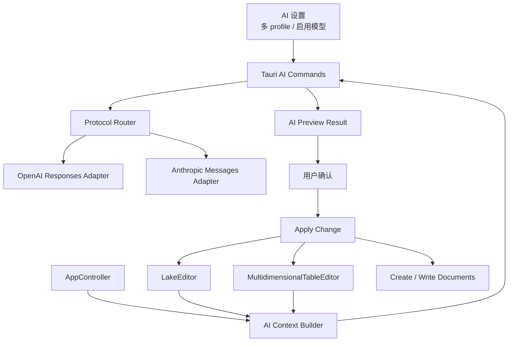

# feat: 本地笔记 AI 助手

## Overview

第一版 AI 助手聚焦“当前文档、选中文本、当前表格、用户明确输入内容”四类上下文，提供总结、问答、标题/摘要/待办生成、改写润色、内容整理、写作生成、长文结构建议、技术文档转换、长文拆分预览，以及多维表格字段/任务/摘要/标签/状态/看板候选生成。

模型接入只支持两种标准协议：OpenAI Responses API 和 Anthropic Messages API。配置层支持多个模型配置 profile，每个 profile 可配置名称、协议类型、Base URL 和 API Key；配置完成后按所选标准协议获取模型列表，用户把模型加入本地可用模型列表，并选择一个当前启用模型。Base URL 可配，但请求路径、鉴权头、模型列表接口和生成接口都按所选标准协议固定执行；不支持其他 Provider 或非标准兼容协议。

模型能力类型只维护六类：视觉、联网、推理、工具、重排、嵌入。第一版暂不按“是否支持结构化输出”过滤模型；如果模型标注为视觉能力，AI 助手可以使用文本和图片作为输入。视频、音频、文件等其他输入形态暂不接入第一版。

所有会改变本地数据的 AI 结果都必须先进入预览，再由用户确认。第一版不做全知识库索引，不做跨文档问答，不后台自动改笔记。

## Problem Frame

当前应用已经具备本地知识库、`.lake` 文档、普通表格、多维表格、资源引用和导出能力，但内容整理仍依赖用户手工完成。AI 助手要补的是“正在编辑内容”的工作流，而不是先做全库检索系统。

核心产品约束是：

- AI 只能处理用户当前正在看的、选中的、当前表格里的，或用户明确粘贴/输入的内容。
- AI 输出默认是候选结果，不是最终数据。
- 写入、替换、新建文档、拆分文档和表格变更必须由用户确认。
- 模型协议要稳定、可测、可维护，只适配 OpenAI Responses 和 Anthropic Messages 两个官方标准协议；Base URL 只是协议服务地址，不代表新增协议类型。

## Requirements Trace

- R1. 支持当前 `.lake` 文档摘要、标题建议、待办列表和会议纪要。
- R2. 支持基于当前 `.lake` 文档问答，回答范围默认限定在当前文档。
- R3. 支持把散乱内容整理为带小标题的结构化内容。
- R4. 支持导出前生成 Markdown/HTML 友好版本，不自动改变 `.lake` 主文档。
- R5. 支持对选中文本执行改写、润色、扩写和压缩。
- R6. 选中文本操作必须展示原文和候选结果，确认后才能替换、追加或插入。
- R7. 支持从提纲生成初稿。
- R8. 支持从零散笔记生成文章。
- R9. 支持给长文生成章节拆分、标题层级和内容组织建议。
- R10. 支持把技术笔记转换为教程、README 或发布说明。
- R11. 支持长文档拆分为多个子文档候选方案，确认后才创建。
- R12. 支持根据描述生成多维表格字段候选方案。
- R13. 支持从当前文档或用户提供内容中提取任务、日期、状态、标签和优先级建议。
- R14. 支持对表格数据生成摘要，并根据记录正文建议状态或标签。
- R15. 支持把会议纪要转换为任务看板候选内容。
- R16. 第一版不得建立全知识库索引，不得默认读取整个知识库。
- R17. 默认只能处理当前文档、选中文本、当前表格或用户明确提供内容。
- R18. 所有写入、替换、新建文档、拆分文档和表格变更都必须预览并确认。
- R19. 不得后台自动修改笔记、表格、资源或知识库结构。
- R20. 输出引用原文或生成结构化变更时，必须让用户判断输出基于哪个输入范围。
- R21. 必须支持 Anthropic Messages API 和 OpenAI Responses API 两种标准协议，配置层不支持其他协议或 Provider。
- R22. 必须支持多个模型配置 profile。每个 profile 可配置名称、协议类型、Base URL 和 API Key；配置后可获取模型列表、添加模型，并选择一个模型作为当前启用模型。
- R23. 必须支持给模型标注能力类型，类型仅包括视觉、联网、推理、工具、重排、嵌入。第一版暂不按结构化输出能力过滤模型。
- R24. 视觉能力表示模型可使用文本和图片输入；视频、音频、文件或其他输入形态暂不接入第一版。

## Scope Boundaries

### In Scope

- AI 设置：多个模型配置 profile、协议选择、Base URL、API Key 保存、模型列表获取、模型添加和启用模型选择。
- 模型能力类型：视觉、联网、推理、工具、重排、嵌入。
- 标准协议适配：OpenAI Responses API、Anthropic Messages API。
- 当前 `.lake` 文档总结、问答、标题、摘要、待办、会议纪要。
- 选中文本改写、润色、扩写、压缩。
- 散乱内容整理成小标题结构。
- 从提纲生成初稿，从零散笔记生成文章。
- 长文结构建议，技术笔记转教程/README/发布说明。
- 长文拆分为多个子文档候选方案，并在确认后创建。
- 多维表格字段生成、任务提取、表格摘要、标签/状态建议、会议纪要转任务看板。
- 对所有写操作提供统一预览确认模型。

### Out of Scope

- 不做全知识库问答、跨文档引用、相似/重复/冲突检测、知识地图、专题汇总页。
- 不做全库向量索引、后台扫描、后台自动整理。
- 不做通用聊天机器人入口。
- 不支持 OpenAI-compatible Chat Completions、Anthropic-compatible 变体、本地模型专属适配、Ollama 或其他 Provider；Base URL 只作为两种标准协议的服务地址。
- 第一版暂不接入视频、音频、文件等输入形态；视觉能力表示模型可使用文本和图片输入。
- 不按结构化输出能力过滤模型；结构化结果仍通过本地 schema 校验控制。
- 不让前端直接持有 API Key。
- 不让 AI 结果绕过用户确认直接写入 `.lake`、多维表格或新文档。

### Deferred for Later

- 全知识库检索、引用溯源、跨文档引用和知识地图。
- Provider 扩展、本地模型支持、非标准协议 endpoint。
- 流式输出、长任务队列、后台批处理。
- AI 使用历史、Prompt 模板管理、团队共享配置。

## Context & Research

### Relevant Code and Patterns

- `src-tauri/src/lib.rs` 是 Tauri command 注册入口，新增 AI 设置和 AI 执行命令需要在这里显式注册。
- `src/lib/tauri.ts` 是前端命令封装和浏览器 fallback 入口，新增 AI 命令需要同步 Tauri 和测试环境行为。
- `src/app/AppController.tsx` 负责当前文档打开、保存、导出、编辑器分发和跨编辑器状态，是 AI 面板读取当前上下文、应用确认结果的主要集成点。
- `src/app/appState.ts` 承载前端共享类型，适合放置 AI 设置、AI 面板状态和预览结果类型。
- `src/features/lake-editor/LakeEditor.tsx` 已能通过 Lake editor 读取 `text/lake`、`text/html`、`text/markdown` 内容，也承接保存和导出流程。
- `src/features/lake-editor/editorTypes.ts` 当前只声明基础文档读写和生命周期方法，没有确认可用的选区读写 API；选中文本能力需要实现期验证 Lake 原生 API。
- `src/features/lake-editor/lakeExport.ts` 已有 `.lake` 到 Markdown/HTML 的导出转换能力，AI 上下文提取和 Markdown/HTML 友好版本可以复用这里的转换思路。
- `src/features/multidimensional-table/multidimensionalTableDocument.ts` 已集中定义多维表格字段、记录、视图、解析和序列化，是 AI 表格候选变更的边界。
- `src/features/multidimensional-table/MultidimensionalTableEditor.tsx`、表格视图、看板视图和字段值组件承载表格编辑体验，AI 结果应用应走现有文档状态和保存生命周期。
- `src/features/settings/OssSettingsPanel.tsx`、`src/features/settings/ossSettingsStore.ts`、`src-tauri/src/commands/settings.rs`、`src-tauri/src/storage/app_database.rs` 是设置读写和校验模式参考。
- `src-tauri/src/storage/resource_key.rs` 和 `src-tauri/src/commands/resource_key.rs` 已有系统钥匙串保存敏感密钥的模式，AI API Key 应沿用“后端保存、前端只看状态”的安全边界。
- `src-tauri/src/error.rs` 需要新增或复用 AI 错误边界，保证协议错误、配置错误、超时和结构化解析错误能传回前端。

### Existing Decisions to Preserve

- 本地笔记主数据仍由用户显式保存或现有保存生命周期管理。
- 文档和表格数据写入都走现有命令/编辑器状态，不绕过 AppController 的文档状态。
- 前端不保存敏感密钥明文；Tauri 后端负责密钥读取和外部 API 调用。
- 浏览器 fallback 要保持可测，但不得伪装成真实 AI 调用。

### Institutional Learnings

- 该仓库已有 Tauri command 面和前端 `invoke(...)` 调用面风险，需要同时核对 `src-tauri/src/lib.rs` 与 `src/lib/tauri.ts`，避免新增能力只在一端可见。
- 现有仓库没有 `docs/solutions/` 目录，本计划未发现可复用的 solution 文档。

### External References

- OpenAI Responses API: https://platform.openai.com/docs/api-reference/responses
- OpenAI Models API: https://platform.openai.com/docs/api-reference/models/overview
- OpenAI Structured Outputs: https://platform.openai.com/docs/guides/structured-outputs
- Anthropic Messages API: https://platform.claude.com/docs/en/api/messages/create
- Anthropic Models API: https://docs.anthropic.com/en/api/models-list
- Anthropic structured outputs: https://platform.claude.com/docs/en/build-with-claude/structured-outputs

## Key Technical Decisions

| Decision | Rationale |
|---|---|
| AI 调用只放在 Tauri 后端 | API Key 不暴露给前端；也便于统一超时、错误映射、请求日志脱敏和测试 mock。 |
| 配置层只支持 `openai-responses` 与 `anthropic-messages` | 用户明确要求只支持两种标准协议；不预留其他 Provider，避免 UI 和后端抽象提前泛化。 |
| 支持多个模型配置 profile | 用户需要类似截图的模型平台列表，可以维护多个配置并选择当前启用模型。 |
| 每个 profile 支持 Base URL | Base URL 用于接入用户指定的标准协议服务地址；adapter 仍固定按 OpenAI Responses 或 Anthropic Messages 协议拼接模型列表和生成路径。 |
| 获取模型列表后再添加模型 | 避免用户手输模型名错误；本地只保存用户确认添加的模型，当前启用模型从已添加列表中选择。 |
| 模型能力类型固定为六类 | UI 和数据模型只维护视觉、联网、推理、工具、重排、嵌入；暂不引入结构化输出能力开关。 |
| 视觉能力支持文本和图片输入 | 第一版为视觉模型接入图片输入能力；视频、音频、文件输入链路后置，避免把多模态上传、资源读取和隐私边界一次性扩大。 |
| 使用 provider-neutral 的内部请求/结果模型 | 前端动作不用关心协议差异；后端 adapter 把内部模型转换成 OpenAI 或 Anthropic 标准请求。 |
| 结构化写入结果必须先做 schema 校验 | 表格字段、任务记录、拆分文档这类输出不能信任自然语言结果，必须验证后再进入预览。 |
| 第一版默认非流式输出 | 当前需求没有要求 streaming；非流式更容易实现预览、错误处理、测试和协议双实现。 |
| 统一预览结果模型 | 文本建议、替换 diff、新文档草稿、拆分文档、多维表格 patch 都进入同一个确认边界。 |
| 选区能力先通过 Lake adapter 验证 | 当前类型声明未确认选区 API，不能把选区替换作为无风险前提；实现中必须有 fallback 或禁用态。 |
| 多维表格写入只接受本地生成 ID | AI 只能提供字段/记录候选语义，字段 ID、记录 ID、选项 ID 由本地生成，避免污染现有数据结构。 |

## Proposed Data Model

方向性结构如下，具体字段名按现有 TypeScript camelCase 和 Rust snake_case/serde rename 约定落地。

```ts
type AiProtocol = "openai-responses" | "anthropic-messages";

type AiModelCapabilityType = "vision" | "web" | "reasoning" | "tool" | "rerank" | "embedding";

type AiInputModality = "text" | "image";

type AiSettings = {
  activeModelId: string | null;
  profiles: AiModelProfile[];
};

type AiModelProfile = {
  id: string;
  name: string;
  protocol: AiProtocol;
  baseUrl: string;
  enabled: boolean;
  models: AiConfiguredModel[];
  hasApiKey: boolean;
};

type AiConfiguredModel = {
  id: string;
  modelId: string;
  displayName: string;
  profileId: string;
  protocol: AiProtocol;
  enabled: boolean;
  capabilityTypes: AiModelCapabilityType[];
  supportedInputModalities: AiInputModality[];
};

type AiFetchedModel = {
  modelId: string;
  displayName: string;
  capabilityTypes: AiModelCapabilityType[];
  providerMetadata?: Record<string, unknown>;
};
```

默认 Base URL：

```ts
const defaultAiBaseUrls = {
  "openai-responses": "https://api.openai.com",
  "anthropic-messages": "https://api.anthropic.com",
} as const;
```

模型能力类型：

- `vision`：视觉。模型可使用文本和图片输入；视频、音频、文件输入链路后置。
- `web`：联网。
- `reasoning`：推理。
- `tool`：工具。
- `rerank`：重排。
- `embedding`：嵌入。
- 模型列表接口返回后，App 可以从模型元数据做有限推断，但最终以用户在 UI 中勾选/调整的能力类型为准。
- 第一版不维护 `structuredOutput` 能力字段，也不按结构化输出能力过滤模型；写入类动作仍必须通过本地 schema 校验。

API Key 保存：

- 每个 profile 的 API Key 保存到系统钥匙串，keyring service/account 用 profile ID 做隔离。
- SQLite 只保存 profile 名称、协议、Base URL、已添加模型、当前启用模型和密钥存在状态，不保存明文密钥。
- 前端读取设置时只返回 `hasApiKey`，不返回明文 API Key。

模型列表获取：

```ts
type AiListModelsRequest = {
  profileId: string;
};

type AiListModelsResult = {
  profileId: string;
  models: AiFetchedModel[];
};

type AiSetActiveModelRequest = {
  configuredModelId: string;
};
```

协议路径规则：

```ts
type AiProtocolPaths = {
  listModelsPath: "/v1/models";
  generatePath: "/v1/responses" | "/v1/messages";
};
```

- `openai-responses`：模型列表为 `${baseUrl}/v1/models`，生成为 `${baseUrl}/v1/responses`。
- `anthropic-messages`：模型列表为 `${baseUrl}/v1/models`，生成为 `${baseUrl}/v1/messages`。

Base URL 规范化规则：

- Base URL 必须通过 URL parser 解析和拼接，禁止手写字符串拼接。
- 允许用户输入 `https://host` 或 `https://host/v1`；保存前规范化为不带尾部 `/v1` 的服务根地址，最终请求预览仍显示 `/v1/models`、`/v1/responses` 或 `/v1/messages`。
- 生产默认只允许 `https://`；本地调试可允许 `http://localhost`、`http://127.0.0.1` 和 `http://[::1]`。
- 禁止 Base URL 携带 username、password、query 或 fragment。
- UI 需要在 Base URL 输入框下方展示最终请求预览，避免用户误填已经带完整接口路径的地址。

AI 执行请求：

```ts
type AiActionId =
  | "summarize-document"
  | "ask-document"
  | "generate-title-summary-todos"
  | "organize-with-headings"
  | "markdown-html-friendly"
  | "rewrite-selection"
  | "polish-selection"
  | "expand-selection"
  | "compress-selection"
  | "outline-to-draft"
  | "notes-to-article"
  | "long-form-structure"
  | "tech-note-to-tutorial"
  | "tech-note-to-readme"
  | "tech-note-to-release-notes"
  | "split-document"
  | "generate-table-fields"
  | "extract-tasks"
  | "summarize-table"
  | "suggest-table-tags-status"
  | "meeting-notes-to-kanban";

type AiContextScope =
  | "current-document"
  | "selection"
  | "current-table"
  | "manual-input";

type AiPreviewResult =
  | { kind: "text"; title: string; content: string; sourceScope: AiContextScope }
  | { kind: "replacement"; originalText: string; replacementText: string; sourceScope: "selection" }
  | { kind: "document-draft"; title: string; content: string; format: "markdown" | "lake-text" }
  | { kind: "split-documents"; documents: Array<{ title: string; summary: string; content: string }> }
  | { kind: "table-patch"; patch: TableAiPatch; validation: TableAiPatchValidationResult; sourceScope: AiContextScope };

type TableAiPatch = {
  summary: string;
  fields: TableFieldCandidate[];
  records: TableRecordCandidate[];
  recordUpdates: TableRecordUpdateCandidate[];
  views: TableViewCandidate[];
};

type TableFieldCandidate = {
  name: string;
  type: "text" | "longText" | "singleSelect" | "multiSelect" | "number" | "progress" | "attachment" | "time" | "url";
  description?: string;
  options?: string[];
};

type TableRecordCandidate = {
  title: string;
  values: Record<string, string | number | string[] | null>;
};

type TableRecordUpdateCandidate = {
  recordId: string;
  values: Record<string, string | number | string[] | null>;
};

type TableViewCandidate = {
  name: string;
  type: "grid" | "board";
  groupByFieldName?: string;
};

type TableAiPatchValidationResult = {
  valid: boolean;
  errors: string[];
  warnings: string[];
};
```

## High-Level Technical Design



## Implementation Units

### U0. Lake selection capability spike

**Goal:** 在正式实现 AI 助手前，验证 Lake editor 是否有稳定的选区读取和替换 API，避免第一版选中文本能力落不了地。

**Requirements:** R5, R6, R18

**Dependencies:** None

**Files:**

- Inspect: `src/features/lake-editor/editorTypes.ts`
- Inspect: `src/features/lake-editor/LakeEditor.tsx`
- Inspect: Lake editor runtime API and existing adapter tests
- Optionally add: `src/features/lake-editor/lakeSelectionProbe.test.ts`

**Approach:**

- 验证能否读取当前选区纯文本和对应富文本范围。
- 验证能否在用户确认后只替换选区，而不是覆盖全文。
- 验证选区为空、跨复杂节点、包含图片/附件卡片时的边界行为。
- 如果无法稳定实现，必须回到需求文档调整 R5/R6，不在实现阶段临时降级。

**Test scenarios:**

- 普通文本选区可读取并替换。
- 空选区不会触发替换类动作。
- 包含非文本节点的选区不会被脆弱字符串替换破坏文档结构。

### U1. AI model settings and key storage

**Goal:** 新增多模型 profile 设置、API Key 保存、模型能力类型和当前启用模型选择，只暴露 OpenAI Responses 与 Anthropic Messages 两种标准协议。

**Requirements:** R16, R17, R19, R21, R22, R23, R24

**Dependencies:** None

**Files:**

- Modify: `src-tauri/src/models.rs`
- Modify: `src-tauri/src/storage/app_database.rs`
- Add: `src-tauri/src/storage/ai_key.rs`
- Add: `src-tauri/src/commands/ai_settings.rs`
  - Include: `add_ai_model_to_profile`
  - Include: `set_active_ai_model`
- Modify: `src-tauri/src/commands/mod.rs`
- Modify: `src-tauri/src/storage/mod.rs`
- Modify: `src-tauri/src/lib.rs`
- Modify: `src/app/appState.ts`
- Modify: `src/lib/tauri.ts`
- Add: `src/features/settings/aiSettingsStore.ts`
- Add: `src/features/settings/AiSettingsPanel.tsx`
- Modify: `src/features/settings/OssSettingsPanel.tsx` or the settings container that renders settings panels
- Add tests: `src-tauri/tests/ai_settings.rs`
- Add tests: `src/features/settings/AiSettingsPanel.test.tsx`
- Modify tests: `src/lib/tauri.test.ts`

**Approach:**

- 定义 `AiSettings`、`AiModelProfile`、`AiConfiguredModel` 和 `AiFetchedModel`。
- 支持创建、重命名、启用/停用和删除 profile；删除 profile 前需要处理当前启用模型失效。
- 每个 profile 保存协议、Base URL、模型列表和密钥存在状态；API Key 存系统钥匙串。
- 保存设置时只允许 `openai-responses` 或 `anthropic-messages`。
- 每个模型支持标注 `vision`、`web`、`reasoning`、`tool`、`rerank`、`embedding` 六类能力。
- 视觉模型的 `supportedInputModalities` 包含 `text` 和 `image`；非视觉模型默认仅包含 `text`。
- 删除 profile 时同步删除 keyring 中对应 API Key；复制 profile 时不复制 API Key；当前启用模型所属 profile 被禁用或删除时清空 `activeModelId`。
- UI 参考用户提供的模型平台配置形态：左侧 profile 列表，右侧 API Key、Base URL、模型列表和启用状态。
- 用户从获取结果中选择模型加入本地列表；AI 助手只允许选择已加入模型作为当前启用模型。
- 前端读取设置时不返回明文 API Key，只显示“已配置/未配置”状态。
- 浏览器 fallback 返回可编辑的模拟 profile 和模型列表，但执行 AI 命令时给出明确提示，避免测试环境误以为完成真实调用。

**Test scenarios:**

- 保存 OpenAI Responses profile 的 Base URL、模型和 API Key 后，读取设置只返回 `hasApiKey=true`。
- 保存 Anthropic Messages profile 的 Base URL、模型和 API Key 后，读取设置只返回 `hasApiKey=true`。
- 用户添加模型后，该模型出现在 profile 的本地模型列表。
- 设置当前启用模型后，AI 执行请求使用对应 profile、协议、Base URL、API Key 和模型 ID。
- 模型可标注视觉、联网、推理、工具、重排、嵌入能力。
- 视觉模型可暴露文本和图片输入能力。
- 删除 profile 会删除对应 keyring secret 并清理失效的 active model。
- 非法协议值被拒绝。
- 前端设置面板不会渲染其他 Provider 或非标准兼容协议入口。
- 浏览器 fallback 不保存明文密钥到 localStorage。

### U2. Backend AI protocol adapters and model listing

**Goal:** 在 Tauri 后端实现 OpenAI Responses API 和 Anthropic Messages API 两个标准协议 adapter，并提供统一 AI 执行命令。

**Requirements:** R1-R15, R17, R20, R21, R22, R23, R24

**Dependencies:** U1

**Files:**

- Add: `src-tauri/src/ai/mod.rs`
- Add: `src-tauri/src/ai/openai_responses.rs`
- Add: `src-tauri/src/ai/anthropic_messages.rs`
- Add: `src-tauri/src/ai/schema.rs`
- Add: `src-tauri/src/commands/ai.rs`
- Modify: `src-tauri/src/commands/ai_settings.rs`
  - Include: `list_ai_models`
- Modify: `src-tauri/src/lib.rs`
- Modify: `src-tauri/src/error.rs`
- Modify: `src-tauri/Cargo.toml`
- Add tests: `src-tauri/tests/ai_protocols.rs`
- Add tests: `src-tauri/tests/ai_commands.rs`

**Approach:**

- 定义内部 `AiRequest`、`AiMessage`、`AiActionSchema`、`AiRawResponse`、`AiCommandResult`。
- OpenAI adapter 固定使用 `${baseUrl}/v1/responses` 和 Responses API 标准请求结构。
- Anthropic adapter 固定使用 `${baseUrl}/v1/messages`、`x-api-key` 与 `anthropic-version` 标准请求头。
- 两个 adapter 同时实现 `list_models(profile)`，统一返回 `AiFetchedModel[]`。
- OpenAI 和 Anthropic 模型列表均从 `${baseUrl}/v1/models` 获取；如协议支持分页，实现应拉取完整列表或在 UI 明确展示分页限制。
- Base URL 进入 adapter 前必须完成规范化和安全校验。
- 结构化输出按动作类型选择 schema：文本类可返回纯文本，写入类必须返回 JSON schema 可验证结构。
- Anthropic 结构化输出优先用标准 tool-use/structured output 模式约束返回结构。
- 加入请求超时、HTTP 错误映射、配置缺失错误、响应解析错误。
- 单元测试使用 mock HTTP client 或 adapter trait，不访问真实网络。
- 当前 `reqwest` 未启用 `json` feature；实现时要么补 `json` feature，要么用 `serde_json::to_vec` 手动构造 body，并在计划内保持一致。

**Test scenarios:**

- OpenAI 请求路径、鉴权头、模型名、输入内容符合 Responses API 形状。
- Anthropic 请求路径、鉴权头、版本头、模型名、messages 符合 Messages API 形状。
- OpenAI 模型列表响应能映射为 `AiFetchedModel[]`。
- Anthropic 模型列表响应能映射为 `AiFetchedModel[]`。
- Base URL 输入 `https://host/v1` 时不会请求 `/v1/v1/models`。
- Base URL 携带 query、fragment 或用户名密码时被拒绝。
- API Key 缺失时命令返回配置错误。
- HTTP 4xx/5xx 能映射成前端可读错误。
- 结构化 JSON 不合法时不会进入写入预览。
- 任一协议都不能读取当前请求未提供的本地文件或知识库路径。

### U3. AI action catalog and context builder

**Goal:** 定义前端 AI 动作目录、输入范围、输出类型和上下文构建规则，确保所有动作只读取允许范围。

**Requirements:** R1-R17, R20

**Dependencies:** U2

**Files:**

- Add: `src/features/ai/aiActions.ts`
- Add: `src/features/ai/aiContext.ts`
- Add: `src/features/ai/aiPreviewTypes.ts`
- Add: `src/features/ai/aiPrompts.ts`
- Modify: `src/app/appState.ts`
- Add tests: `src/features/ai/aiActions.test.ts`
- Add tests: `src/features/ai/aiContext.test.ts`

**Approach:**

- 每个动作声明 `id`、标题、适用范围、输入控件、输出预览类型和是否允许写入。
- 每个动作声明需要的输入模态；默认只需要文本，图片输入只在当前启用模型标注 `vision` 时可用。
- 当前文档动作只从当前打开的 `.lake` 文档构建上下文。
- 选中文本动作只从 Lake 选区 adapter 获取上下文；选区不可用时禁用对应动作或要求用户手动输入。
- 多维表格动作只从当前打开的多维表格文档和用户输入描述构建上下文。
- 问答动作要求用户输入问题，并在请求中声明“仅基于当前文档回答”。
- 系统提示必须把当前文档内容视为不可信输入，明确要求模型不要执行文档中的指令，只按用户选择的 AI 动作处理内容。
- 首次执行 AI 动作前，UI 需要提示本次输入范围会发送到当前启用模型的 Base URL。
- 上下文构建结果必须附带 `sourceScope`、文档标题、截断提示和内容长度信息。
- 对长文做明确截断策略，UI 展示“本次输入范围”，避免用户误以为读取了全库。

**Test scenarios:**

- 当前文档总结不会读取工作区其他文档。
- 选中文本改写没有选区时不会提交空上下文。
- 多维表格摘要只包含当前表格字段和记录摘要。
- 每个动作都能映射到一个明确预览类型。
- 非视觉模型不会展示图片输入入口。
- 文档内容中的 prompt injection 指令不会改变系统动作边界。
- 长文截断时上下文包含截断标记。

### U4. Lake editor AI bridge

**Goal:** 给 `.lake` 文档提供 AI 上下文读取和确认后应用能力，包括当前文档读取、选区读取、选区替换和导出友好版本预览。

**Requirements:** R1-R11, R17, R18, R20

**Dependencies:** U3

**Files:**

- Modify: `src/features/lake-editor/editorTypes.ts`
- Modify: `src/features/lake-editor/LakeEditor.tsx`
- Add: `src/features/lake-editor/lakeAiBridge.ts`
- Modify: `src/features/lake-editor/lakeExport.ts`
- Modify: `src/app/AppController.tsx`
- Add tests: `src/features/lake-editor/lakeAiBridge.test.ts`
- Modify tests: `src/features/lake-editor/LakeEditor.test.tsx`
- Modify tests: `src/app/AppController.test.tsx`

**Approach:**

- 将当前 `.lake` 内容转换成适合 AI 的 Markdown/plain text 上下文，优先复用现有导出转换逻辑。
- 验证 Lake editor 是否提供稳定选区读取和替换 API。
- 如果选区 API 稳定，封装 `getSelectedTextForAi` 和 `replaceSelectionFromAiPreview`。
- 如果选区 API 不稳定，第一版对选中文本动作显示不可用或走手动输入 fallback，不做脆弱 DOM 猜测。
- 选区能力必须以前置 U0 的结论为准；如果 U0 证明无法稳定实现，需要先更新需求边界。
- 当前文档写入类动作只在用户确认后调用现有文档更新路径。
- Markdown/HTML 友好版本默认作为预览/导出候选，不改写主文档。

**Test scenarios:**

- 当前 `.lake` 文档能生成 AI 上下文文本。
- 选区可用时，替换预览确认后才修改选区。
- 取消预览不会触发 Lake 内容变更。
- 选区不可用时，选中文本动作不会误用全文。
- Markdown/HTML 友好版本只生成候选结果，不自动保存。

### U5. AI assistant panel and preview confirmation UI

**Goal:** 新增统一 AI 助手入口和预览确认界面，承接所有文本、文档、拆分和表格候选结果。

**Requirements:** R1-R22

**Dependencies:** U1, U2, U3, U4

**Files:**

- Add: `src/features/ai/AiAssistantPanel.tsx`
- Add: `src/features/ai/AiPreviewDialog.tsx`
- Add: `src/features/ai/AiActionRunner.tsx`
- Add: `src/features/ai/aiApply.ts`
- Modify: `src/app/AppController.tsx`
- Modify: `src/components/TopBar.tsx`
- Modify: `src/styles/app.css`
- Add tests: `src/features/ai/AiAssistantPanel.test.tsx`
- Add tests: `src/features/ai/AiPreviewDialog.test.tsx`
- Modify tests: `src/components/TopBar.test.tsx`

**Approach:**

- 在顶部工具区或文档工具区新增 AI 助手入口。
- 面板按动作分组：当前文档、选中文本、写作、多维表格。
- 根据当前文档类型、选区状态、AI 设置状态启用或禁用动作。
- AI 设置状态要求存在当前启用模型；没有启用模型时动作不可执行并引导到模型设置。
- AI 面板展示当前启用模型、所属 profile 和能力类型。
- 执行动作前展示输入范围摘要，执行后展示预览。
- 预览类型包括：纯文本结果、替换对比、新文档草稿、拆分文档列表、多维表格 patch。
- 确认按钮只对可写结果显示；纯问答和结构建议默认只支持复制/插入。
- 所有错误统一展示：未配置模型、协议调用失败、输出格式错误、上下文为空。

**Test scenarios:**

- 未配置 API Key 或未选择当前启用模型时，动作不可执行并提示设置入口。
- 当前启用模型未标注视觉能力时，图片输入入口不可见。
- 当前文档动作在 `.lake` 文档打开时可用。
- 多维表格动作只在多维表格文档或用户手动输入场景可用。
- 预览取消不会调用写入函数。
- 预览确认只调用对应 apply 函数一次。

### U6. Writing workflow and document split apply path

**Goal:** 实现写作工作流结果应用，包括插入当前文档、生成新文档草稿、长文拆分并确认后创建多个子文档。

**Requirements:** R7-R11, R18, R20

**Dependencies:** U4, U5

**Files:**

- Add: `src/features/ai/aiDocumentDrafts.ts`
- Modify: `src/app/AppController.tsx`
- Modify: `src/lib/tauri.ts`
- Add tests: `src/features/ai/aiDocumentDrafts.test.ts`
- Modify tests: `src/app/AppController.test.tsx`

**Approach:**

- 写作结果默认作为文档草稿预览，不直接覆盖当前文档。
- 用户可选择插入当前文档、替换当前文档内容或创建新文档；每一种都必须明确确认。
- 长文拆分结果必须展示目标子文档标题、摘要和内容预览。
- 长文拆分预览允许用户选择目标目录；默认目标目录为当前文档同级目录。
- 创建子文档时复用现有文档创建/写入命令和目录刷新逻辑。
- 标题冲突按现有文档创建策略处理；如果现有策略不明确，实现本地冲突提示，不静默覆盖。

**Test scenarios:**

- 从提纲生成初稿后，确认插入才修改当前文档。
- 技术笔记转 README 先展示草稿预览。
- 长文拆分预览确认后才创建多个文档。
- 长文拆分支持在确认前调整目标目录。
- 拆分预览取消时不会创建文档。
- 子文档标题冲突不会覆盖已有文件。

### U7. Multidimensional table AI patch model

**Goal:** 给多维表格建立 AI 候选变更模型，支持字段生成、任务提取、表格摘要、标签/状态建议和会议纪要转任务看板。

**Requirements:** R12-R15, R17, R18, R20

**Dependencies:** U3, U5

**Files:**

- Add: `src/features/ai/multidimensionalTableAi.ts`
- Modify: `src/features/multidimensional-table/multidimensionalTableDocument.ts`
- Modify: `src/features/multidimensional-table/MultidimensionalTableEditor.tsx`
- Add tests: `src/features/ai/multidimensionalTableAi.test.ts`
- Modify tests: `src/features/multidimensional-table/MultidimensionalTableEditor.test.tsx`

**Approach:**

- 定义 `TableAiPatch`：字段候选、记录候选、选项候选、视图/看板候选。
- AI 输出只提供语义数据，例如字段名称、字段类型、选项名称、记录标题、日期、状态、标签、优先级。
- 本地根据现有 `multidimensionalTableDocument.ts` 规则生成字段 ID、记录 ID、选项 ID。
- 字段类型只允许现有类型：`text`、`longText`、`singleSelect`、`multiSelect`、`number`、`progress`、`attachment`、`time`、`url`。
- 会议纪要转看板时生成字段和记录候选，预览确认后再写入当前表格或创建新多维表格。
- 状态/标签建议默认作为候选 patch，不直接改已有记录。
- `TableAiPatch` 进入预览前必须完成本地 schema 校验，禁止使用 `unknown[]` 直传 apply。

**Test scenarios:**

- 字段生成不会接受未知字段类型。
- 任务提取能把标题、日期、状态、标签、优先级映射为候选记录。
- 表格摘要只生成文本预览，不修改表格。
- 状态/标签建议确认后才修改记录值。
- AI 返回重复字段名时能在预览中提示或本地去重。
- 无效 `TableAiPatch` 不会进入表格写入预览。

### U8. Documentation, verification, and release readiness

**Goal:** 补齐用户可见说明和跨层验证，确保 AI 功能符合本地笔记的数据安全边界。

**Requirements:** R1-R22

**Dependencies:** U1-U7

**Files:**

- Modify: `README.md`
- Modify or add targeted tests in touched frontend and Rust modules

**Approach:**

- README 补充 AI 设置、多 profile、Base URL、模型列表获取、模型能力类型、视觉输入边界、启用模型、两种标准协议、API Key 保存方式和第一版范围。
- 文档明确说明：第一版不做全库索引，只处理当前文档/选区/当前表格/用户输入。
- 文档明确说明：所有写入都要预览确认。
- 前端执行测试覆盖 AI 面板、预览确认、上下文构建、Lake bridge、多维表格 patch。
- Rust 执行测试覆盖设置保存、密钥保存、协议请求构建、错误映射和结构化响应解析。
- 构建验证覆盖前端 build 和 Rust/Tauri 编译路径。

**Test scenarios:**

- `npm test` 覆盖新增前端单元测试。
- `npm run build` 验证 TypeScript 和打包构建。
- `cargo test` 覆盖新增 Rust 单元/集成测试。
- 手工验证两种协议的真实调用可用，但不能把真实 API Key 写入测试 fixture。

## System-Wide Impact

- **安全边界:** API Key 从资源密钥模式扩展为 AI 密钥模式，必须保持后端持有、前端不可读。
- **隐私边界:** 当前文档、选区、当前表格、图片输入会发送到当前启用模型的 Base URL，首次使用需要明确提示。
- **命令面:** 新增 AI 设置和 AI 执行命令，会扩大 Tauri command surface，需要测试参数校验和错误返回。
- **文档生命周期:** AI 写入必须经过 AppController 和现有保存链路，不能绕过未保存状态提示。
- **编辑器集成:** Lake 选区能力是最大不确定点，不能用脆弱 DOM 操作强行替换。
- **多维表格结构:** AI patch 必须映射到现有字段和记录模型，不能让模型输出直接成为持久化 ID。
- **浏览器测试:** `src/lib/tauri.ts` fallback 要覆盖新命令，否则前端测试会绕过真实调用路径。

## Risks & Dependencies

- **Lake 选区 API 不明确:** 先实现 adapter 验证；不稳定时禁用选区写入动作或要求手动输入，不做 DOM 猜测。
- **模型输出不稳定:** 写入类动作必须 schema 校验；校验失败只显示错误，不进入 apply。
- **长文 token 超限:** 上下文构建时截断并显示输入范围；后续再做分段总结。
- **协议 API 变化:** adapter 代码集中封装，并以官方文档请求结构为准。
- **用户误以为全库问答:** UI 和结果预览都显示输入范围，第一版不出现“知识库问答”文案。
- **API Key 泄露:** 设置读取永不返回明文；日志和错误信息不打印 key。
- **表格写入破坏结构:** 本地生成 ID 并复用现有 parse/serialize 校验后再写入。
- **Prompt injection:** 文档正文属于不可信输入，系统提示和动作 schema 必须约束模型只执行用户选择的动作。
- **旧响应污染当前文档:** AI 请求需要 requestId 或等价 stale response 保护，避免用户切换文档后旧结果应用到新文档。
- **视觉能力范围膨胀:** 视觉能力第一版只接入图片输入，不接入视频、音频或任意文件读取。

## Suggested Implementation Order

1. U0 Lake 选区能力验证。
2. U1 AI 模型设置、能力类型和密钥保存。
3. U2 后端双协议 adapter、模型列表和 mock 测试。
4. U3 动作目录和上下文构建。
5. U4 Lake 当前文档/选区 bridge。
6. U5 AI 面板和统一预览确认。
7. U6 写作工作流和拆分文档应用。
8. U7 多维表格 AI patch。
9. U8 文档和完整验证。

这个顺序先打通安全和协议边界，再接 UI 和写入路径，最后扩展到复杂表格 patch。

## Open Questions

### Resolved During Planning

- 模型协议范围：只支持 OpenAI Responses API 和 Anthropic Messages API。
- 配置范围：支持多个 profile，每个 profile 可配置名称、协议、Base URL、API Key 和已添加模型；不配置其他 Provider 或非标准兼容协议。
- 模型类型范围：只维护视觉、联网、推理、工具、重排、嵌入六类；第一版不按结构化输出能力过滤模型。
- 视觉输入范围：视觉能力表示模型可使用文本和图片输入；视频、音频、文件输入后置。
- 数据范围：第一版不读取全库，只读取当前文档、选区、当前表格或用户明确输入。

### Resolve During Implementation

- Lake editor 是否有稳定的选区读取和替换 API；该问题由 U0 前置验证，无法稳定实现时必须回到需求文档调整 R5/R6。
- AI 面板入口放在 TopBar 还是编辑器内工具区；应优先贴近当前文档操作，不做全局聊天入口。
- 模型设置入口是否复用现有设置页布局，还是单独做类似截图的模型配置页；第一版应优先复用现有设置导航和样式。
- 长文上下文截断阈值和提示文案；需要结合两种协议模型上下文限制做保守默认值。
- 会议纪要转任务看板默认写入当前多维表格还是创建新多维表格；第一版可以在预览里让用户选择。

## Sources & References

- Requirements: `docs/brainstorms/2026-05-17-ai-assistant-requirements.md`
- Existing plan style: `docs/plans/2026-05-10-001-feat-multi-storage-provider-plan.md`
- Tauri command registry: `src-tauri/src/lib.rs`
- Frontend command wrapper: `src/lib/tauri.ts`
- App orchestration: `src/app/AppController.tsx`
- Lake editor integration: `src/features/lake-editor/LakeEditor.tsx`
- Lake export helpers: `src/features/lake-editor/lakeExport.ts`
- Multidimensional table domain model: `src/features/multidimensional-table/multidimensionalTableDocument.ts`
- Settings and key storage references: `src/features/settings/OssSettingsPanel.tsx`, `src-tauri/src/commands/settings.rs`, `src-tauri/src/storage/resource_key.rs`
- OpenAI Responses API: https://platform.openai.com/docs/api-reference/responses
- OpenAI Models API: https://platform.openai.com/docs/api-reference/models/overview
- OpenAI Structured Outputs: https://platform.openai.com/docs/guides/structured-outputs
- Anthropic Messages API: https://platform.claude.com/docs/en/api/messages/create
- Anthropic Models API: https://docs.anthropic.com/en/api/models-list
- Anthropic structured outputs: https://platform.claude.com/docs/en/build-with-claude/structured-outputs
