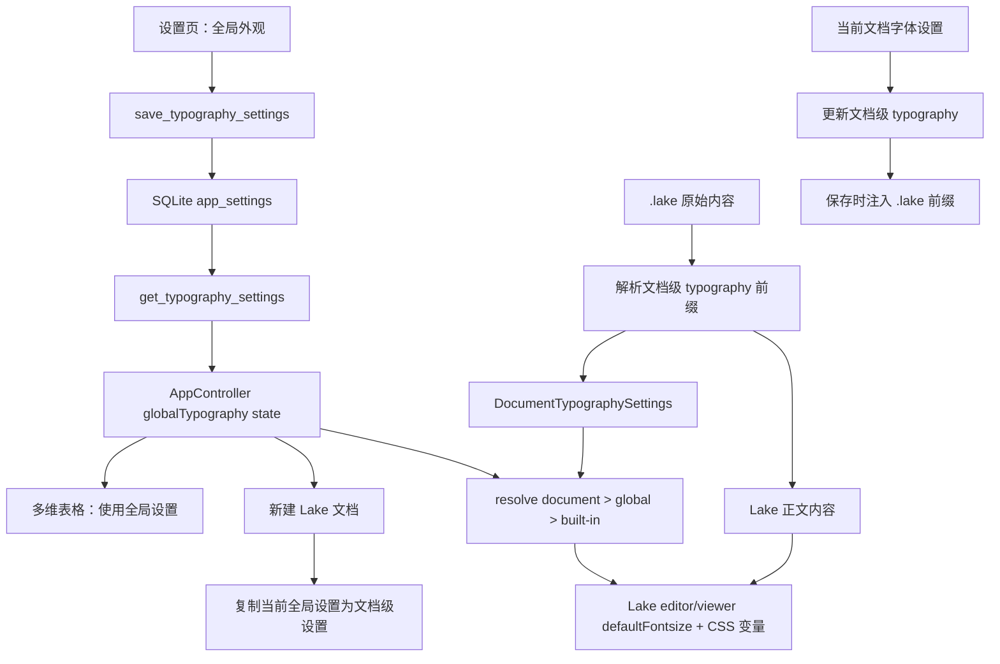

# feat: 全局与文档级字体设置

## Overview

为本地笔记应用新增两层字体设置：应用级全局默认和 Lake 文档级覆盖。全局设置用于初始化后续新建文档，并作为没有文档级设置时的渲染回退；Lake 文档一旦保存了自己的字体或字号，编辑和阅读都优先使用文档级设置。多维表格继续按全局设置展示正文和看板文本；Univer 表格不受影响。

---

## Problem Frame

当前 Lake 运行时在 `src/features/lake-editor/lakeEditorAdapter.ts` 中写死 `defaultFontsize: 19`，新建 `.lake` 文档模板在 `src-tauri/src/commands/documents.rs` 和浏览器 fallback 中也固定为空白段落。用户无法设置应用默认字体，也无法让单篇文档拥有自己的字体偏好。

新的行为需要区分“全局默认”和“文档自身设置”：全局设置不是批量覆盖所有已有文档，而是给之后新建的 Lake 文档提供初始文档级字体/字号；已有或新建文档如果保存了自己的字体设置，后续渲染必须以文档级设置为准。

---

## Requirements

- R1. 设置页必须提供全局字体和默认字号配置，并在重启后保持。
- R2. 新建 Lake 文档必须把当前全局字体和字号写入该文档的初始文档级设置。
- R3. Lake 文档必须支持单篇文档级字体和字号设置，并随 `.lake` 文档保存。
- R4. Lake 编辑模式和阅读模式渲染时必须按文档级设置优先、全局设置其次、内置默认最后的顺序解析字体和字号。
- R5. 修改全局设置不得批量改写已有 `.lake` 文档；已有文档只有在用户显式保存文档级设置时才写入文档级字体信息。
- R6. 多维表格的记录正文编辑器、全屏正文编辑器、textarea fallback、看板卡片和详情展示继续使用全局字体族和默认字号规则。
- R7. Univer 表格编辑器不受本设置影响。
- R8. 已有文档里手动设置过字号或字体的局部内容不得被全局或文档级默认覆盖。
- R9. 非法字体值和不支持的字号必须被前后端规范化或拒绝，避免注入 CSS 或传入 Lake 不支持的字号。

---

## Scope Boundaries

### In Scope

- 新增全局字体设置模型、默认值、前端合并逻辑和 Tauri 读写命令。
- 新增 Lake 文档级字体设置解析、写回、有效值合并和测试。
- 在设置面板增加“外观/字体”类全局配置入口。
- 在 Lake 文档编辑界面提供当前文档字体和字号设置入口。
- 将 Lake `defaultFontsize` 从硬编码改为有效字体设置驱动。
- 新建 Lake 文档模板按当前全局设置初始化文档级字体和字号。
- 多维表格记录正文的 Lake 编辑器、textarea fallback、看板和详情展示继续跟随全局设置。
- 浏览器 fallback 和 Tauri 桌面两条路径保持一致。

### Out of Scope

- 不修改 Univer 表格的单元格字体、字号或主题。
- 不批量迁移或重写已有 `.lake` 文档。
- 不为多维表格新增表格级或记录级字体设置；本轮多维表格只使用全局设置展示。
- 不提供本地字体文件上传、字体预览截图、云端同步或按知识库分别配置。
- 不改变 Lake 工具栏里用户手动设置选中文本字号的能力。
- 不让默认字号覆盖标题、卡片、代码块、表格等 Lake 内部有独立字号规则的节点。

### Deferred for Later

- 给已有文档提供“一次性写入当前全局字体/字号”的显式迁移工具。
- 给多维表格增加表格级字体设置。
- 按知识库或按文档类型维护不同字体设置。
- 字体可用性检测和系统字体列表选择器。

---

## Context & Research

### Relevant Code and Patterns

- `src-tauri/src/storage/app_database.rs` 已有 `app_settings(key,value)` 通用配置表，`oss_settings` 与 `ai_settings` 都以 JSON 形式保存，新增全局字体设置不需要数据库迁移。
- `src-tauri/src/commands/settings.rs` 是应用设置命令模式参考，适合新增全局字体设置的 `get` / `save` 命令和 Rust 侧校验。
- `src/app/appState.ts` 放置前端共享类型；`src/lib/tauri.ts` 封装 Tauri 命令和浏览器 fallback。
- `src/app/AppController.tsx` 启动时并行加载设置，并把 `ossSettings.resourcePreviewConcurrency` 下发到 Lake 与多维表格编辑器；全局字体设置可沿同一数据流下发。
- `src/features/settings/OssSettingsPanel.tsx` 虽然命名偏 OSS，但已承载 AI、文件存储、数据存储、备份和资源加密设置，新增“外观”入口应复用该面板。
- `src/components/TopBar.tsx` 和 `src/app/AppController.tsx` 承载当前文档操作入口，适合放置 Lake 当前文档字体设置入口。
- `src/features/lake-editor/lakeEditorAdapter.ts` 的 `createLakeRuntimeOptions` 目前硬编码 `defaultFontsize: 19`，编辑器和阅读器都经过这条共享配置。
- `src-tauri/src/commands/documents.rs` 的 `EMPTY_LAKE_DOCUMENT` 与 `create_document_at` 决定桌面端新 Lake 文档初始内容；`src/lib/tauri.ts` 里浏览器 fallback 也写入同样空白模板。
- `src/features/lake-editor/LakeEditor.tsx` 当前直接接收 `.lake` 内容并传给 Lake runtime，需要在进入 runtime 前解析文档级字体元数据，在保存时再写回原始 `.lake` 内容。
- `src/features/multidimensional-table/MultidimensionalTableRichTextEditor.tsx` 复用 `createLakeEditor`，是多维表格正文使用全局设置的主要落点。
- `src/styles/app.css` 已有 Lake 根节点、多维表格看板、详情面板和正文编辑器样式，可以通过 CSS 变量把有效字体族传递到目标区域。

### Lake Runtime Notes

本地 `yuque-developer-docs.md` 记录 Lake 编辑器和阅读器都支持 `defaultFontsize` 配置，支持字号为 `12, 13, 14, 15, 16, 19, 22, 24`，且默认字号不会作用于标题、卡片等节点。文档还提示 `setDocument` 会重新读取内容中的 `meta` 覆盖当前默认字号，因此实现时要优先通过运行时配置控制编辑/阅读默认，并在文档级元数据解析时避免把应用私有元数据直接交给 Lake runtime。

### External Research

未做外部研究。该需求主要依赖仓库内现有设置、Lake 本地开发文档和当前编辑器适配方式，外部资料不会改变主要实现路径。

---

## Key Technical Decisions

- KTD1. 将模型拆成 `GlobalTypographySettings` 和 `DocumentTypographySettings`：全局设置是应用默认；文档级设置跟随单篇 Lake 文档。
- KTD2. 有效字体设置按 `document > global > built-in` 合并：文档级缺字段时可继承全局对应字段，完全没有文档级设置时使用当前全局设置作为渲染回退。
- KTD3. 新建 Lake 文档时把当前全局设置复制成文档级设置：后续全局设置变化不会隐式改写这篇文档。
- KTD4. 文档级设置随 `.lake` 文件保存，而不是只存 SQLite：这样文档移动、备份和导出时不会丢失单篇文档字体偏好。
- KTD5. 文档级元数据采用应用私有文件前缀并在进入 Lake runtime 前剥离：保存时重新注入，避免 Lake `setDocument` 清理或误读应用私有元数据。
- KTD6. 默认字号只允许 Lake 支持的白名单：`12, 13, 14, 15, 16, 19, 22, 24`；前端选择器和 Rust 校验使用同一白名单。
- KTD7. 字体族保存为受限字符串，不保存任意 CSS 片段：允许用户输入字体名或逗号分隔字体族，但需要去除危险字符并生成安全的 CSS `font-family` 值。
- KTD8. Lake 编辑器和阅读器都通过共享 runtime options 接收有效默认字号：现有 `createLakeRuntimeOptions` 同时服务 editor/viewer，改这里可以减少双写和行为漂移。
- KTD9. 多维表格正文继续使用全局设置，不引入表格级覆盖：这保持用户之前要求的多维表格全局展示能力，同时避免把 Lake 文档级元数据扩展到不同数据模型。
- KTD10. Univer 表格不接收字体设置 props：SpreadsheetEditor 保持现状，避免把笔记正文偏好误解释为表格主题或单元格格式。

---

## High-Level Technical Design

文档读取时先拆出应用私有 typography 元数据，再把纯 Lake 正文交给 Lake runtime。保存时把最新文档级设置和 Lake 正文重新组合为 `.lake` 原始内容。新建 Lake 文档时复制当前全局设置为文档级设置，之后这篇文档按自己的文档级设置优先渲染。

---

## Implementation Units

### U1. 全局字体设置模型与持久化命令

**Goal:** 建立应用级全局字体设置的前后端数据模型、默认值、规范化和持久化能力。

**Requirements:** R1, R6, R9

**Dependencies:** 无

**Files:**

- `src/app/appState.ts`
- `src/features/settings/typographySettingsStore.ts`
- `src/lib/tauri.ts`
- `src-tauri/src/models.rs`
- `src-tauri/src/commands/settings.rs`
- `src-tauri/src/storage/app_database.rs`
- `src-tauri/src/lib.rs`
- `src/features/settings/typographySettingsStore.test.ts`
- `src-tauri/tests/typography_settings.rs`

**Approach:** 新增 `GlobalTypographySettings`，至少包含 `fontFamily` 和 `defaultFontSize`。前端提供默认值、合并函数、有效 CSS 字体族生成函数和校验函数；Rust 侧提供同等白名单校验与 JSON setting 读写。浏览器 fallback 使用 `localStorage` 独立 key，保持浏览器预览可测。

**Patterns to follow:** `ossSettingsStore.ts` 的合并/校验模式，`aiSettingsStore.ts` 的默认设置合并模式，`app_database.rs` 的 `load_ai_settings_at` / `save_ai_settings_at` JSON setting 模式。

**Test scenarios:**

- 默认加载：数据库无全局字体设置时，Tauri 命令返回默认字体族和默认字号 `19`。
- 保存成功：保存合法字体族和字号后，再次读取返回同一规范化结果。
- 非法字号：保存 `18` 或 `40` 时被拒绝或规范化为默认值，行为前后端一致。
- 字体安全：输入包含分号、括号或换行时不会生成可注入 CSS 的 `font-family`。
- 浏览器 fallback：`getTypographySettings` / `saveTypographySettings` 使用独立 `localStorage` key，不影响 OSS 设置。

**Verification:** 前端 store 测试覆盖默认合并和安全规范化；Rust 测试覆盖 setting 读写和非法输入。

### U2. Lake 文档级字体元数据解析与写回

**Goal:** 让单篇 Lake 文档拥有自己的字体和字号设置，并随 `.lake` 文件保存。

**Requirements:** R2, R3, R4, R5, R8, R9

**Dependencies:** U1

**Files:**

- `src/features/lake-editor/lakeDocumentTypography.ts`
- `src/features/lake-editor/lakeDocumentTypography.test.ts`
- `src/app/appState.ts`
- `src/features/lake-editor/LakeEditor.tsx`
- `src/features/lake-editor/LakeEditor.test.tsx`
- `src-tauri/src/commands/documents.rs`
- `src-tauri/tests/workspace_commands.rs`

**Approach:** 新增 Lake 文档级 typography helper，负责从 `.lake` 原始内容中解析应用私有前缀，返回 `{ body, documentTypography }`；保存时把 `documentTypography` 和最新 Lake body 重新组合。应用私有前缀必须在传给 Lake `setDocument` 前剥离，避免第三方 runtime 清理或渲染它。Rust 新建文档模板也使用同一语义生成带文档级设置的初始内容。

**Patterns to follow:** `resourceReference.ts` 已有资源引用脱水/水合的边界处理思路；LakeEditor 当前也在读写前后处理资源预览占位和真实内容。

**Test scenarios:**

- 无元数据文档：解析返回原正文和空文档级设置，保存时不凭空写入文档级设置。
- 有文档级设置：解析出字体族和字号，传给 Lake 的 body 不包含应用私有前缀。
- 写回文档级设置：保存时输出的 `.lake` 原始内容包含最新文档级字体设置和最新正文。
- 非法元数据：非法字号或危险字体族被忽略或规范化，不影响正文打开。
- 手动局部样式：正文内已有 `ne-fontsize` 或行内 span 样式时不被解析/写回 helper 改写。

**Verification:** helper 单元测试覆盖解析、写回、非法元数据和无元数据兼容；LakeEditor 测试覆盖传给 runtime 的内容不包含应用私有前缀。

### U3. 设置页全局外观配置入口

**Goal:** 在现有设置面板中增加全局字体和默认字号的可操作 UI。

**Requirements:** R1, R2, R6, R7, R9

**Dependencies:** U1

**Files:**

- `src/features/settings/OssSettingsPanel.tsx`
- `src/features/settings/OssSettingsPanel.test.tsx`
- `src/styles/app.css`
- `src/app/AppController.tsx`
- `src/app/AppController.test.tsx`

**Approach:** 复用现有设置面板的左侧 tab，新增“外观”或“字体”入口。字体族用文本输入或少量预设加自定义输入，字号用白名单下拉/分段控件。保存时调用新的 `onSaveTypographySettings`，成功后更新 AppController 中的全局设置。全局修改立即影响无文档级设置的 Lake 渲染和多维表格展示，但不写回已有 `.lake` 文件。

**Patterns to follow:** 设置面板现有 tab 切换、数据存储独立保存、AI 设置独立保存的 UI 组织方式。

**Test scenarios:**

- 打开设置：出现“外观”入口，默认显示当前全局字体族和字号。
- 保存设置：修改字体族和字号后点击保存，调用 `onSaveTypographySettings`，参数为规范化后的设置。
- 校验失败：选择或输入非法字号/字体时展示错误，不关闭设置面板。
- 独立保存：保存外观设置不触发 `onSave` 的 OSS 配置保存。
- 不改文档：保存全局设置后，当前已有 Lake 文档内容不会被自动写回。

**Verification:** React 测试验证 tab、表单保存、错误提示和不触发 OSS 保存。

### U4. Lake 当前文档字体设置入口

**Goal:** 让用户能为当前 Lake 文档单独设置字体和字号，并立即按文档级设置渲染。

**Requirements:** R3, R4, R5, R8, R9

**Dependencies:** U1, U2

**Files:**

- `src/components/TopBar.tsx`
- `src/components/TopBar.test.tsx`
- `src/app/AppController.tsx`
- `src/app/AppController.test.tsx`
- `src/features/lake-editor/LakeEditor.tsx`
- `src/styles/app.css`

**Approach:** 在当前 Lake 文档可编辑时提供文档字体设置入口，可放在 TopBar 的文档操作区或现有设置触发入口附近。面板显示当前有效值，并标识该值来自文档级还是全局默认。用户保存后更新当前文档级设置、触发保存链路，并让 LakeEditor 用文档级设置重新计算 runtime options。阅读模式可以显示文档级设置来源，但不应提供会绕过编辑权限的写入口。

**Patterns to follow:** TopBar 当前承载文档操作、保存状态和导出入口；AppController 已负责当前文档保存、手动保存请求和编辑器注册。

**Test scenarios:**

- Lake 文档打开：显示文档字体设置入口；Spreadsheet 和多维表格不显示该文档级入口。
- 来源展示：没有文档级设置时，面板显示正在继承全局设置。
- 保存文档级设置：选择字体族和字号后，AppController 更新当前文档级设置并调用现有保存链路。
- 优先级：文档级设置保存后，即使全局设置变化，当前文档仍使用文档级设置渲染。
- 阅读模式：阅读模式不暴露会直接修改文档的入口。

**Verification:** TopBar/AppController 测试覆盖入口显示、保存回调、文档类型过滤和优先级。

### U5. Lake 运行时有效字体解析与新文档初始化

**Goal:** Lake 编辑/阅读运行时按文档级优先级渲染，并让新建 Lake 文档复制当前全局设置为文档级设置。

**Requirements:** R2, R4, R5, R8, R9

**Dependencies:** U1, U2, U4

**Files:**

- `src/features/lake-editor/lakeEditorAdapter.ts`
- `src/features/lake-editor/LakeEditor.tsx`
- `src/features/lake-editor/lakeEditorAdapter.test.ts`
- `src/features/lake-editor/LakeEditor.test.tsx`
- `src-tauri/src/commands/documents.rs`
- `src-tauri/tests/workspace_commands.rs`
- `src/lib/tauri.ts`
- `src/app/AppController.tsx`
- `src/app/AppController.test.tsx`
- `src/styles/app.css`

**Approach:** 新增 `resolveEffectiveTypography(documentTypography, globalTypography)`，并把有效设置传入 Lake editor/viewer。`createLakeRuntimeOptions` 使用有效 `defaultFontSize` 写入 `defaultFontsize`；字体族通过 CSS 变量作用到 `.lake-editor-root` / `.lake-editor-mount` / `.ne-engine` / `.ne-viewer`。桌面端 `create_lake_document` 在 Rust 命令内读取当前全局设置并生成带文档级设置的初始模板；浏览器 fallback 从 `localStorage` 读取同一设置后生成模板。

**Patterns to follow:** 当前 `tocEnabled` 通过共享 options 同时服务 editor/viewer；`resourcePreviewConcurrency` 由 AppController 下发到 LakeEditor；创建文档命令集中生成初始内容。

**Test scenarios:**

- 文档级优先：文档设置字号 `22`、全局字号 `16` 时，editor/viewer options 使用 `defaultFontsize: 22`。
- 全局回退：无文档级设置、全局字号 `16` 时，editor/viewer options 使用 `defaultFontsize: 16`。
- 内置默认：文档和全局都缺失时，editor/viewer options 使用 `defaultFontsize: 19`。
- 新建文档：SQLite 中保存全局字体族 `LXGW WenKai`、字号 `22` 后，新 `.lake` 初始内容包含对应文档级设置。
- 全局变更不回写：打开已有带文档级设置的文档后修改全局设置，不触发该文档内容自动变化。
- 唯一路径：修改模板后不影响 `create_document_at` 的安全文件名和重名递增逻辑。

**Verification:** adapter 测试覆盖 runtime options；LakeEditor 测试覆盖有效值解析；Rust workspace/document 测试读取新建文件内容断言模板；`tauri.ts` 测试覆盖浏览器 fallback。

### U6. 多维表格按全局设置展示

**Goal:** 多维表格按用户要求跟随全局设置展示，但不引入表格级覆盖，也不影响 Univer 表格。

**Requirements:** R6, R7, R9

**Dependencies:** U1, U5

**Files:**

- `src/features/multidimensional-table/MultidimensionalTableEditor.tsx`
- `src/features/multidimensional-table/MultidimensionalTableBoard.tsx`
- `src/features/multidimensional-table/MultidimensionalTableRichTextEditor.tsx`
- `src/features/multidimensional-table/MultidimensionalTableEditor.test.tsx`
- `src/styles/app.css`
- `src/app/AppController.tsx`

**Approach:** `MultidimensionalTableEditor` 接收全局 typography settings，传给正文编辑器和看板/详情容器。正文编辑器复用 Lake runtime options；fallback textarea 使用相同 CSS 变量。看板卡片、详情标题、字段值区域跟随全局字体族；默认字号只应用到正文内容区域，不改变字段标签、按钮、筛选面板和工具栏密度。

**Patterns to follow:** 多维表格已通过 props 接收上传、下载、资源预览并继续下发到 `MultidimensionalTableRichTextEditor`。

**Test scenarios:**

- 正文编辑器：全局字号 `24` 时，内嵌正文 Lake editor 创建参数包含 `defaultFontsize: 24`。
- 全屏正文：全屏编辑器接收同一全局设置，不退回默认字号。
- fallback textarea：Lake runtime 不可用时，textarea 使用全局字体族和默认字号。
- 卡片展示：看板卡片字段文本使用全局字体族，但字段标签和按钮尺寸不被默认字号放大。
- Univer 排除：`SpreadsheetEditor` 不新增 typography props，现有表格测试无需调整字体行为。

**Verification:** 多维表格 React 测试覆盖 props 透传、fallback 和不影响 SpreadsheetEditor。

### U7. 文档与回归验证

**Goal:** 更新用户可见说明和验证清单，确保全局默认、文档级覆盖和多维表格展示行为可回归。

**Requirements:** R1, R2, R3, R4, R5, R6, R7

**Dependencies:** U1, U2, U3, U4, U5, U6

**Files:**

- `README.md`
- `src/features/settings/OssSettingsPanel.test.tsx`
- `src/components/TopBar.test.tsx`
- `src/features/lake-editor/lakeDocumentTypography.test.ts`
- `src/features/lake-editor/lakeEditorAdapter.test.ts`
- `src/features/lake-editor/LakeEditor.test.tsx`
- `src/features/multidimensional-table/MultidimensionalTableEditor.test.tsx`
- `src-tauri/tests/workspace_commands.rs`

**Approach:** README 的“当前能力”和本地验证流程补充全局字体/字号、文档级覆盖、优先级和 Univer 排除说明。测试覆盖前端设置、文档级元数据、Lake runtime、新建文档模板、多维表格正文和 Rust 持久化。

**Patterns to follow:** README 当前按能力列表和本地验证流程维护，新增内容应只补相关条目，不重写整篇。

**Test scenarios:**

- 用户设置全局字体和字号后，新建 Lake 文档，新文档带文档级字体设置并按该设置打开。
- 用户为单篇 Lake 文档设置不同字号后，再修改全局字号，该文档仍按文档级字号渲染。
- 打开无文档级设置的旧 Lake 文档时，按当前全局设置回退渲染，但不自动写回文件。
- 切换到多维表格记录详情，正文编辑器和 fallback 展示使用全局设置。
- 打开 Univer 表格，表格内容不因全局或文档级字体设置变化而改写。

**Verification:** 执行前端单元测试、Rust 测试和一次手动桌面冒烟验证。

---

## System-Wide Impact

- 设置数据新增一个应用级 JSON key，影响启动加载、设置页保存和浏览器 fallback。
- `.lake` 文件会新增应用私有 typography 前缀；读写、导出、AI 内容读取和资源处理必须使用剥离后的 Lake 正文，避免把私有元数据展示给用户或模型。
- Lake 编辑器实例可能需要在有效字体/字号变化时刷新 runtime options；实现时要避免正在编辑内容丢失。
- 新建 `.lake` 文件的初始内容会变化，并会携带从全局设置复制来的文档级字体设置。
- 多维表格正文复用 Lake adapter 后，全局设置会同时影响详情内嵌和全屏正文。

---

## Risks & Dependencies

- Lake 字体族没有明确官方配置项；字体族需要通过 CSS 变量覆盖，并只在文档级元数据中保存应用自己的字体偏好。实现后需要用真实桌面窗口检查正文、列表、引用、代码块的表现。
- 应用私有 `.lake` 前缀必须在所有传给 Lake、AI、导出转换的内容前剥离；漏剥离会污染用户内容。
- Lake 文档提到 `setDocument` 会读取内容 `meta` 覆盖默认字号；如果 Lake 正文自带 meta，文档级设置和 Lake meta 的优先级需要实现中用测试固定。
- 字体族是用户输入，必须做 CSS 注入防护，不能直接拼接任意字符串到 style 属性。
- 字号白名单要和 Lake 文档保持一致，避免设置页允许但运行时无效。

---

## Acceptance Examples

- AE1. 用户在全局设置页选择字体 `LXGW WenKai`、字号 `22` 并保存，关闭应用再打开后全局设置仍显示为该值。
- AE2. 用户保存全局字号 `22` 后新建 Lake 文档，该文档写入文档级字号 `22`；用户随后把全局字号改为 `16`，该文档仍按 `22` 渲染。
- AE3. 用户把某篇 Lake 文档的文档级字体改为 `Songti SC`、字号改为 `16`，再次打开该文档时优先使用文档级设置。
- AE4. 用户打开没有文档级设置的旧 Lake 文档，正文按当前全局设置回退展示，但文件不会因为打开而自动写入 typography 前缀。
- AE5. 用户打开多维表格记录详情，正文编辑器和全屏正文编辑器使用全局字体和字号；看板卡片文本使用全局字体族。
- AE6. 用户打开 Univer 表格，表格单元格内容和样式不因全局或文档级字体设置变化而改变。

---

## Documentation Notes

README 需要补充三处：当前能力列表新增“全局与文档级字体/字号设置”；数据存储说明补充全局设置存在 SQLite、文档级设置随 `.lake` 文件保存；本地验证流程新增“新建 Lake 文档继承全局、单篇文档覆盖全局、多维表格全局展示、Univer 表格不受影响”的步骤。

---

## Sources

- `yuque-developer-docs.md` 的 `defaultFontsize` 章节：Lake 编辑器和阅读器支持默认字号配置，支持字号为 `12, 13, 14, 15, 16, 19, 22, 24`，且标题/卡片等节点不受默认字号影响。
- `src/features/lake-editor/lakeEditorAdapter.ts`：当前 Lake runtime options 硬编码 `defaultFontsize: 19`。
- `src/features/lake-editor/LakeEditor.tsx`：当前 Lake 文档内容进入 runtime 前没有文档级元数据解析层。
- `src-tauri/src/commands/documents.rs`：当前桌面端新 Lake 文档模板为固定空白段落。
- `src/lib/tauri.ts`：当前浏览器 fallback 新 Lake 文档模板为固定空白段落。
- `src/features/multidimensional-table/MultidimensionalTableRichTextEditor.tsx`：多维表格正文复用 Lake editor adapter。
- `src-tauri/src/storage/app_database.rs`：应用设置使用 SQLite `app_settings` 的 JSON key/value 模式。
